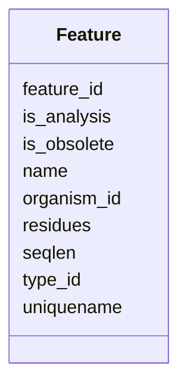

# Class: Feature 


_Genomic feature (gene, mRNA, exon, CDS, etc.). Central table in Chado schema._


URI: [https://w3id.org/jgi/phytozome/Feature](https://w3id.org/jgi/phytozome/Feature)





<!-- no inheritance hierarchy -->


## Slots

| Name | Cardinality and Range | Description | Inheritance |
| ---  | --- | --- | --- |
| [feature_id](feature_id.md) | 1 <br/> [Integer](Integer.md) |  | direct |
| [name](name.md) | 0..1 <br/> [String](String.md) | Feature name/symbol | direct |
| [uniquename](uniquename.md) | 0..1 <br/> [String](String.md) | Unique identifier | direct |
| [type_id](type_id.md) | 0..1 <br/> [Integer](Integer.md) | SO term for feature type | direct |
| [organism_id](organism_id.md) | 0..1 <br/> [Integer](Integer.md) |  | direct |
| [residues](residues.md) | 0..1 <br/> [String](String.md) | Sequence if stored | direct |
| [seqlen](seqlen.md) | 0..1 <br/> [Integer](Integer.md) |  | direct |
| [is_analysis](is_analysis.md) | 0..1 <br/> [Boolean](Boolean.md) |  | direct |
| [is_obsolete](is_obsolete.md) | 0..1 <br/> [Boolean](Boolean.md) |  | direct |


## Identifier and Mapping Information


### Annotations

| property | value |
| --- | --- |
| source_table | feature (via all_feature_names view) |


### Schema Source


* from schema: https://w3id.org/jgi/phytozome


## Mappings

| Mapping Type | Mapped Value |
| ---  | ---  |
| self | https://w3id.org/jgi/phytozome/Feature |
| native | https://w3id.org/jgi/phytozome/Feature |


## LinkML Source

<!-- TODO: investigate https://stackoverflow.com/questions/37606292/how-to-create-tabbed-code-blocks-in-mkdocs-or-sphinx -->

### Direct

<details>
```yaml
name: Feature
annotations:
  source_table:
    tag: source_table
    value: feature (via all_feature_names view)
description: Genomic feature (gene, mRNA, exon, CDS, etc.). Central table in Chado
  schema.
from_schema: https://w3id.org/jgi/phytozome
attributes:
  feature_id:
    name: feature_id
    from_schema: https://w3id.org/jgi/phytozome
    rank: 1000
    identifier: true
    domain_of:
    - Feature
    - AnalysisFeature
    - CellLineFeature
    range: integer
    required: true
  name:
    name: name
    description: Feature name/symbol
    from_schema: https://w3id.org/jgi/phytozome
    rank: 1000
    domain_of:
    - Feature
    - Analysis
    - CV
    - CVTerm
    - Biomaterial
    - CellLine
    - Assay
    - ArrayDesign
    - Acquisition
    - AnalysisSet
    - AnalysisGrp
    - Contact
    range: string
  uniquename:
    name: uniquename
    description: Unique identifier
    from_schema: https://w3id.org/jgi/phytozome
    rank: 1000
    domain_of:
    - Feature
    - CellLine
    range: string
  type_id:
    name: type_id
    description: SO term for feature type
    comments:
    - Foreign key to cvterm.cvterm_id
    from_schema: https://w3id.org/jgi/phytozome
    rank: 1000
    domain_of:
    - Feature
    - BiomaterialProp
    - BiomaterialRelationship
    - CellLineProp
    - ContactRelationship
    range: integer
  organism_id:
    name: organism_id
    comments:
    - Foreign key to organism.organism_id
    from_schema: https://w3id.org/jgi/phytozome
    rank: 1000
    domain_of:
    - Feature
    - Organism
    - CellLine
    range: integer
  residues:
    name: residues
    description: Sequence if stored
    from_schema: https://w3id.org/jgi/phytozome
    rank: 1000
    domain_of:
    - Feature
    range: string
  seqlen:
    name: seqlen
    from_schema: https://w3id.org/jgi/phytozome
    rank: 1000
    domain_of:
    - Feature
    range: integer
  is_analysis:
    name: is_analysis
    from_schema: https://w3id.org/jgi/phytozome
    rank: 1000
    domain_of:
    - Feature
    range: boolean
  is_obsolete:
    name: is_obsolete
    from_schema: https://w3id.org/jgi/phytozome
    rank: 1000
    domain_of:
    - Feature
    range: boolean

```
</details>

### Induced

<details>
```yaml
name: Feature
annotations:
  source_table:
    tag: source_table
    value: feature (via all_feature_names view)
description: Genomic feature (gene, mRNA, exon, CDS, etc.). Central table in Chado
  schema.
from_schema: https://w3id.org/jgi/phytozome
attributes:
  feature_id:
    name: feature_id
    from_schema: https://w3id.org/jgi/phytozome
    rank: 1000
    identifier: true
    alias: feature_id
    owner: Feature
    domain_of:
    - Feature
    - AnalysisFeature
    - CellLineFeature
    range: integer
  name:
    name: name
    description: Feature name/symbol
    from_schema: https://w3id.org/jgi/phytozome
    rank: 1000
    alias: name
    owner: Feature
    domain_of:
    - Feature
    - Analysis
    - CV
    - CVTerm
    - Biomaterial
    - CellLine
    - Assay
    - ArrayDesign
    - Acquisition
    - AnalysisSet
    - AnalysisGrp
    - Contact
    range: string
  uniquename:
    name: uniquename
    description: Unique identifier
    from_schema: https://w3id.org/jgi/phytozome
    rank: 1000
    alias: uniquename
    owner: Feature
    domain_of:
    - Feature
    - CellLine
    range: string
  type_id:
    name: type_id
    description: SO term for feature type
    comments:
    - Foreign key to cvterm.cvterm_id
    from_schema: https://w3id.org/jgi/phytozome
    rank: 1000
    alias: type_id
    owner: Feature
    domain_of:
    - Feature
    - BiomaterialProp
    - BiomaterialRelationship
    - CellLineProp
    - ContactRelationship
    range: integer
  organism_id:
    name: organism_id
    comments:
    - Foreign key to organism.organism_id
    from_schema: https://w3id.org/jgi/phytozome
    rank: 1000
    alias: organism_id
    owner: Feature
    domain_of:
    - Feature
    - Organism
    - CellLine
    range: integer
  residues:
    name: residues
    description: Sequence if stored
    from_schema: https://w3id.org/jgi/phytozome
    rank: 1000
    alias: residues
    owner: Feature
    domain_of:
    - Feature
    range: string
  seqlen:
    name: seqlen
    from_schema: https://w3id.org/jgi/phytozome
    rank: 1000
    alias: seqlen
    owner: Feature
    domain_of:
    - Feature
    range: integer
  is_analysis:
    name: is_analysis
    from_schema: https://w3id.org/jgi/phytozome
    rank: 1000
    alias: is_analysis
    owner: Feature
    domain_of:
    - Feature
    range: boolean
  is_obsolete:
    name: is_obsolete
    from_schema: https://w3id.org/jgi/phytozome
    rank: 1000
    alias: is_obsolete
    owner: Feature
    domain_of:
    - Feature
    range: boolean

```
</details>