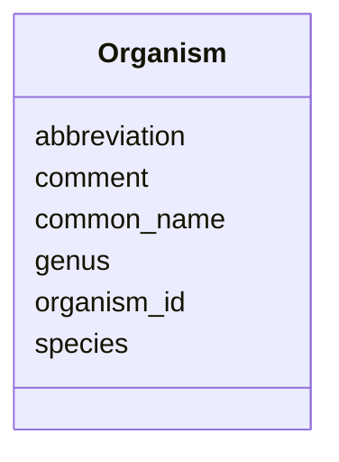

# Class: Organism 


_Plant organism/species._


URI: [https://w3id.org/jgi/phytozome/Organism](https://w3id.org/jgi/phytozome/Organism)





<!-- no inheritance hierarchy -->


## Slots

| Name | Cardinality and Range | Description | Inheritance |
| ---  | --- | --- | --- |
| [organism_id](organism_id.md) | 1 <br/> [Integer](Integer.md) |  | direct |
| [abbreviation](abbreviation.md) | 0..1 <br/> [String](String.md) |  | direct |
| [genus](genus.md) | 0..1 <br/> [String](String.md) |  | direct |
| [species](species.md) | 0..1 <br/> [String](String.md) |  | direct |
| [common_name](common_name.md) | 0..1 <br/> [String](String.md) |  | direct |
| [comment](comment.md) | 0..1 <br/> [String](String.md) |  | direct |


## Identifier and Mapping Information


### Annotations

| property | value |
| --- | --- |
| source_table | organism (inferred) |


### Schema Source


* from schema: https://w3id.org/jgi/phytozome


## Mappings

| Mapping Type | Mapped Value |
| ---  | ---  |
| self | https://w3id.org/jgi/phytozome/Organism |
| native | https://w3id.org/jgi/phytozome/Organism |


## LinkML Source

<!-- TODO: investigate https://stackoverflow.com/questions/37606292/how-to-create-tabbed-code-blocks-in-mkdocs-or-sphinx -->

### Direct

<details>
```yaml
name: Organism
annotations:
  source_table:
    tag: source_table
    value: organism (inferred)
description: Plant organism/species.
from_schema: https://w3id.org/jgi/phytozome
attributes:
  organism_id:
    name: organism_id
    from_schema: https://w3id.org/jgi/phytozome
    identifier: true
    domain_of:
    - Feature
    - Organism
    - CellLine
    range: integer
    required: true
  abbreviation:
    name: abbreviation
    from_schema: https://w3id.org/jgi/phytozome
    rank: 1000
    domain_of:
    - Organism
    range: string
  genus:
    name: genus
    from_schema: https://w3id.org/jgi/phytozome
    rank: 1000
    domain_of:
    - Organism
    range: string
  species:
    name: species
    from_schema: https://w3id.org/jgi/phytozome
    rank: 1000
    domain_of:
    - Organism
    range: string
  common_name:
    name: common_name
    from_schema: https://w3id.org/jgi/phytozome
    rank: 1000
    domain_of:
    - Organism
    range: string
  comment:
    name: comment
    from_schema: https://w3id.org/jgi/phytozome
    rank: 1000
    domain_of:
    - Organism
    range: string

```
</details>

### Induced

<details>
```yaml
name: Organism
annotations:
  source_table:
    tag: source_table
    value: organism (inferred)
description: Plant organism/species.
from_schema: https://w3id.org/jgi/phytozome
attributes:
  organism_id:
    name: organism_id
    from_schema: https://w3id.org/jgi/phytozome
    identifier: true
    alias: organism_id
    owner: Organism
    domain_of:
    - Feature
    - Organism
    - CellLine
    range: integer
    required: true
  abbreviation:
    name: abbreviation
    from_schema: https://w3id.org/jgi/phytozome
    rank: 1000
    alias: abbreviation
    owner: Organism
    domain_of:
    - Organism
    range: string
  genus:
    name: genus
    from_schema: https://w3id.org/jgi/phytozome
    rank: 1000
    alias: genus
    owner: Organism
    domain_of:
    - Organism
    range: string
  species:
    name: species
    from_schema: https://w3id.org/jgi/phytozome
    rank: 1000
    alias: species
    owner: Organism
    domain_of:
    - Organism
    range: string
  common_name:
    name: common_name
    from_schema: https://w3id.org/jgi/phytozome
    rank: 1000
    alias: common_name
    owner: Organism
    domain_of:
    - Organism
    range: string
  comment:
    name: comment
    from_schema: https://w3id.org/jgi/phytozome
    rank: 1000
    alias: comment
    owner: Organism
    domain_of:
    - Organism
    range: string

```
</details>