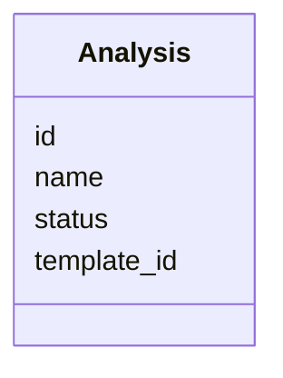

# Class: Analysis 


_Analysis workflow or pipeline run._


URI: [https://w3id.org/jgi/sdm_metadata/Analysis](https://w3id.org/jgi/sdm_metadata/Analysis)





<!-- no inheritance hierarchy -->


## Slots

| Name | Cardinality and Range | Description | Inheritance |
| ---  | --- | --- | --- |
| [id](id.md) | 1 <br/> [String](String.md) | Analysis identifier | direct |
| [name](name.md) | 0..1 <br/> [String](String.md) |  | direct |
| [template_id](template_id.md) | 0..1 <br/> [String](String.md) |  | direct |
| [status](status.md) | 0..1 <br/> [String](String.md) |  | direct |


## Identifier and Mapping Information


### Annotations

| property | value |
| --- | --- |
| source_table | analysis |


### Schema Source


* from schema: https://w3id.org/jgi/sdm_metadata


## Mappings

| Mapping Type | Mapped Value |
| ---  | ---  |
| self | https://w3id.org/jgi/sdm_metadata/Analysis |
| native | https://w3id.org/jgi/sdm_metadata/Analysis |


## LinkML Source

<!-- TODO: investigate https://stackoverflow.com/questions/37606292/how-to-create-tabbed-code-blocks-in-mkdocs-or-sphinx -->

### Direct

<details>
```yaml
name: Analysis
annotations:
  source_table:
    tag: source_table
    value: analysis
description: Analysis workflow or pipeline run.
from_schema: https://w3id.org/jgi/sdm_metadata
attributes:
  id:
    name: id
    description: Analysis identifier
    from_schema: https://w3id.org/jgi/sdm_metadata
    rank: 1000
    identifier: true
    domain_of:
    - Analysis
    - AnalysisTemplate
    - AnalysisTagTemplate
    - AnalysisPublishingFlags
    - AnalysisPlocations
    - AnalysisCallerWarnings
    - AnalysisMacro
    - Macro
    - DataStore
    - File
    - FileIngest
    - DeletedFile
    - DeletedAnalysis
    - Metadata
    - MetadataRefresh
    - NcbiSubmission
    - NcbiTaxon
    - NcbiWorker
    - SraSubmission
    - SraUnsubmittable
    - Publication
    - Service
    - ProcessService
    - Subscription
    - SubscriptionJira
    - Template
    - User
    - Email
    - Query
    range: string
    required: true
  name:
    name: name
    from_schema: https://w3id.org/jgi/sdm_metadata
    rank: 1000
    domain_of:
    - Analysis
    - AnalysisTemplate
    - AnalysisTagTemplate
    - Macro
    - DataStore
    - File
    - NcbiTaxon
    - Service
    - Template
    - Query
    range: string
  template_id:
    name: template_id
    comments:
    - Foreign key to AnalysisTemplate.id
    from_schema: https://w3id.org/jgi/sdm_metadata
    rank: 1000
    domain_of:
    - Analysis
    range: string
  status:
    name: status
    from_schema: https://w3id.org/jgi/sdm_metadata
    rank: 1000
    domain_of:
    - Analysis
    - FileIngest
    - NcbiSubmission
    - NcbiWorker
    - SraSubmission
    range: string

```
</details>

### Induced

<details>
```yaml
name: Analysis
annotations:
  source_table:
    tag: source_table
    value: analysis
description: Analysis workflow or pipeline run.
from_schema: https://w3id.org/jgi/sdm_metadata
attributes:
  id:
    name: id
    description: Analysis identifier
    from_schema: https://w3id.org/jgi/sdm_metadata
    rank: 1000
    identifier: true
    alias: id
    owner: Analysis
    domain_of:
    - Analysis
    - AnalysisTemplate
    - AnalysisTagTemplate
    - AnalysisPublishingFlags
    - AnalysisPlocations
    - AnalysisCallerWarnings
    - AnalysisMacro
    - Macro
    - DataStore
    - File
    - FileIngest
    - DeletedFile
    - DeletedAnalysis
    - Metadata
    - MetadataRefresh
    - NcbiSubmission
    - NcbiTaxon
    - NcbiWorker
    - SraSubmission
    - SraUnsubmittable
    - Publication
    - Service
    - ProcessService
    - Subscription
    - SubscriptionJira
    - Template
    - User
    - Email
    - Query
    range: string
  name:
    name: name
    from_schema: https://w3id.org/jgi/sdm_metadata
    rank: 1000
    alias: name
    owner: Analysis
    domain_of:
    - Analysis
    - AnalysisTemplate
    - AnalysisTagTemplate
    - Macro
    - DataStore
    - File
    - NcbiTaxon
    - Service
    - Template
    - Query
    range: string
  template_id:
    name: template_id
    comments:
    - Foreign key to AnalysisTemplate.id
    from_schema: https://w3id.org/jgi/sdm_metadata
    rank: 1000
    alias: template_id
    owner: Analysis
    domain_of:
    - Analysis
    range: string
  status:
    name: status
    from_schema: https://w3id.org/jgi/sdm_metadata
    rank: 1000
    alias: status
    owner: Analysis
    domain_of:
    - Analysis
    - FileIngest
    - NcbiSubmission
    - NcbiWorker
    - SraSubmission
    range: string

```
</details>