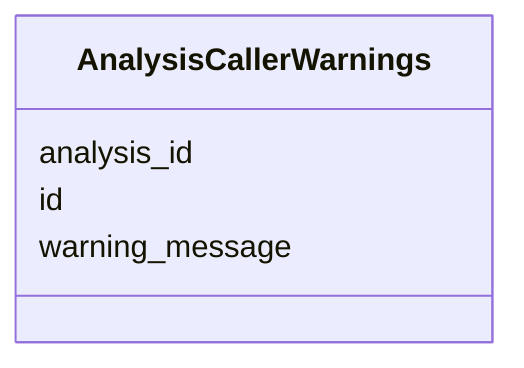

# Class: AnalysisCallerWarnings 


_Warnings from analysis callers/tools._


URI: [https://w3id.org/jgi/sdm_metadata/AnalysisCallerWarnings](https://w3id.org/jgi/sdm_metadata/AnalysisCallerWarnings)





<!-- no inheritance hierarchy -->


## Slots

| Name | Cardinality and Range | Description | Inheritance |
| ---  | --- | --- | --- |
| [id](id.md) | 1 <br/> [String](String.md) |  | direct |
| [analysis_id](analysis_id.md) | 0..1 <br/> [String](String.md) |  | direct |
| [warning_message](warning_message.md) | 0..1 <br/> [String](String.md) |  | direct |


## Identifier and Mapping Information


### Annotations

| property | value |
| --- | --- |
| source_table | analysis_caller_warnings |


### Schema Source


* from schema: https://w3id.org/jgi/sdm_metadata


## Mappings

| Mapping Type | Mapped Value |
| ---  | ---  |
| self | https://w3id.org/jgi/sdm_metadata/AnalysisCallerWarnings |
| native | https://w3id.org/jgi/sdm_metadata/AnalysisCallerWarnings |


## LinkML Source

<!-- TODO: investigate https://stackoverflow.com/questions/37606292/how-to-create-tabbed-code-blocks-in-mkdocs-or-sphinx -->

### Direct

<details>
```yaml
name: AnalysisCallerWarnings
annotations:
  source_table:
    tag: source_table
    value: analysis_caller_warnings
description: Warnings from analysis callers/tools.
from_schema: https://w3id.org/jgi/sdm_metadata
attributes:
  id:
    name: id
    from_schema: https://w3id.org/jgi/sdm_metadata
    identifier: true
    domain_of:
    - Analysis
    - AnalysisTemplate
    - AnalysisTagTemplate
    - AnalysisPublishingFlags
    - AnalysisPlocations
    - AnalysisCallerWarnings
    - AnalysisMacro
    - Macro
    - DataStore
    - File
    - FileIngest
    - DeletedFile
    - DeletedAnalysis
    - Metadata
    - MetadataRefresh
    - NcbiSubmission
    - NcbiTaxon
    - NcbiWorker
    - SraSubmission
    - SraUnsubmittable
    - Publication
    - Service
    - ProcessService
    - Subscription
    - SubscriptionJira
    - Template
    - User
    - Email
    - Query
    range: string
    required: true
  analysis_id:
    name: analysis_id
    from_schema: https://w3id.org/jgi/sdm_metadata
    domain_of:
    - AnalysisPublishingFlags
    - AnalysisPlocations
    - AnalysisCallerWarnings
    - NcbiSubmission
    range: string
  warning_message:
    name: warning_message
    from_schema: https://w3id.org/jgi/sdm_metadata
    rank: 1000
    domain_of:
    - AnalysisCallerWarnings
    range: string

```
</details>

### Induced

<details>
```yaml
name: AnalysisCallerWarnings
annotations:
  source_table:
    tag: source_table
    value: analysis_caller_warnings
description: Warnings from analysis callers/tools.
from_schema: https://w3id.org/jgi/sdm_metadata
attributes:
  id:
    name: id
    from_schema: https://w3id.org/jgi/sdm_metadata
    identifier: true
    alias: id
    owner: AnalysisCallerWarnings
    domain_of:
    - Analysis
    - AnalysisTemplate
    - AnalysisTagTemplate
    - AnalysisPublishingFlags
    - AnalysisPlocations
    - AnalysisCallerWarnings
    - AnalysisMacro
    - Macro
    - DataStore
    - File
    - FileIngest
    - DeletedFile
    - DeletedAnalysis
    - Metadata
    - MetadataRefresh
    - NcbiSubmission
    - NcbiTaxon
    - NcbiWorker
    - SraSubmission
    - SraUnsubmittable
    - Publication
    - Service
    - ProcessService
    - Subscription
    - SubscriptionJira
    - Template
    - User
    - Email
    - Query
    range: string
    required: true
  analysis_id:
    name: analysis_id
    from_schema: https://w3id.org/jgi/sdm_metadata
    alias: analysis_id
    owner: AnalysisCallerWarnings
    domain_of:
    - AnalysisPublishingFlags
    - AnalysisPlocations
    - AnalysisCallerWarnings
    - NcbiSubmission
    range: string
  warning_message:
    name: warning_message
    from_schema: https://w3id.org/jgi/sdm_metadata
    rank: 1000
    alias: warning_message
    owner: AnalysisCallerWarnings
    domain_of:
    - AnalysisCallerWarnings
    range: string

```
</details>