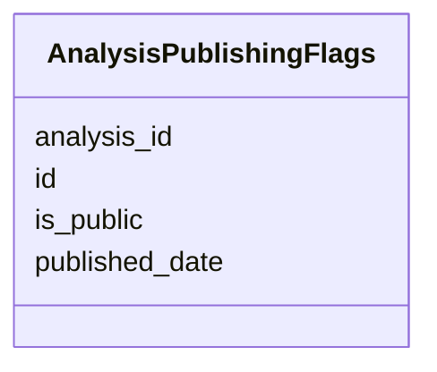

# Class: AnalysisPublishingFlags 


_Publishing status flags for analyses._


URI: [https://w3id.org/jgi/sdm_metadata/AnalysisPublishingFlags](https://w3id.org/jgi/sdm_metadata/AnalysisPublishingFlags)





<!-- no inheritance hierarchy -->


## Slots

| Name | Cardinality and Range | Description | Inheritance |
| ---  | --- | --- | --- |
| [id](id.md) | 1 <br/> [String](String.md) |  | direct |
| [analysis_id](analysis_id.md) | 0..1 <br/> [String](String.md) |  | direct |
| [is_public](is_public.md) | 0..1 <br/> [Boolean](Boolean.md) |  | direct |
| [published_date](published_date.md) | 0..1 <br/> [Datetime](Datetime.md) |  | direct |


## Identifier and Mapping Information


### Annotations

| property | value |
| --- | --- |
| source_table | analysis_publishingflags |


### Schema Source


* from schema: https://w3id.org/jgi/sdm_metadata


## Mappings

| Mapping Type | Mapped Value |
| ---  | ---  |
| self | https://w3id.org/jgi/sdm_metadata/AnalysisPublishingFlags |
| native | https://w3id.org/jgi/sdm_metadata/AnalysisPublishingFlags |


## LinkML Source

<!-- TODO: investigate https://stackoverflow.com/questions/37606292/how-to-create-tabbed-code-blocks-in-mkdocs-or-sphinx -->

### Direct

<details>
```yaml
name: AnalysisPublishingFlags
annotations:
  source_table:
    tag: source_table
    value: analysis_publishingflags
description: Publishing status flags for analyses.
from_schema: https://w3id.org/jgi/sdm_metadata
attributes:
  id:
    name: id
    from_schema: https://w3id.org/jgi/sdm_metadata
    identifier: true
    domain_of:
    - Analysis
    - AnalysisTemplate
    - AnalysisTagTemplate
    - AnalysisPublishingFlags
    - AnalysisPlocations
    - AnalysisCallerWarnings
    - AnalysisMacro
    - Macro
    - DataStore
    - File
    - FileIngest
    - DeletedFile
    - DeletedAnalysis
    - Metadata
    - MetadataRefresh
    - NcbiSubmission
    - NcbiTaxon
    - NcbiWorker
    - SraSubmission
    - SraUnsubmittable
    - Publication
    - Service
    - ProcessService
    - Subscription
    - SubscriptionJira
    - Template
    - User
    - Email
    - Query
    range: string
    required: true
  analysis_id:
    name: analysis_id
    comments:
    - Foreign key to Analysis.id
    from_schema: https://w3id.org/jgi/sdm_metadata
    rank: 1000
    domain_of:
    - AnalysisPublishingFlags
    - AnalysisPlocations
    - AnalysisCallerWarnings
    - NcbiSubmission
    range: string
  is_public:
    name: is_public
    from_schema: https://w3id.org/jgi/sdm_metadata
    rank: 1000
    domain_of:
    - AnalysisPublishingFlags
    range: boolean
  published_date:
    name: published_date
    from_schema: https://w3id.org/jgi/sdm_metadata
    rank: 1000
    domain_of:
    - AnalysisPublishingFlags
    range: datetime

```
</details>

### Induced

<details>
```yaml
name: AnalysisPublishingFlags
annotations:
  source_table:
    tag: source_table
    value: analysis_publishingflags
description: Publishing status flags for analyses.
from_schema: https://w3id.org/jgi/sdm_metadata
attributes:
  id:
    name: id
    from_schema: https://w3id.org/jgi/sdm_metadata
    identifier: true
    alias: id
    owner: AnalysisPublishingFlags
    domain_of:
    - Analysis
    - AnalysisTemplate
    - AnalysisTagTemplate
    - AnalysisPublishingFlags
    - AnalysisPlocations
    - AnalysisCallerWarnings
    - AnalysisMacro
    - Macro
    - DataStore
    - File
    - FileIngest
    - DeletedFile
    - DeletedAnalysis
    - Metadata
    - MetadataRefresh
    - NcbiSubmission
    - NcbiTaxon
    - NcbiWorker
    - SraSubmission
    - SraUnsubmittable
    - Publication
    - Service
    - ProcessService
    - Subscription
    - SubscriptionJira
    - Template
    - User
    - Email
    - Query
    range: string
    required: true
  analysis_id:
    name: analysis_id
    comments:
    - Foreign key to Analysis.id
    from_schema: https://w3id.org/jgi/sdm_metadata
    rank: 1000
    alias: analysis_id
    owner: AnalysisPublishingFlags
    domain_of:
    - AnalysisPublishingFlags
    - AnalysisPlocations
    - AnalysisCallerWarnings
    - NcbiSubmission
    range: string
  is_public:
    name: is_public
    from_schema: https://w3id.org/jgi/sdm_metadata
    rank: 1000
    alias: is_public
    owner: AnalysisPublishingFlags
    domain_of:
    - AnalysisPublishingFlags
    range: boolean
  published_date:
    name: published_date
    from_schema: https://w3id.org/jgi/sdm_metadata
    rank: 1000
    alias: published_date
    owner: AnalysisPublishingFlags
    domain_of:
    - AnalysisPublishingFlags
    range: datetime

```
</details>