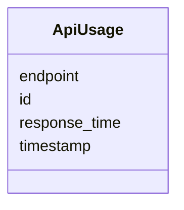

# Class: ApiUsage 


_API usage tracking._


URI: [https://w3id.org/jgi/smc/ApiUsage](https://w3id.org/jgi/smc/ApiUsage)





<!-- no inheritance hierarchy -->


## Slots

| Name | Cardinality and Range | Description | Inheritance |
| ---  | --- | --- | --- |
| [id](id.md) | 1 <br/> [Integer](Integer.md) |  | direct |
| [endpoint](endpoint.md) | 0..1 <br/> [String](String.md) |  | direct |
| [timestamp](timestamp.md) | 0..1 <br/> [Datetime](Datetime.md) |  | direct |
| [response_time](response_time.md) | 0..1 <br/> [Integer](Integer.md) |  | direct |


## Identifier and Mapping Information


### Annotations

| property | value |
| --- | --- |
| source_table | api_usage |


### Schema Source


* from schema: https://w3id.org/jgi/smc


## Mappings

| Mapping Type | Mapped Value |
| ---  | ---  |
| self | https://w3id.org/jgi/smc/ApiUsage |
| native | https://w3id.org/jgi/smc/ApiUsage |


## LinkML Source

<!-- TODO: investigate https://stackoverflow.com/questions/37606292/how-to-create-tabbed-code-blocks-in-mkdocs-or-sphinx -->

### Direct

<details>
```yaml
name: ApiUsage
annotations:
  source_table:
    tag: source_table
    value: api_usage
description: API usage tracking.
from_schema: https://w3id.org/jgi/smc
attributes:
  id:
    name: id
    from_schema: https://w3id.org/jgi/smc
    identifier: true
    domain_of:
    - BGC
    - BGCClass
    - BGCAnalysis
    - BGCAnalysisToSecmetFile
    - BGCAnnotation
    - AnalysisTool
    - Contig
    - Gene
    - Collection
    - CollectionMember
    - Comment
    - Blog
    - Activity
    - ApiUsage
    range: integer
    required: true
  endpoint:
    name: endpoint
    from_schema: https://w3id.org/jgi/smc
    rank: 1000
    domain_of:
    - ApiUsage
    range: string
  timestamp:
    name: timestamp
    from_schema: https://w3id.org/jgi/smc
    domain_of:
    - Activity
    - ApiUsage
    range: datetime
  response_time:
    name: response_time
    from_schema: https://w3id.org/jgi/smc
    rank: 1000
    domain_of:
    - ApiUsage
    range: integer

```
</details>

### Induced

<details>
```yaml
name: ApiUsage
annotations:
  source_table:
    tag: source_table
    value: api_usage
description: API usage tracking.
from_schema: https://w3id.org/jgi/smc
attributes:
  id:
    name: id
    from_schema: https://w3id.org/jgi/smc
    identifier: true
    alias: id
    owner: ApiUsage
    domain_of:
    - BGC
    - BGCClass
    - BGCAnalysis
    - BGCAnalysisToSecmetFile
    - BGCAnnotation
    - AnalysisTool
    - Contig
    - Gene
    - Collection
    - CollectionMember
    - Comment
    - Blog
    - Activity
    - ApiUsage
    range: integer
    required: true
  endpoint:
    name: endpoint
    from_schema: https://w3id.org/jgi/smc
    rank: 1000
    alias: endpoint
    owner: ApiUsage
    domain_of:
    - ApiUsage
    range: string
  timestamp:
    name: timestamp
    from_schema: https://w3id.org/jgi/smc
    alias: timestamp
    owner: ApiUsage
    domain_of:
    - Activity
    - ApiUsage
    range: datetime
  response_time:
    name: response_time
    from_schema: https://w3id.org/jgi/smc
    rank: 1000
    alias: response_time
    owner: ApiUsage
    domain_of:
    - ApiUsage
    range: integer

```
</details>