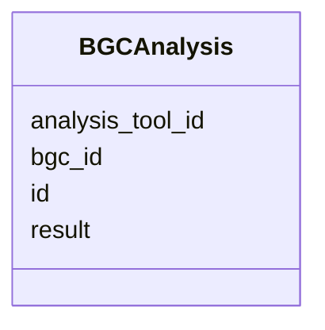

# Class: BGCAnalysis 


_Analysis result for a BGC._


URI: [https://w3id.org/jgi/smc/BGCAnalysis](https://w3id.org/jgi/smc/BGCAnalysis)





<!-- no inheritance hierarchy -->


## Slots

| Name | Cardinality and Range | Description | Inheritance |
| ---  | --- | --- | --- |
| [id](id.md) | 1 <br/> [Integer](Integer.md) |  | direct |
| [bgc_id](bgc_id.md) | 0..1 <br/> [Integer](Integer.md) |  | direct |
| [analysis_tool_id](analysis_tool_id.md) | 0..1 <br/> [Integer](Integer.md) |  | direct |
| [result](result.md) | 0..1 <br/> [String](String.md) |  | direct |


## Identifier and Mapping Information


### Annotations

| property | value |
| --- | --- |
| source_table | bgc_analysis |


### Schema Source


* from schema: https://w3id.org/jgi/smc


## Mappings

| Mapping Type | Mapped Value |
| ---  | ---  |
| self | https://w3id.org/jgi/smc/BGCAnalysis |
| native | https://w3id.org/jgi/smc/BGCAnalysis |


## LinkML Source

<!-- TODO: investigate https://stackoverflow.com/questions/37606292/how-to-create-tabbed-code-blocks-in-mkdocs-or-sphinx -->

### Direct

<details>
```yaml
name: BGCAnalysis
annotations:
  source_table:
    tag: source_table
    value: bgc_analysis
description: Analysis result for a BGC.
from_schema: https://w3id.org/jgi/smc
attributes:
  id:
    name: id
    from_schema: https://w3id.org/jgi/smc
    identifier: true
    domain_of:
    - BGC
    - BGCClass
    - BGCAnalysis
    - BGCAnalysisToSecmetFile
    - BGCAnnotation
    - AnalysisTool
    - Contig
    - Gene
    - Collection
    - CollectionMember
    - Comment
    - Blog
    - Activity
    - ApiUsage
    range: integer
    required: true
  bgc_id:
    name: bgc_id
    comments:
    - Foreign key to BGC.id
    from_schema: https://w3id.org/jgi/smc
    domain_of:
    - BGCToBGCClass
    - BGCAnalysis
    - BGCAnnotation
    range: integer
  analysis_tool_id:
    name: analysis_tool_id
    comments:
    - Foreign key to AnalysisTool.id
    from_schema: https://w3id.org/jgi/smc
    rank: 1000
    domain_of:
    - BGCAnalysis
    range: integer
  result:
    name: result
    from_schema: https://w3id.org/jgi/smc
    rank: 1000
    domain_of:
    - BGCAnalysis
    range: string

```
</details>

### Induced

<details>
```yaml
name: BGCAnalysis
annotations:
  source_table:
    tag: source_table
    value: bgc_analysis
description: Analysis result for a BGC.
from_schema: https://w3id.org/jgi/smc
attributes:
  id:
    name: id
    from_schema: https://w3id.org/jgi/smc
    identifier: true
    alias: id
    owner: BGCAnalysis
    domain_of:
    - BGC
    - BGCClass
    - BGCAnalysis
    - BGCAnalysisToSecmetFile
    - BGCAnnotation
    - AnalysisTool
    - Contig
    - Gene
    - Collection
    - CollectionMember
    - Comment
    - Blog
    - Activity
    - ApiUsage
    range: integer
    required: true
  bgc_id:
    name: bgc_id
    comments:
    - Foreign key to BGC.id
    from_schema: https://w3id.org/jgi/smc
    alias: bgc_id
    owner: BGCAnalysis
    domain_of:
    - BGCToBGCClass
    - BGCAnalysis
    - BGCAnnotation
    range: integer
  analysis_tool_id:
    name: analysis_tool_id
    comments:
    - Foreign key to AnalysisTool.id
    from_schema: https://w3id.org/jgi/smc
    rank: 1000
    alias: analysis_tool_id
    owner: BGCAnalysis
    domain_of:
    - BGCAnalysis
    range: integer
  result:
    name: result
    from_schema: https://w3id.org/jgi/smc
    rank: 1000
    alias: result
    owner: BGCAnalysis
    domain_of:
    - BGCAnalysis
    range: string

```
</details>