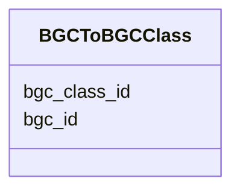

# Class: BGCToBGCClass 


_Many-to-many link between BGCs and their classes._


URI: [https://w3id.org/jgi/smc/BGCToBGCClass](https://w3id.org/jgi/smc/BGCToBGCClass)





<!-- no inheritance hierarchy -->


## Slots

| Name | Cardinality and Range | Description | Inheritance |
| ---  | --- | --- | --- |
| [bgc_id](bgc_id.md) | 0..1 <br/> [Integer](Integer.md) |  | direct |
| [bgc_class_id](bgc_class_id.md) | 0..1 <br/> [Integer](Integer.md) |  | direct |


## Identifier and Mapping Information


### Annotations

| property | value |
| --- | --- |
| source_table | bgc_to_bgc_class |


### Schema Source


* from schema: https://w3id.org/jgi/smc


## Mappings

| Mapping Type | Mapped Value |
| ---  | ---  |
| self | https://w3id.org/jgi/smc/BGCToBGCClass |
| native | https://w3id.org/jgi/smc/BGCToBGCClass |


## LinkML Source

<!-- TODO: investigate https://stackoverflow.com/questions/37606292/how-to-create-tabbed-code-blocks-in-mkdocs-or-sphinx -->

### Direct

<details>
```yaml
name: BGCToBGCClass
annotations:
  source_table:
    tag: source_table
    value: bgc_to_bgc_class
description: Many-to-many link between BGCs and their classes.
from_schema: https://w3id.org/jgi/smc
attributes:
  bgc_id:
    name: bgc_id
    comments:
    - Foreign key to BGC.id
    from_schema: https://w3id.org/jgi/smc
    rank: 1000
    domain_of:
    - BGCToBGCClass
    - BGCAnalysis
    - BGCAnnotation
    range: integer
  bgc_class_id:
    name: bgc_class_id
    comments:
    - Foreign key to BGCClass.id
    from_schema: https://w3id.org/jgi/smc
    rank: 1000
    domain_of:
    - BGCToBGCClass
    range: integer

```
</details>

### Induced

<details>
```yaml
name: BGCToBGCClass
annotations:
  source_table:
    tag: source_table
    value: bgc_to_bgc_class
description: Many-to-many link between BGCs and their classes.
from_schema: https://w3id.org/jgi/smc
attributes:
  bgc_id:
    name: bgc_id
    comments:
    - Foreign key to BGC.id
    from_schema: https://w3id.org/jgi/smc
    rank: 1000
    alias: bgc_id
    owner: BGCToBGCClass
    domain_of:
    - BGCToBGCClass
    - BGCAnalysis
    - BGCAnnotation
    range: integer
  bgc_class_id:
    name: bgc_class_id
    comments:
    - Foreign key to BGCClass.id
    from_schema: https://w3id.org/jgi/smc
    rank: 1000
    alias: bgc_class_id
    owner: BGCToBGCClass
    domain_of:
    - BGCToBGCClass
    range: integer

```
</details>