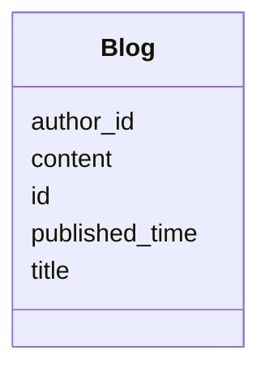

# Class: Blog 


_Blog post about secondary metabolites._


URI: [https://w3id.org/jgi/smc/Blog](https://w3id.org/jgi/smc/Blog)





<!-- no inheritance hierarchy -->


## Slots

| Name | Cardinality and Range | Description | Inheritance |
| ---  | --- | --- | --- |
| [id](id.md) | 1 <br/> [Integer](Integer.md) |  | direct |
| [title](title.md) | 0..1 <br/> [String](String.md) |  | direct |
| [content](content.md) | 0..1 <br/> [String](String.md) |  | direct |
| [author_id](author_id.md) | 0..1 <br/> [Integer](Integer.md) |  | direct |
| [published_time](published_time.md) | 0..1 <br/> [Datetime](Datetime.md) |  | direct |


## Identifier and Mapping Information


### Annotations

| property | value |
| --- | --- |
| source_table | blog |


### Schema Source


* from schema: https://w3id.org/jgi/smc


## Mappings

| Mapping Type | Mapped Value |
| ---  | ---  |
| self | https://w3id.org/jgi/smc/Blog |
| native | https://w3id.org/jgi/smc/Blog |


## LinkML Source

<!-- TODO: investigate https://stackoverflow.com/questions/37606292/how-to-create-tabbed-code-blocks-in-mkdocs-or-sphinx -->

### Direct

<details>
```yaml
name: Blog
annotations:
  source_table:
    tag: source_table
    value: blog
description: Blog post about secondary metabolites.
from_schema: https://w3id.org/jgi/smc
attributes:
  id:
    name: id
    from_schema: https://w3id.org/jgi/smc
    identifier: true
    domain_of:
    - BGC
    - BGCClass
    - BGCAnalysis
    - BGCAnalysisToSecmetFile
    - BGCAnnotation
    - AnalysisTool
    - Contig
    - Gene
    - Collection
    - CollectionMember
    - Comment
    - Blog
    - Activity
    - ApiUsage
    range: integer
    required: true
  title:
    name: title
    from_schema: https://w3id.org/jgi/smc
    rank: 1000
    domain_of:
    - Blog
    range: string
  content:
    name: content
    from_schema: https://w3id.org/jgi/smc
    rank: 1000
    domain_of:
    - Blog
    range: string
  author_id:
    name: author_id
    from_schema: https://w3id.org/jgi/smc
    rank: 1000
    domain_of:
    - Blog
    range: integer
  published_time:
    name: published_time
    from_schema: https://w3id.org/jgi/smc
    rank: 1000
    domain_of:
    - Blog
    range: datetime

```
</details>

### Induced

<details>
```yaml
name: Blog
annotations:
  source_table:
    tag: source_table
    value: blog
description: Blog post about secondary metabolites.
from_schema: https://w3id.org/jgi/smc
attributes:
  id:
    name: id
    from_schema: https://w3id.org/jgi/smc
    identifier: true
    alias: id
    owner: Blog
    domain_of:
    - BGC
    - BGCClass
    - BGCAnalysis
    - BGCAnalysisToSecmetFile
    - BGCAnnotation
    - AnalysisTool
    - Contig
    - Gene
    - Collection
    - CollectionMember
    - Comment
    - Blog
    - Activity
    - ApiUsage
    range: integer
    required: true
  title:
    name: title
    from_schema: https://w3id.org/jgi/smc
    rank: 1000
    alias: title
    owner: Blog
    domain_of:
    - Blog
    range: string
  content:
    name: content
    from_schema: https://w3id.org/jgi/smc
    rank: 1000
    alias: content
    owner: Blog
    domain_of:
    - Blog
    range: string
  author_id:
    name: author_id
    from_schema: https://w3id.org/jgi/smc
    rank: 1000
    alias: author_id
    owner: Blog
    domain_of:
    - Blog
    range: integer
  published_time:
    name: published_time
    from_schema: https://w3id.org/jgi/smc
    rank: 1000
    alias: published_time
    owner: Blog
    domain_of:
    - Blog
    range: datetime

```
</details>