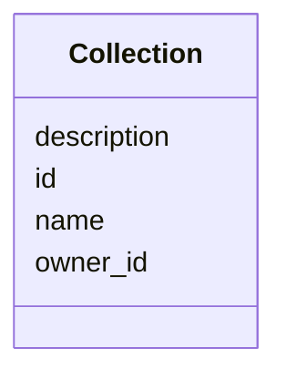

# Class: Collection 


_Collection of BGCs or genomes._


URI: [https://w3id.org/jgi/smc/Collection](https://w3id.org/jgi/smc/Collection)





<!-- no inheritance hierarchy -->


## Slots

| Name | Cardinality and Range | Description | Inheritance |
| ---  | --- | --- | --- |
| [id](id.md) | 1 <br/> [Integer](Integer.md) |  | direct |
| [name](name.md) | 0..1 <br/> [String](String.md) |  | direct |
| [description](description.md) | 0..1 <br/> [String](String.md) |  | direct |
| [owner_id](owner_id.md) | 0..1 <br/> [Integer](Integer.md) |  | direct |


## Identifier and Mapping Information


### Annotations

| property | value |
| --- | --- |
| source_table | collection |


### Schema Source


* from schema: https://w3id.org/jgi/smc


## Mappings

| Mapping Type | Mapped Value |
| ---  | ---  |
| self | https://w3id.org/jgi/smc/Collection |
| native | https://w3id.org/jgi/smc/Collection |


## LinkML Source

<!-- TODO: investigate https://stackoverflow.com/questions/37606292/how-to-create-tabbed-code-blocks-in-mkdocs-or-sphinx -->

### Direct

<details>
```yaml
name: Collection
annotations:
  source_table:
    tag: source_table
    value: collection
description: Collection of BGCs or genomes.
from_schema: https://w3id.org/jgi/smc
attributes:
  id:
    name: id
    from_schema: https://w3id.org/jgi/smc
    identifier: true
    domain_of:
    - BGC
    - BGCClass
    - BGCAnalysis
    - BGCAnalysisToSecmetFile
    - BGCAnnotation
    - AnalysisTool
    - Contig
    - Gene
    - Collection
    - CollectionMember
    - Comment
    - Blog
    - Activity
    - ApiUsage
    range: integer
    required: true
  name:
    name: name
    from_schema: https://w3id.org/jgi/smc
    domain_of:
    - BGC
    - BGCClass
    - AnalysisTool
    - Contig
    - Collection
    range: string
  description:
    name: description
    from_schema: https://w3id.org/jgi/smc
    domain_of:
    - BGCClass
    - Collection
    range: string
  owner_id:
    name: owner_id
    from_schema: https://w3id.org/jgi/smc
    rank: 1000
    domain_of:
    - Collection
    range: integer

```
</details>

### Induced

<details>
```yaml
name: Collection
annotations:
  source_table:
    tag: source_table
    value: collection
description: Collection of BGCs or genomes.
from_schema: https://w3id.org/jgi/smc
attributes:
  id:
    name: id
    from_schema: https://w3id.org/jgi/smc
    identifier: true
    alias: id
    owner: Collection
    domain_of:
    - BGC
    - BGCClass
    - BGCAnalysis
    - BGCAnalysisToSecmetFile
    - BGCAnnotation
    - AnalysisTool
    - Contig
    - Gene
    - Collection
    - CollectionMember
    - Comment
    - Blog
    - Activity
    - ApiUsage
    range: integer
    required: true
  name:
    name: name
    from_schema: https://w3id.org/jgi/smc
    alias: name
    owner: Collection
    domain_of:
    - BGC
    - BGCClass
    - AnalysisTool
    - Contig
    - Collection
    range: string
  description:
    name: description
    from_schema: https://w3id.org/jgi/smc
    alias: description
    owner: Collection
    domain_of:
    - BGCClass
    - Collection
    range: string
  owner_id:
    name: owner_id
    from_schema: https://w3id.org/jgi/smc
    rank: 1000
    alias: owner_id
    owner: Collection
    domain_of:
    - Collection
    range: integer

```
</details>