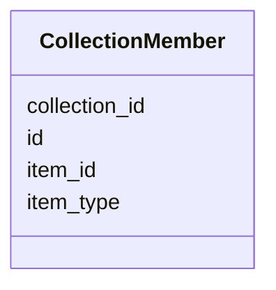

# Class: CollectionMember 


_Member of a collection._


URI: [https://w3id.org/jgi/smc/CollectionMember](https://w3id.org/jgi/smc/CollectionMember)





<!-- no inheritance hierarchy -->


## Slots

| Name | Cardinality and Range | Description | Inheritance |
| ---  | --- | --- | --- |
| [id](id.md) | 1 <br/> [Integer](Integer.md) |  | direct |
| [collection_id](collection_id.md) | 0..1 <br/> [Integer](Integer.md) |  | direct |
| [item_type](item_type.md) | 0..1 <br/> [String](String.md) | Type of item (bgc, genome, etc | direct |
| [item_id](item_id.md) | 0..1 <br/> [Integer](Integer.md) |  | direct |


## Identifier and Mapping Information


### Annotations

| property | value |
| --- | --- |
| source_table | collection_members |


### Schema Source


* from schema: https://w3id.org/jgi/smc


## Mappings

| Mapping Type | Mapped Value |
| ---  | ---  |
| self | https://w3id.org/jgi/smc/CollectionMember |
| native | https://w3id.org/jgi/smc/CollectionMember |


## LinkML Source

<!-- TODO: investigate https://stackoverflow.com/questions/37606292/how-to-create-tabbed-code-blocks-in-mkdocs-or-sphinx -->

### Direct

<details>
```yaml
name: CollectionMember
annotations:
  source_table:
    tag: source_table
    value: collection_members
description: Member of a collection.
from_schema: https://w3id.org/jgi/smc
attributes:
  id:
    name: id
    from_schema: https://w3id.org/jgi/smc
    identifier: true
    domain_of:
    - BGC
    - BGCClass
    - BGCAnalysis
    - BGCAnalysisToSecmetFile
    - BGCAnnotation
    - AnalysisTool
    - Contig
    - Gene
    - Collection
    - CollectionMember
    - Comment
    - Blog
    - Activity
    - ApiUsage
    range: integer
    required: true
  collection_id:
    name: collection_id
    comments:
    - Foreign key to Collection.id
    from_schema: https://w3id.org/jgi/smc
    rank: 1000
    domain_of:
    - CollectionMember
    range: integer
  item_type:
    name: item_type
    description: Type of item (bgc, genome, etc.)
    from_schema: https://w3id.org/jgi/smc
    rank: 1000
    domain_of:
    - CollectionMember
    range: string
  item_id:
    name: item_id
    from_schema: https://w3id.org/jgi/smc
    rank: 1000
    domain_of:
    - CollectionMember
    range: integer

```
</details>

### Induced

<details>
```yaml
name: CollectionMember
annotations:
  source_table:
    tag: source_table
    value: collection_members
description: Member of a collection.
from_schema: https://w3id.org/jgi/smc
attributes:
  id:
    name: id
    from_schema: https://w3id.org/jgi/smc
    identifier: true
    alias: id
    owner: CollectionMember
    domain_of:
    - BGC
    - BGCClass
    - BGCAnalysis
    - BGCAnalysisToSecmetFile
    - BGCAnnotation
    - AnalysisTool
    - Contig
    - Gene
    - Collection
    - CollectionMember
    - Comment
    - Blog
    - Activity
    - ApiUsage
    range: integer
    required: true
  collection_id:
    name: collection_id
    comments:
    - Foreign key to Collection.id
    from_schema: https://w3id.org/jgi/smc
    rank: 1000
    alias: collection_id
    owner: CollectionMember
    domain_of:
    - CollectionMember
    range: integer
  item_type:
    name: item_type
    description: Type of item (bgc, genome, etc.)
    from_schema: https://w3id.org/jgi/smc
    rank: 1000
    alias: item_type
    owner: CollectionMember
    domain_of:
    - CollectionMember
    range: string
  item_id:
    name: item_id
    from_schema: https://w3id.org/jgi/smc
    rank: 1000
    alias: item_id
    owner: CollectionMember
    domain_of:
    - CollectionMember
    range: integer

```
</details>