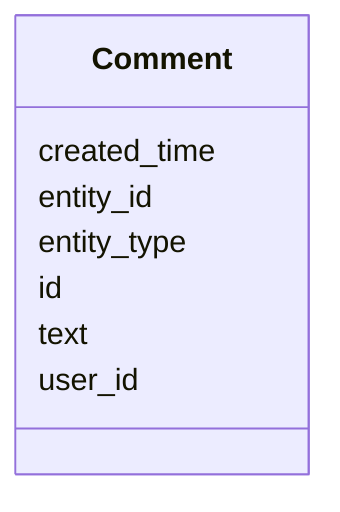

# Class: Comment 


_User comment on a BGC or other entity._


URI: [https://w3id.org/jgi/smc/Comment](https://w3id.org/jgi/smc/Comment)





<!-- no inheritance hierarchy -->


## Slots

| Name | Cardinality and Range | Description | Inheritance |
| ---  | --- | --- | --- |
| [id](id.md) | 1 <br/> [Integer](Integer.md) |  | direct |
| [entity_type](entity_type.md) | 0..1 <br/> [String](String.md) |  | direct |
| [entity_id](entity_id.md) | 0..1 <br/> [Integer](Integer.md) |  | direct |
| [user_id](user_id.md) | 0..1 <br/> [Integer](Integer.md) |  | direct |
| [text](text.md) | 0..1 <br/> [String](String.md) |  | direct |
| [created_time](created_time.md) | 0..1 <br/> [Datetime](Datetime.md) |  | direct |


## Identifier and Mapping Information


### Annotations

| property | value |
| --- | --- |
| source_table | comment |


### Schema Source


* from schema: https://w3id.org/jgi/smc


## Mappings

| Mapping Type | Mapped Value |
| ---  | ---  |
| self | https://w3id.org/jgi/smc/Comment |
| native | https://w3id.org/jgi/smc/Comment |


## LinkML Source

<!-- TODO: investigate https://stackoverflow.com/questions/37606292/how-to-create-tabbed-code-blocks-in-mkdocs-or-sphinx -->

### Direct

<details>
```yaml
name: Comment
annotations:
  source_table:
    tag: source_table
    value: comment
description: User comment on a BGC or other entity.
from_schema: https://w3id.org/jgi/smc
attributes:
  id:
    name: id
    from_schema: https://w3id.org/jgi/smc
    identifier: true
    domain_of:
    - BGC
    - BGCClass
    - BGCAnalysis
    - BGCAnalysisToSecmetFile
    - BGCAnnotation
    - AnalysisTool
    - Contig
    - Gene
    - Collection
    - CollectionMember
    - Comment
    - Blog
    - Activity
    - ApiUsage
    range: integer
    required: true
  entity_type:
    name: entity_type
    from_schema: https://w3id.org/jgi/smc
    rank: 1000
    domain_of:
    - Comment
    range: string
  entity_id:
    name: entity_id
    from_schema: https://w3id.org/jgi/smc
    rank: 1000
    domain_of:
    - Comment
    range: integer
  user_id:
    name: user_id
    from_schema: https://w3id.org/jgi/smc
    rank: 1000
    domain_of:
    - Comment
    - Activity
    range: integer
  text:
    name: text
    from_schema: https://w3id.org/jgi/smc
    rank: 1000
    domain_of:
    - Comment
    range: string
  created_time:
    name: created_time
    from_schema: https://w3id.org/jgi/smc
    rank: 1000
    domain_of:
    - Comment
    range: datetime

```
</details>

### Induced

<details>
```yaml
name: Comment
annotations:
  source_table:
    tag: source_table
    value: comment
description: User comment on a BGC or other entity.
from_schema: https://w3id.org/jgi/smc
attributes:
  id:
    name: id
    from_schema: https://w3id.org/jgi/smc
    identifier: true
    alias: id
    owner: Comment
    domain_of:
    - BGC
    - BGCClass
    - BGCAnalysis
    - BGCAnalysisToSecmetFile
    - BGCAnnotation
    - AnalysisTool
    - Contig
    - Gene
    - Collection
    - CollectionMember
    - Comment
    - Blog
    - Activity
    - ApiUsage
    range: integer
    required: true
  entity_type:
    name: entity_type
    from_schema: https://w3id.org/jgi/smc
    rank: 1000
    alias: entity_type
    owner: Comment
    domain_of:
    - Comment
    range: string
  entity_id:
    name: entity_id
    from_schema: https://w3id.org/jgi/smc
    rank: 1000
    alias: entity_id
    owner: Comment
    domain_of:
    - Comment
    range: integer
  user_id:
    name: user_id
    from_schema: https://w3id.org/jgi/smc
    rank: 1000
    alias: user_id
    owner: Comment
    domain_of:
    - Comment
    - Activity
    range: integer
  text:
    name: text
    from_schema: https://w3id.org/jgi/smc
    rank: 1000
    alias: text
    owner: Comment
    domain_of:
    - Comment
    range: string
  created_time:
    name: created_time
    from_schema: https://w3id.org/jgi/smc
    rank: 1000
    alias: created_time
    owner: Comment
    domain_of:
    - Comment
    range: datetime

```
</details>