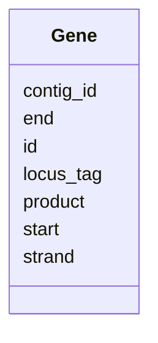

# Class: Gene 


_Gene record. Note: Multiple gene_N tables exist for partitioning._


URI: [https://w3id.org/jgi/smc/Gene](https://w3id.org/jgi/smc/Gene)





<!-- no inheritance hierarchy -->


## Slots

| Name | Cardinality and Range | Description | Inheritance |
| ---  | --- | --- | --- |
| [id](id.md) | 1 <br/> [Integer](Integer.md) |  | direct |
| [locus_tag](locus_tag.md) | 0..1 <br/> [String](String.md) |  | direct |
| [contig_id](contig_id.md) | 0..1 <br/> [Integer](Integer.md) |  | direct |
| [start](start.md) | 0..1 <br/> [Integer](Integer.md) |  | direct |
| [end](end.md) | 0..1 <br/> [Integer](Integer.md) |  | direct |
| [strand](strand.md) | 0..1 <br/> [Integer](Integer.md) |  | direct |
| [product](product.md) | 0..1 <br/> [String](String.md) | Gene product annotation | direct |


## Identifier and Mapping Information


### Annotations

| property | value |
| --- | --- |
| source_table | gene |


### Schema Source


* from schema: https://w3id.org/jgi/smc


## Mappings

| Mapping Type | Mapped Value |
| ---  | ---  |
| self | https://w3id.org/jgi/smc/Gene |
| native | https://w3id.org/jgi/smc/Gene |


## LinkML Source

<!-- TODO: investigate https://stackoverflow.com/questions/37606292/how-to-create-tabbed-code-blocks-in-mkdocs-or-sphinx -->

### Direct

<details>
```yaml
name: Gene
annotations:
  source_table:
    tag: source_table
    value: gene
description: 'Gene record. Note: Multiple gene_N tables exist for partitioning.'
from_schema: https://w3id.org/jgi/smc
attributes:
  id:
    name: id
    from_schema: https://w3id.org/jgi/smc
    identifier: true
    domain_of:
    - BGC
    - BGCClass
    - BGCAnalysis
    - BGCAnalysisToSecmetFile
    - BGCAnnotation
    - AnalysisTool
    - Contig
    - Gene
    - Collection
    - CollectionMember
    - Comment
    - Blog
    - Activity
    - ApiUsage
    range: integer
    required: true
  locus_tag:
    name: locus_tag
    from_schema: https://w3id.org/jgi/smc
    rank: 1000
    domain_of:
    - Gene
    range: string
  contig_id:
    name: contig_id
    comments:
    - Foreign key to Contig.id
    from_schema: https://w3id.org/jgi/smc
    domain_of:
    - BGC
    - Gene
    range: integer
  start:
    name: start
    from_schema: https://w3id.org/jgi/smc
    domain_of:
    - BGC
    - Gene
    range: integer
  end:
    name: end
    from_schema: https://w3id.org/jgi/smc
    domain_of:
    - BGC
    - Gene
    range: integer
  strand:
    name: strand
    from_schema: https://w3id.org/jgi/smc
    domain_of:
    - BGC
    - Gene
    range: integer
  product:
    name: product
    description: Gene product annotation
    from_schema: https://w3id.org/jgi/smc
    rank: 1000
    domain_of:
    - Gene
    range: string

```
</details>

### Induced

<details>
```yaml
name: Gene
annotations:
  source_table:
    tag: source_table
    value: gene
description: 'Gene record. Note: Multiple gene_N tables exist for partitioning.'
from_schema: https://w3id.org/jgi/smc
attributes:
  id:
    name: id
    from_schema: https://w3id.org/jgi/smc
    identifier: true
    alias: id
    owner: Gene
    domain_of:
    - BGC
    - BGCClass
    - BGCAnalysis
    - BGCAnalysisToSecmetFile
    - BGCAnnotation
    - AnalysisTool
    - Contig
    - Gene
    - Collection
    - CollectionMember
    - Comment
    - Blog
    - Activity
    - ApiUsage
    range: integer
    required: true
  locus_tag:
    name: locus_tag
    from_schema: https://w3id.org/jgi/smc
    rank: 1000
    alias: locus_tag
    owner: Gene
    domain_of:
    - Gene
    range: string
  contig_id:
    name: contig_id
    comments:
    - Foreign key to Contig.id
    from_schema: https://w3id.org/jgi/smc
    alias: contig_id
    owner: Gene
    domain_of:
    - BGC
    - Gene
    range: integer
  start:
    name: start
    from_schema: https://w3id.org/jgi/smc
    alias: start
    owner: Gene
    domain_of:
    - BGC
    - Gene
    range: integer
  end:
    name: end
    from_schema: https://w3id.org/jgi/smc
    alias: end
    owner: Gene
    domain_of:
    - BGC
    - Gene
    range: integer
  strand:
    name: strand
    from_schema: https://w3id.org/jgi/smc
    alias: strand
    owner: Gene
    domain_of:
    - BGC
    - Gene
    range: integer
  product:
    name: product
    description: Gene product annotation
    from_schema: https://w3id.org/jgi/smc
    rank: 1000
    alias: product
    owner: Gene
    domain_of:
    - Gene
    range: string

```
</details>