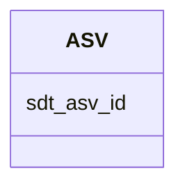

# Class: ASV 


_Amplicon Sequence Variant from 16S rRNA gene sequencing. Exact sequence variants without clustering._


URI: [https://w3id.org/kbase/enigma_coral/ASV](https://w3id.org/kbase/enigma_coral/ASV)





<!-- no inheritance hierarchy -->


## Slots

| Name | Cardinality and Range | Description | Inheritance |
| ---  | --- | --- | --- |
| [sdt_asv_id](sdt_asv_id.md) | 1 <br/> [String](String.md) | ASV identifier | direct |


## Identifier and Mapping Information


### Annotations

| property | value |
| --- | --- |
| source_table | sdt_asv |


### Schema Source


* from schema: https://w3id.org/kbase/enigma_coral


## Mappings

| Mapping Type | Mapped Value |
| ---  | ---  |
| self | https://w3id.org/kbase/enigma_coral/ASV |
| native | https://w3id.org/kbase/enigma_coral/ASV |


## LinkML Source

<!-- TODO: investigate https://stackoverflow.com/questions/37606292/how-to-create-tabbed-code-blocks-in-mkdocs-or-sphinx -->

### Direct

<details>
```yaml
name: ASV
annotations:
  source_table:
    tag: source_table
    value: sdt_asv
description: Amplicon Sequence Variant from 16S rRNA gene sequencing. Exact sequence
  variants without clustering.
from_schema: https://w3id.org/kbase/enigma_coral
attributes:
  sdt_asv_id:
    name: sdt_asv_id
    description: ASV identifier
    from_schema: https://w3id.org/kbase/enigma_coral
    rank: 1000
    identifier: true
    domain_of:
    - ASV
    range: string
    required: true

```
</details>

### Induced

<details>
```yaml
name: ASV
annotations:
  source_table:
    tag: source_table
    value: sdt_asv
description: Amplicon Sequence Variant from 16S rRNA gene sequencing. Exact sequence
  variants without clustering.
from_schema: https://w3id.org/kbase/enigma_coral
attributes:
  sdt_asv_id:
    name: sdt_asv_id
    description: ASV identifier
    from_schema: https://w3id.org/kbase/enigma_coral
    rank: 1000
    identifier: true
    alias: sdt_asv_id
    owner: ASV
    domain_of:
    - ASV
    range: string
    required: true

```
</details>