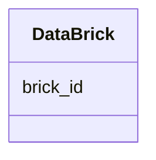

# Class: DataBrick 


_Data brick for array/matrix data storage (ddt_brick* tables). Used for efficient storage of multi-dimensional data like abundance matrices._


URI: [https://w3id.org/kbase/enigma_coral/DataBrick](https://w3id.org/kbase/enigma_coral/DataBrick)





<!-- no inheritance hierarchy -->


## Slots

| Name | Cardinality and Range | Description | Inheritance |
| ---  | --- | --- | --- |
| [brick_id](brick_id.md) | 1 <br/> [String](String.md) | Data brick identifier | direct |


## Identifier and Mapping Information


### Annotations

| property | value |
| --- | --- |
| source_table | ddt_brick* |


### Schema Source


* from schema: https://w3id.org/kbase/enigma_coral


## Mappings

| Mapping Type | Mapped Value |
| ---  | ---  |
| self | https://w3id.org/kbase/enigma_coral/DataBrick |
| native | https://w3id.org/kbase/enigma_coral/DataBrick |


## LinkML Source

<!-- TODO: investigate https://stackoverflow.com/questions/37606292/how-to-create-tabbed-code-blocks-in-mkdocs-or-sphinx -->

### Direct

<details>
```yaml
name: DataBrick
annotations:
  source_table:
    tag: source_table
    value: ddt_brick*
description: Data brick for array/matrix data storage (ddt_brick* tables). Used for
  efficient storage of multi-dimensional data like abundance matrices.
from_schema: https://w3id.org/kbase/enigma_coral
attributes:
  brick_id:
    name: brick_id
    description: Data brick identifier
    from_schema: https://w3id.org/kbase/enigma_coral
    rank: 1000
    identifier: true
    domain_of:
    - DataBrick
    range: string
    required: true

```
</details>

### Induced

<details>
```yaml
name: DataBrick
annotations:
  source_table:
    tag: source_table
    value: ddt_brick*
description: Data brick for array/matrix data storage (ddt_brick* tables). Used for
  efficient storage of multi-dimensional data like abundance matrices.
from_schema: https://w3id.org/kbase/enigma_coral
attributes:
  brick_id:
    name: brick_id
    description: Data brick identifier
    from_schema: https://w3id.org/kbase/enigma_coral
    rank: 1000
    identifier: true
    alias: brick_id
    owner: DataBrick
    domain_of:
    - DataBrick
    range: string
    required: true

```
</details>