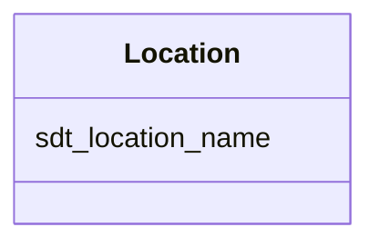

# Class: Location 


_Sampling location (groundwater monitoring well)._


URI: [https://w3id.org/kbase/enigma_coral/Location](https://w3id.org/kbase/enigma_coral/Location)





<!-- no inheritance hierarchy -->


## Slots

| Name | Cardinality and Range | Description | Inheritance |
| ---  | --- | --- | --- |
| [sdt_location_name](sdt_location_name.md) | 1 <br/> [String](String.md) | Location/well identifier | direct |


## Identifier and Mapping Information


### Annotations

| property | value |
| --- | --- |
| source_table | sdt_location |


### Schema Source


* from schema: https://w3id.org/kbase/enigma_coral


## Mappings

| Mapping Type | Mapped Value |
| ---  | ---  |
| self | https://w3id.org/kbase/enigma_coral/Location |
| native | https://w3id.org/kbase/enigma_coral/Location |


## LinkML Source

<!-- TODO: investigate https://stackoverflow.com/questions/37606292/how-to-create-tabbed-code-blocks-in-mkdocs-or-sphinx -->

### Direct

<details>
```yaml
name: Location
annotations:
  source_table:
    tag: source_table
    value: sdt_location
description: Sampling location (groundwater monitoring well).
from_schema: https://w3id.org/kbase/enigma_coral
attributes:
  sdt_location_name:
    name: sdt_location_name
    description: Location/well identifier
    examples:
    - value: EU02
    - value: EU03
    from_schema: https://w3id.org/kbase/enigma_coral
    identifier: true
    domain_of:
    - Sample
    - Location
    range: string
    required: true

```
</details>

### Induced

<details>
```yaml
name: Location
annotations:
  source_table:
    tag: source_table
    value: sdt_location
description: Sampling location (groundwater monitoring well).
from_schema: https://w3id.org/kbase/enigma_coral
attributes:
  sdt_location_name:
    name: sdt_location_name
    description: Location/well identifier
    examples:
    - value: EU02
    - value: EU03
    from_schema: https://w3id.org/kbase/enigma_coral
    identifier: true
    alias: sdt_location_name
    owner: Location
    domain_of:
    - Sample
    - Location
    range: string
    required: true

```
</details>