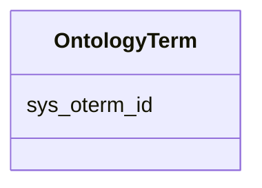

# Class: OntologyTerm 


_System ontology term (ENVO, MIxS, etc.) for standardized annotations._


URI: [https://w3id.org/kbase/enigma_coral/OntologyTerm](https://w3id.org/kbase/enigma_coral/OntologyTerm)





<!-- no inheritance hierarchy -->


## Slots

| Name | Cardinality and Range | Description | Inheritance |
| ---  | --- | --- | --- |
| [sys_oterm_id](sys_oterm_id.md) | 1 <br/> [String](String.md) | Ontology term ID (CURIE format) | direct |


## Identifier and Mapping Information


### Annotations

| property | value |
| --- | --- |
| source_table | sys_oterm |


### Schema Source


* from schema: https://w3id.org/kbase/enigma_coral


## Mappings

| Mapping Type | Mapped Value |
| ---  | ---  |
| self | https://w3id.org/kbase/enigma_coral/OntologyTerm |
| native | https://w3id.org/kbase/enigma_coral/OntologyTerm |


## LinkML Source

<!-- TODO: investigate https://stackoverflow.com/questions/37606292/how-to-create-tabbed-code-blocks-in-mkdocs-or-sphinx -->

### Direct

<details>
```yaml
name: OntologyTerm
annotations:
  source_table:
    tag: source_table
    value: sys_oterm
description: System ontology term (ENVO, MIxS, etc.) for standardized annotations.
from_schema: https://w3id.org/kbase/enigma_coral
attributes:
  sys_oterm_id:
    name: sys_oterm_id
    description: Ontology term ID (CURIE format)
    examples:
    - value: ENVO:00002041
    - value: MIxS:0000017
    from_schema: https://w3id.org/kbase/enigma_coral
    rank: 1000
    identifier: true
    domain_of:
    - OntologyTerm
    range: string
    required: true

```
</details>

### Induced

<details>
```yaml
name: OntologyTerm
annotations:
  source_table:
    tag: source_table
    value: sys_oterm
description: System ontology term (ENVO, MIxS, etc.) for standardized annotations.
from_schema: https://w3id.org/kbase/enigma_coral
attributes:
  sys_oterm_id:
    name: sys_oterm_id
    description: Ontology term ID (CURIE format)
    examples:
    - value: ENVO:00002041
    - value: MIxS:0000017
    from_schema: https://w3id.org/kbase/enigma_coral
    rank: 1000
    identifier: true
    alias: sys_oterm_id
    owner: OntologyTerm
    domain_of:
    - OntologyTerm
    range: string
    required: true

```
</details>