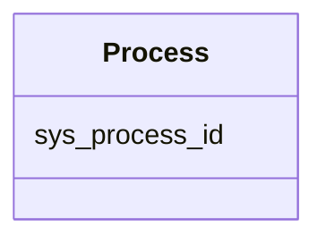

# Class: Process 


_Data processing workflow or analysis process._


URI: [https://w3id.org/kbase/enigma_coral/Process](https://w3id.org/kbase/enigma_coral/Process)





<!-- no inheritance hierarchy -->


## Slots

| Name | Cardinality and Range | Description | Inheritance |
| ---  | --- | --- | --- |
| [sys_process_id](sys_process_id.md) | 1 <br/> [String](String.md) | Process identifier | direct |


## Identifier and Mapping Information


### Annotations

| property | value |
| --- | --- |
| source_table | sys_process |


### Schema Source


* from schema: https://w3id.org/kbase/enigma_coral


## Mappings

| Mapping Type | Mapped Value |
| ---  | ---  |
| self | https://w3id.org/kbase/enigma_coral/Process |
| native | https://w3id.org/kbase/enigma_coral/Process |


## LinkML Source

<!-- TODO: investigate https://stackoverflow.com/questions/37606292/how-to-create-tabbed-code-blocks-in-mkdocs-or-sphinx -->

### Direct

<details>
```yaml
name: Process
annotations:
  source_table:
    tag: source_table
    value: sys_process
description: Data processing workflow or analysis process.
from_schema: https://w3id.org/kbase/enigma_coral
attributes:
  sys_process_id:
    name: sys_process_id
    description: Process identifier
    from_schema: https://w3id.org/kbase/enigma_coral
    rank: 1000
    identifier: true
    domain_of:
    - Process
    range: string
    required: true

```
</details>

### Induced

<details>
```yaml
name: Process
annotations:
  source_table:
    tag: source_table
    value: sys_process
description: Data processing workflow or analysis process.
from_schema: https://w3id.org/kbase/enigma_coral
attributes:
  sys_process_id:
    name: sys_process_id
    description: Process identifier
    from_schema: https://w3id.org/kbase/enigma_coral
    rank: 1000
    identifier: true
    alias: sys_process_id
    owner: Process
    domain_of:
    - Process
    range: string
    required: true

```
</details>