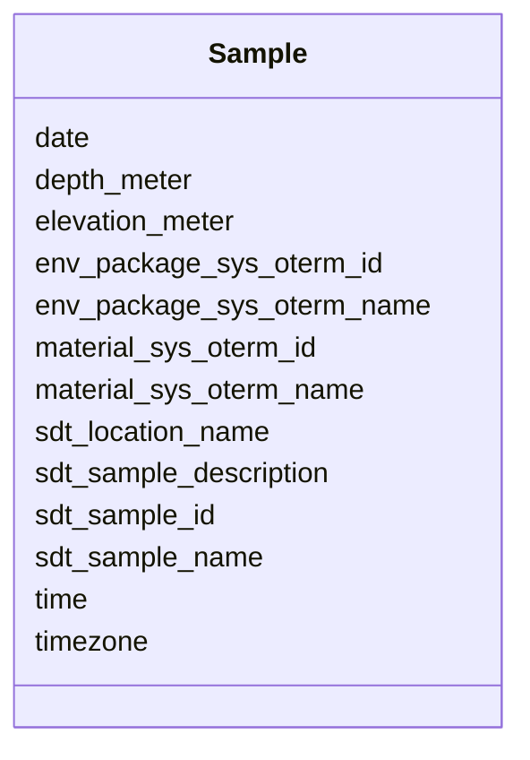

# Class: Sample 


_Environmental sample from groundwater monitoring wells. Contains location, depth, and material type using ontology terms._

_EXAMPLE SAMPLES: - EU02-D01: Groundwater from well EU02 at 5.4m depth - EU03-D01: Groundwater from well EU03 at 4.6m depth - ED04-D01: Groundwater from well ED04 at 4.8m depth_


URI: [https://w3id.org/kbase/enigma_coral/Sample](https://w3id.org/kbase/enigma_coral/Sample)





<!-- no inheritance hierarchy -->


## Slots

| Name | Cardinality and Range | Description | Inheritance |
| ---  | --- | --- | --- |
| [sdt_sample_id](sdt_sample_id.md) | 1 <br/> [String](String.md) | Unique sample identifier | direct |
| [sdt_sample_name](sdt_sample_name.md) | 0..1 <br/> [String](String.md) | Human-readable sample name (well-date format) | direct |
| [sdt_location_name](sdt_location_name.md) | 0..1 <br/> [String](String.md) | Sampling location/well identifier | direct |
| [depth_meter](depth_meter.md) | 0..1 <br/> [Float](Float.md) | Sample depth in meters below ground surface | direct |
| [elevation_meter](elevation_meter.md) | 0..1 <br/> [Float](Float.md) | Elevation in meters (above sea level) | direct |
| [date](date.md) | 0..1 <br/> [date](date.md) | Sampling date (YYYY-MM-DD) | direct |
| [time](time.md) | 0..1 <br/> [String](String.md) | Sampling time (HH:MM format) | direct |
| [timezone](timezone.md) | 0..1 <br/> [String](String.md) | Timezone offset | direct |
| [material_sys_oterm_id](material_sys_oterm_id.md) | 0..1 <br/> [String](String.md) | ENVO ontology term ID for sample material type | direct |
| [material_sys_oterm_name](material_sys_oterm_name.md) | 0..1 <br/> [String](String.md) | Human-readable material type name | direct |
| [env_package_sys_oterm_id](env_package_sys_oterm_id.md) | 0..1 <br/> [String](String.md) | MIxS environmental package term ID | direct |
| [env_package_sys_oterm_name](env_package_sys_oterm_name.md) | 0..1 <br/> [String](String.md) | MIxS environmental package name | direct |
| [sdt_sample_description](sdt_sample_description.md) | 0..1 <br/> [String](String.md) | Free-text sample description | direct |


## Identifier and Mapping Information


### Annotations

| property | value |
| --- | --- |
| source_table | sdt_sample |


### Schema Source


* from schema: https://w3id.org/kbase/enigma_coral


## Mappings

| Mapping Type | Mapped Value |
| ---  | ---  |
| self | https://w3id.org/kbase/enigma_coral/Sample |
| native | https://w3id.org/kbase/enigma_coral/Sample |


## LinkML Source

<!-- TODO: investigate https://stackoverflow.com/questions/37606292/how-to-create-tabbed-code-blocks-in-mkdocs-or-sphinx -->

### Direct

<details>
```yaml
name: Sample
annotations:
  source_table:
    tag: source_table
    value: sdt_sample
description: 'Environmental sample from groundwater monitoring wells. Contains location,
  depth, and material type using ontology terms.

  EXAMPLE SAMPLES: - EU02-D01: Groundwater from well EU02 at 5.4m depth - EU03-D01:
  Groundwater from well EU03 at 4.6m depth - ED04-D01: Groundwater from well ED04
  at 4.8m depth'
from_schema: https://w3id.org/kbase/enigma_coral
attributes:
  sdt_sample_id:
    name: sdt_sample_id
    description: Unique sample identifier
    examples:
    - value: Sample0000001
    - value: Sample0000002
    - value: Sample0000003
    from_schema: https://w3id.org/kbase/enigma_coral
    rank: 1000
    identifier: true
    domain_of:
    - Sample
    range: string
    required: true
    pattern: Sample\d{7}
  sdt_sample_name:
    name: sdt_sample_name
    description: Human-readable sample name (well-date format)
    examples:
    - value: EU02-D01
      description: Well EU02, sampling day 01
    - value: EU03-D01
    - value: ED04-D01
    from_schema: https://w3id.org/kbase/enigma_coral
    rank: 1000
    domain_of:
    - Sample
    range: string
  sdt_location_name:
    name: sdt_location_name
    description: Sampling location/well identifier
    comments:
    - Foreign key to Location.sdt_location_name
    examples:
    - value: EU02
    - value: EU03
    - value: ED04
    from_schema: https://w3id.org/kbase/enigma_coral
    rank: 1000
    domain_of:
    - Sample
    - Location
    range: string
  depth_meter:
    name: depth_meter
    description: Sample depth in meters below ground surface
    examples:
    - value: '5.401056'
    - value: '4.605528'
    - value: '4.7625'
    from_schema: https://w3id.org/kbase/enigma_coral
    rank: 1000
    domain_of:
    - Sample
    range: float
    minimum_value: 0.0
  elevation_meter:
    name: elevation_meter
    description: Elevation in meters (above sea level)
    from_schema: https://w3id.org/kbase/enigma_coral
    rank: 1000
    domain_of:
    - Sample
    range: float
  date:
    name: date
    description: Sampling date (YYYY-MM-DD)
    examples:
    - value: '2019-07-29'
    from_schema: https://w3id.org/kbase/enigma_coral
    rank: 1000
    domain_of:
    - Sample
    range: date
  time:
    name: time
    description: Sampling time (HH:MM format)
    examples:
    - value: '6:59'
    - value: '8:09'
    - value: '8:58'
    from_schema: https://w3id.org/kbase/enigma_coral
    rank: 1000
    domain_of:
    - Sample
    range: string
  timezone:
    name: timezone
    description: Timezone offset
    examples:
    - value: UTC-04
    from_schema: https://w3id.org/kbase/enigma_coral
    rank: 1000
    domain_of:
    - Sample
    range: string
  material_sys_oterm_id:
    name: material_sys_oterm_id
    description: ENVO ontology term ID for sample material type
    examples:
    - value: ENVO:00002041
      description: Ground water
    from_schema: https://w3id.org/kbase/enigma_coral
    rank: 1000
    domain_of:
    - Sample
    range: string
  material_sys_oterm_name:
    name: material_sys_oterm_name
    description: Human-readable material type name
    examples:
    - value: ground water
    from_schema: https://w3id.org/kbase/enigma_coral
    rank: 1000
    domain_of:
    - Sample
    range: string
  env_package_sys_oterm_id:
    name: env_package_sys_oterm_id
    description: MIxS environmental package term ID
    examples:
    - value: MIxS:0000017
      description: Water package
    from_schema: https://w3id.org/kbase/enigma_coral
    rank: 1000
    domain_of:
    - Sample
    range: string
  env_package_sys_oterm_name:
    name: env_package_sys_oterm_name
    description: MIxS environmental package name
    examples:
    - value: water
    from_schema: https://w3id.org/kbase/enigma_coral
    rank: 1000
    domain_of:
    - Sample
    range: string
  sdt_sample_description:
    name: sdt_sample_description
    description: Free-text sample description
    examples:
    - value: 1 L purged
    from_schema: https://w3id.org/kbase/enigma_coral
    rank: 1000
    domain_of:
    - Sample
    range: string

```
</details>

### Induced

<details>
```yaml
name: Sample
annotations:
  source_table:
    tag: source_table
    value: sdt_sample
description: 'Environmental sample from groundwater monitoring wells. Contains location,
  depth, and material type using ontology terms.

  EXAMPLE SAMPLES: - EU02-D01: Groundwater from well EU02 at 5.4m depth - EU03-D01:
  Groundwater from well EU03 at 4.6m depth - ED04-D01: Groundwater from well ED04
  at 4.8m depth'
from_schema: https://w3id.org/kbase/enigma_coral
attributes:
  sdt_sample_id:
    name: sdt_sample_id
    description: Unique sample identifier
    examples:
    - value: Sample0000001
    - value: Sample0000002
    - value: Sample0000003
    from_schema: https://w3id.org/kbase/enigma_coral
    rank: 1000
    identifier: true
    alias: sdt_sample_id
    owner: Sample
    domain_of:
    - Sample
    range: string
    required: true
    pattern: Sample\d{7}
  sdt_sample_name:
    name: sdt_sample_name
    description: Human-readable sample name (well-date format)
    examples:
    - value: EU02-D01
      description: Well EU02, sampling day 01
    - value: EU03-D01
    - value: ED04-D01
    from_schema: https://w3id.org/kbase/enigma_coral
    rank: 1000
    alias: sdt_sample_name
    owner: Sample
    domain_of:
    - Sample
    range: string
  sdt_location_name:
    name: sdt_location_name
    description: Sampling location/well identifier
    comments:
    - Foreign key to Location.sdt_location_name
    examples:
    - value: EU02
    - value: EU03
    - value: ED04
    from_schema: https://w3id.org/kbase/enigma_coral
    rank: 1000
    alias: sdt_location_name
    owner: Sample
    domain_of:
    - Sample
    - Location
    range: string
  depth_meter:
    name: depth_meter
    description: Sample depth in meters below ground surface
    examples:
    - value: '5.401056'
    - value: '4.605528'
    - value: '4.7625'
    from_schema: https://w3id.org/kbase/enigma_coral
    rank: 1000
    alias: depth_meter
    owner: Sample
    domain_of:
    - Sample
    range: float
    minimum_value: 0.0
  elevation_meter:
    name: elevation_meter
    description: Elevation in meters (above sea level)
    from_schema: https://w3id.org/kbase/enigma_coral
    rank: 1000
    alias: elevation_meter
    owner: Sample
    domain_of:
    - Sample
    range: float
  date:
    name: date
    description: Sampling date (YYYY-MM-DD)
    examples:
    - value: '2019-07-29'
    from_schema: https://w3id.org/kbase/enigma_coral
    rank: 1000
    alias: date
    owner: Sample
    domain_of:
    - Sample
    range: date
  time:
    name: time
    description: Sampling time (HH:MM format)
    examples:
    - value: '6:59'
    - value: '8:09'
    - value: '8:58'
    from_schema: https://w3id.org/kbase/enigma_coral
    rank: 1000
    alias: time
    owner: Sample
    domain_of:
    - Sample
    range: string
  timezone:
    name: timezone
    description: Timezone offset
    examples:
    - value: UTC-04
    from_schema: https://w3id.org/kbase/enigma_coral
    rank: 1000
    alias: timezone
    owner: Sample
    domain_of:
    - Sample
    range: string
  material_sys_oterm_id:
    name: material_sys_oterm_id
    description: ENVO ontology term ID for sample material type
    examples:
    - value: ENVO:00002041
      description: Ground water
    from_schema: https://w3id.org/kbase/enigma_coral
    rank: 1000
    alias: material_sys_oterm_id
    owner: Sample
    domain_of:
    - Sample
    range: string
  material_sys_oterm_name:
    name: material_sys_oterm_name
    description: Human-readable material type name
    examples:
    - value: ground water
    from_schema: https://w3id.org/kbase/enigma_coral
    rank: 1000
    alias: material_sys_oterm_name
    owner: Sample
    domain_of:
    - Sample
    range: string
  env_package_sys_oterm_id:
    name: env_package_sys_oterm_id
    description: MIxS environmental package term ID
    examples:
    - value: MIxS:0000017
      description: Water package
    from_schema: https://w3id.org/kbase/enigma_coral
    rank: 1000
    alias: env_package_sys_oterm_id
    owner: Sample
    domain_of:
    - Sample
    range: string
  env_package_sys_oterm_name:
    name: env_package_sys_oterm_name
    description: MIxS environmental package name
    examples:
    - value: water
    from_schema: https://w3id.org/kbase/enigma_coral
    rank: 1000
    alias: env_package_sys_oterm_name
    owner: Sample
    domain_of:
    - Sample
    range: string
  sdt_sample_description:
    name: sdt_sample_description
    description: Free-text sample description
    examples:
    - value: 1 L purged
    from_schema: https://w3id.org/kbase/enigma_coral
    rank: 1000
    alias: sdt_sample_description
    owner: Sample
    domain_of:
    - Sample
    range: string

```
</details>