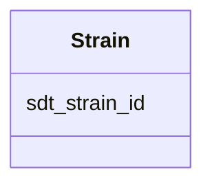

# Class: Strain 


_Cultured microbial strain/isolate._


URI: [https://w3id.org/kbase/enigma_coral/Strain](https://w3id.org/kbase/enigma_coral/Strain)





<!-- no inheritance hierarchy -->


## Slots

| Name | Cardinality and Range | Description | Inheritance |
| ---  | --- | --- | --- |
| [sdt_strain_id](sdt_strain_id.md) | 1 <br/> [String](String.md) | Strain identifier | direct |


## Identifier and Mapping Information


### Annotations

| property | value |
| --- | --- |
| source_table | sdt_strain |


### Schema Source


* from schema: https://w3id.org/kbase/enigma_coral


## Mappings

| Mapping Type | Mapped Value |
| ---  | ---  |
| self | https://w3id.org/kbase/enigma_coral/Strain |
| native | https://w3id.org/kbase/enigma_coral/Strain |


## LinkML Source

<!-- TODO: investigate https://stackoverflow.com/questions/37606292/how-to-create-tabbed-code-blocks-in-mkdocs-or-sphinx -->

### Direct

<details>
```yaml
name: Strain
annotations:
  source_table:
    tag: source_table
    value: sdt_strain
description: Cultured microbial strain/isolate.
from_schema: https://w3id.org/kbase/enigma_coral
attributes:
  sdt_strain_id:
    name: sdt_strain_id
    description: Strain identifier
    from_schema: https://w3id.org/kbase/enigma_coral
    rank: 1000
    identifier: true
    domain_of:
    - Strain
    range: string
    required: true

```
</details>

### Induced

<details>
```yaml
name: Strain
annotations:
  source_table:
    tag: source_table
    value: sdt_strain
description: Cultured microbial strain/isolate.
from_schema: https://w3id.org/kbase/enigma_coral
attributes:
  sdt_strain_id:
    name: sdt_strain_id
    description: Strain identifier
    from_schema: https://w3id.org/kbase/enigma_coral
    rank: 1000
    identifier: true
    alias: sdt_strain_id
    owner: Strain
    domain_of:
    - Strain
    range: string
    required: true

```
</details>