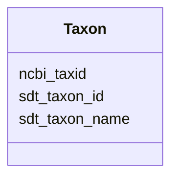

# Class: Taxon 


_Taxonomic identification linked to NCBI taxonomy. Includes bacteria, archaea, and other microorganisms._


URI: [https://w3id.org/kbase/enigma_coral/Taxon](https://w3id.org/kbase/enigma_coral/Taxon)





<!-- no inheritance hierarchy -->


## Slots

| Name | Cardinality and Range | Description | Inheritance |
| ---  | --- | --- | --- |
| [sdt_taxon_id](sdt_taxon_id.md) | 1 <br/> [String](String.md) | Internal taxon identifier | direct |
| [sdt_taxon_name](sdt_taxon_name.md) | 0..1 <br/> [String](String.md) | Taxonomic name (any rank) | direct |
| [ncbi_taxid](ncbi_taxid.md) | 0..1 <br/> [String](String.md) | NCBI Taxonomy ID with NCBITaxon prefix | direct |


## Identifier and Mapping Information


### Annotations

| property | value |
| --- | --- |
| source_table | sdt_taxon |


### Schema Source


* from schema: https://w3id.org/kbase/enigma_coral


## Mappings

| Mapping Type | Mapped Value |
| ---  | ---  |
| self | https://w3id.org/kbase/enigma_coral/Taxon |
| native | https://w3id.org/kbase/enigma_coral/Taxon |


## LinkML Source

<!-- TODO: investigate https://stackoverflow.com/questions/37606292/how-to-create-tabbed-code-blocks-in-mkdocs-or-sphinx -->

### Direct

<details>
```yaml
name: Taxon
annotations:
  source_table:
    tag: source_table
    value: sdt_taxon
description: Taxonomic identification linked to NCBI taxonomy. Includes bacteria,
  archaea, and other microorganisms.
from_schema: https://w3id.org/kbase/enigma_coral
attributes:
  sdt_taxon_id:
    name: sdt_taxon_id
    description: Internal taxon identifier
    examples:
    - value: Taxon0000842
    - value: Taxon0000843
    - value: Taxon0000844
    from_schema: https://w3id.org/kbase/enigma_coral
    rank: 1000
    identifier: true
    domain_of:
    - Taxon
    range: string
    required: true
    pattern: Taxon\d{7}
  sdt_taxon_name:
    name: sdt_taxon_name
    description: Taxonomic name (any rank)
    examples:
    - value: Cytophagales
      description: Order level
    - value: Cytophaga
      description: Genus level
    - value: Cytophagia
      description: Class level
    from_schema: https://w3id.org/kbase/enigma_coral
    rank: 1000
    domain_of:
    - Taxon
    range: string
  ncbi_taxid:
    name: ncbi_taxid
    description: NCBI Taxonomy ID with NCBITaxon prefix
    examples:
    - value: NCBITaxon:768507
      description: Cytophagales
    - value: NCBITaxon:978
      description: Cytophaga
    - value: NCBITaxon:768503
      description: Cytophagia
    from_schema: https://w3id.org/kbase/enigma_coral
    rank: 1000
    domain_of:
    - Taxon
    range: string
    pattern: NCBITaxon:\d+

```
</details>

### Induced

<details>
```yaml
name: Taxon
annotations:
  source_table:
    tag: source_table
    value: sdt_taxon
description: Taxonomic identification linked to NCBI taxonomy. Includes bacteria,
  archaea, and other microorganisms.
from_schema: https://w3id.org/kbase/enigma_coral
attributes:
  sdt_taxon_id:
    name: sdt_taxon_id
    description: Internal taxon identifier
    examples:
    - value: Taxon0000842
    - value: Taxon0000843
    - value: Taxon0000844
    from_schema: https://w3id.org/kbase/enigma_coral
    rank: 1000
    identifier: true
    alias: sdt_taxon_id
    owner: Taxon
    domain_of:
    - Taxon
    range: string
    required: true
    pattern: Taxon\d{7}
  sdt_taxon_name:
    name: sdt_taxon_name
    description: Taxonomic name (any rank)
    examples:
    - value: Cytophagales
      description: Order level
    - value: Cytophaga
      description: Genus level
    - value: Cytophagia
      description: Class level
    from_schema: https://w3id.org/kbase/enigma_coral
    rank: 1000
    alias: sdt_taxon_name
    owner: Taxon
    domain_of:
    - Taxon
    range: string
  ncbi_taxid:
    name: ncbi_taxid
    description: NCBI Taxonomy ID with NCBITaxon prefix
    examples:
    - value: NCBITaxon:768507
      description: Cytophagales
    - value: NCBITaxon:978
      description: Cytophaga
    - value: NCBITaxon:768503
      description: Cytophagia
    from_schema: https://w3id.org/kbase/enigma_coral
    rank: 1000
    alias: ncbi_taxid
    owner: Taxon
    domain_of:
    - Taxon
    range: string
    pattern: NCBITaxon:\d+

```
</details>