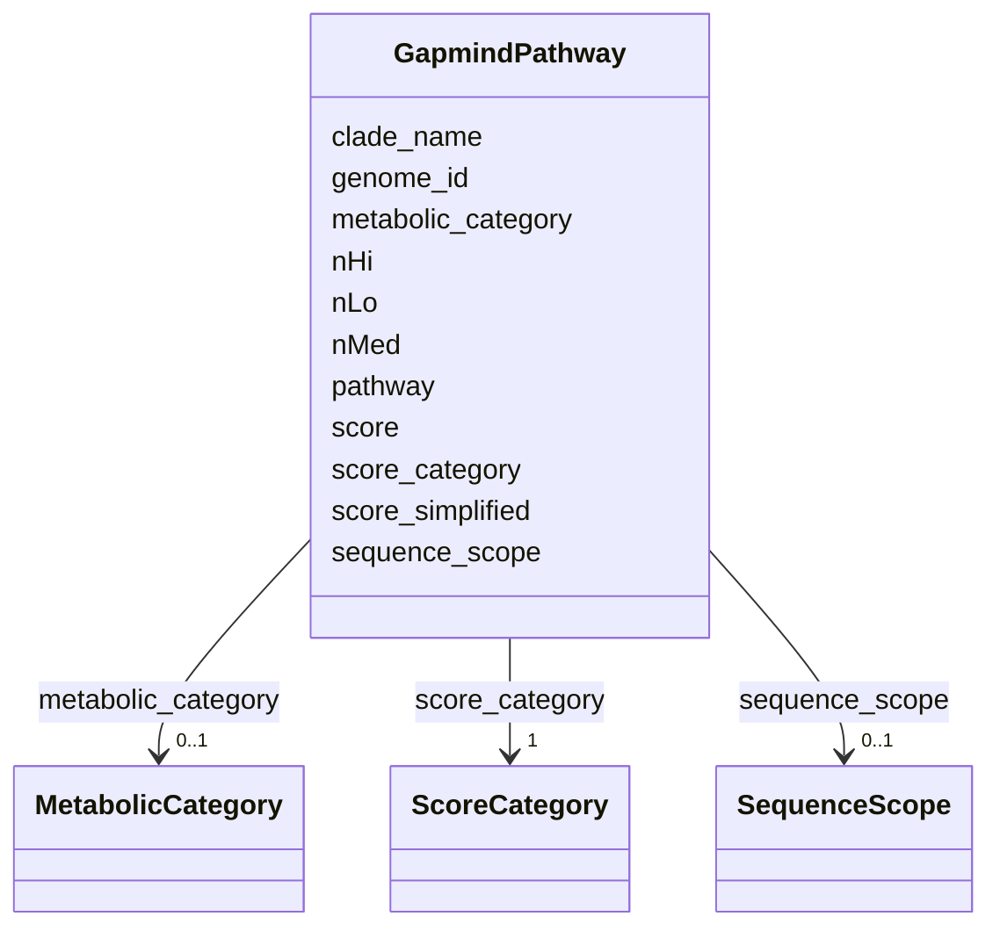

# Class: GapmindPathway 


_GapMind pathway completeness assessment for a genome. Each row represents the assessment of one metabolic pathway for one genome, with gene hit counts and scores._

_EXAMPLE INTERPRETATION: - score > 0, score_category = "present" -> pathway functional - score < 0, nLo > 0 -> some genes found but pathway incomplete - score = 0, all counts = 0 -> no genes found_

_JOIN PATTERN: ```sql SELECT g.*, p.genome_id, p.pathway, p.score_category FROM kbase_ke_pangenome.genome g JOIN globalusers_gapmind_pathways.gapmind_pathways p_

_  ON g.genome_id = p.genome_id_

_WHERE p.score_category = 'present' ```_


URI: [https://w3id.org/kbase/gapmind_pathways/GapmindPathway](https://w3id.org/kbase/gapmind_pathways/GapmindPathway)





<!-- no inheritance hierarchy -->


## Slots

| Name | Cardinality and Range | Description | Inheritance |
| ---  | --- | --- | --- |
| [genome_id](genome_id.md) | 1 <br/> [String](String.md) | RefSeq/GenBank genome assembly accession (GCF_*/GCA_*) | direct |
| [pathway](pathway.md) | 1 <br/> [String](String.md) | Metabolic pathway being assessed | direct |
| [clade_name](clade_name.md) | 0..1 <br/> [String](String.md) | GTDB species clade identifier | direct |
| [metabolic_category](metabolic_category.md) | 0..1 <br/> [MetabolicCategory](MetabolicCategory.md) | Broad metabolic category (amino acid, carbon, aromatic) | direct |
| [sequence_scope](sequence_scope.md) | 0..1 <br/> [SequenceScope](SequenceScope.md) | Whether assessing core or auxiliary pathway genes | direct |
| [nHi](nHi.md) | 0..1 <br/> [Integer](Integer.md) | Count of high-confidence gene hits | direct |
| [nMed](nMed.md) | 0..1 <br/> [Integer](Integer.md) | Count of medium-confidence gene hits | direct |
| [nLo](nLo.md) | 0..1 <br/> [Integer](Integer.md) | Count of low-confidence gene hits | direct |
| [score](score.md) | 0..1 <br/> [Integer](Integer.md) | Overall pathway completeness score | direct |
| [score_category](score_category.md) | 1 <br/> [ScoreCategory](ScoreCategory.md) | Categorical assessment of pathway completeness | direct |
| [score_simplified](score_simplified.md) | 0..1 <br/> [Float](Float.md) | Simplified numeric score for aggregation | direct |


## Identifier and Mapping Information


### Annotations

| property | value |
| --- | --- |
| source_table | gapmind_pathways |


### Schema Source


* from schema: https://w3id.org/kbase/gapmind_pathways


## Mappings

| Mapping Type | Mapped Value |
| ---  | ---  |
| self | https://w3id.org/kbase/gapmind_pathways/GapmindPathway |
| native | https://w3id.org/kbase/gapmind_pathways/GapmindPathway |


## LinkML Source

<!-- TODO: investigate https://stackoverflow.com/questions/37606292/how-to-create-tabbed-code-blocks-in-mkdocs-or-sphinx -->

### Direct

<details>
```yaml
name: GapmindPathway
annotations:
  source_table:
    tag: source_table
    value: gapmind_pathways
description: "GapMind pathway completeness assessment for a genome. Each row represents\
  \ the assessment of one metabolic pathway for one genome, with gene hit counts and\
  \ scores.\nEXAMPLE INTERPRETATION: - score > 0, score_category = \"present\" ->\
  \ pathway functional - score < 0, nLo > 0 -> some genes found but pathway incomplete\
  \ - score = 0, all counts = 0 -> no genes found\nJOIN PATTERN: ```sql SELECT g.*,\
  \ p.genome_id, p.pathway, p.score_category FROM kbase_ke_pangenome.genome g JOIN\
  \ globalusers_gapmind_pathways.gapmind_pathways p\n  ON g.genome_id = p.genome_id\n\
  WHERE p.score_category = 'present' ```"
from_schema: https://w3id.org/kbase/gapmind_pathways
attributes:
  genome_id:
    name: genome_id
    description: RefSeq/GenBank genome assembly accession (GCF_*/GCA_*). Links to
      kbase_ke_pangenome.genome.genome_id.
    comments:
    - Foreign key to kbase_ke_pangenome.genome.genome_id
    examples:
    - value: GCF_019211765.1
      description: Lactiplantibacillus plantarum genome
    from_schema: https://w3id.org/kbase/gapmind_pathways
    rank: 1000
    domain_of:
    - GapmindPathway
    range: string
    required: true
    pattern: GC[FA]_\d+\.\d+
  pathway:
    name: pathway
    description: Metabolic pathway being assessed. 80 different pathways covering
      amino acid biosynthesis, carbon utilization, etc.
    examples:
    - value: arg
      description: Arginine biosynthesis
    - value: asn
      description: Asparagine biosynthesis
    - value: phenylalanine
      description: Phenylalanine biosynthesis/catabolism
    - value: sucrose
      description: Sucrose utilization
    - value: lactose
      description: Lactose utilization
    - value: 4-hydroxybenzoate
      description: 4-hydroxybenzoate degradation
    from_schema: https://w3id.org/kbase/gapmind_pathways
    rank: 1000
    domain_of:
    - GapmindPathway
    range: string
    required: true
  clade_name:
    name: clade_name
    description: 'GTDB species clade identifier. Links to pangenome data. Format:
      s__Genus_species--RS_GCF_XXXXXXXXX.X'
    comments:
    - Foreign key to kbase_ke_pangenome.gtdb_species_clade.gtdb_species_clade_id
    examples:
    - value: s__Lactiplantibacillus_plantarum--RS_GCF_014131735.1
      description: L. plantarum species clade
    from_schema: https://w3id.org/kbase/gapmind_pathways
    rank: 1000
    domain_of:
    - GapmindPathway
    range: string
  metabolic_category:
    name: metabolic_category
    description: Broad metabolic category (amino acid, carbon, aromatic).
    examples:
    - value: aa
      description: Amino acid pathway
    from_schema: https://w3id.org/kbase/gapmind_pathways
    rank: 1000
    domain_of:
    - GapmindPathway
    range: MetabolicCategory
  sequence_scope:
    name: sequence_scope
    description: Whether assessing core or auxiliary pathway genes.
    examples:
    - value: aux
      description: Auxiliary genes
    - value: core
      description: Core pathway genes
    from_schema: https://w3id.org/kbase/gapmind_pathways
    rank: 1000
    domain_of:
    - GapmindPathway
    range: SequenceScope
  nHi:
    name: nHi
    description: Count of high-confidence gene hits. These are strong matches to characterized
      enzymes.
    examples:
    - value: '0'
    - value: '5'
      description: 5 high-confidence hits
    from_schema: https://w3id.org/kbase/gapmind_pathways
    rank: 1000
    domain_of:
    - GapmindPathway
    range: integer
    minimum_value: 0
  nMed:
    name: nMed
    description: Count of medium-confidence gene hits. Moderate matches that may or
      may not be functional.
    examples:
    - value: '0'
    - value: '2'
    from_schema: https://w3id.org/kbase/gapmind_pathways
    rank: 1000
    domain_of:
    - GapmindPathway
    range: integer
    minimum_value: 0
  nLo:
    name: nLo
    description: Count of low-confidence gene hits. Weak matches that are unlikely
      to perform the expected function.
    examples:
    - value: '8'
      description: 8 low-confidence hits only
    - value: '1'
    - value: '3'
    from_schema: https://w3id.org/kbase/gapmind_pathways
    rank: 1000
    domain_of:
    - GapmindPathway
    range: integer
    minimum_value: 0
  score:
    name: score
    description: 'Overall pathway completeness score. Calculated from gene hits with
      weighting: positive = likely complete, negative = likely incomplete.'
    examples:
    - value: '-16'
      description: Very incomplete (only low hits)
    - value: '-2'
      description: Incomplete
    - value: '-6'
      description: Incomplete
    - value: '10'
      description: Complete pathway
    from_schema: https://w3id.org/kbase/gapmind_pathways
    rank: 1000
    domain_of:
    - GapmindPathway
    range: integer
  score_category:
    name: score_category
    description: Categorical assessment of pathway completeness.
    examples:
    - value: not_present
      description: Pathway absent or non-functional
    - value: partial
      description: Pathway partially present
    - value: present
      description: Pathway complete
    from_schema: https://w3id.org/kbase/gapmind_pathways
    rank: 1000
    domain_of:
    - GapmindPathway
    range: ScoreCategory
    required: true
  score_simplified:
    name: score_simplified
    description: Simplified numeric score for aggregation. 1.0 = present, 0.5 = partial,
      0.0 = not_present.
    examples:
    - value: '0.0'
      description: Not present
    - value: '0.5'
      description: Partial
    - value: '1.0'
      description: Present
    from_schema: https://w3id.org/kbase/gapmind_pathways
    rank: 1000
    domain_of:
    - GapmindPathway
    range: float
    minimum_value: 0.0
    maximum_value: 1.0

```
</details>

### Induced

<details>
```yaml
name: GapmindPathway
annotations:
  source_table:
    tag: source_table
    value: gapmind_pathways
description: "GapMind pathway completeness assessment for a genome. Each row represents\
  \ the assessment of one metabolic pathway for one genome, with gene hit counts and\
  \ scores.\nEXAMPLE INTERPRETATION: - score > 0, score_category = \"present\" ->\
  \ pathway functional - score < 0, nLo > 0 -> some genes found but pathway incomplete\
  \ - score = 0, all counts = 0 -> no genes found\nJOIN PATTERN: ```sql SELECT g.*,\
  \ p.genome_id, p.pathway, p.score_category FROM kbase_ke_pangenome.genome g JOIN\
  \ globalusers_gapmind_pathways.gapmind_pathways p\n  ON g.genome_id = p.genome_id\n\
  WHERE p.score_category = 'present' ```"
from_schema: https://w3id.org/kbase/gapmind_pathways
attributes:
  genome_id:
    name: genome_id
    description: RefSeq/GenBank genome assembly accession (GCF_*/GCA_*). Links to
      kbase_ke_pangenome.genome.genome_id.
    comments:
    - Foreign key to kbase_ke_pangenome.genome.genome_id
    examples:
    - value: GCF_019211765.1
      description: Lactiplantibacillus plantarum genome
    from_schema: https://w3id.org/kbase/gapmind_pathways
    rank: 1000
    alias: genome_id
    owner: GapmindPathway
    domain_of:
    - GapmindPathway
    range: string
    required: true
    pattern: GC[FA]_\d+\.\d+
  pathway:
    name: pathway
    description: Metabolic pathway being assessed. 80 different pathways covering
      amino acid biosynthesis, carbon utilization, etc.
    examples:
    - value: arg
      description: Arginine biosynthesis
    - value: asn
      description: Asparagine biosynthesis
    - value: phenylalanine
      description: Phenylalanine biosynthesis/catabolism
    - value: sucrose
      description: Sucrose utilization
    - value: lactose
      description: Lactose utilization
    - value: 4-hydroxybenzoate
      description: 4-hydroxybenzoate degradation
    from_schema: https://w3id.org/kbase/gapmind_pathways
    rank: 1000
    alias: pathway
    owner: GapmindPathway
    domain_of:
    - GapmindPathway
    range: string
    required: true
  clade_name:
    name: clade_name
    description: 'GTDB species clade identifier. Links to pangenome data. Format:
      s__Genus_species--RS_GCF_XXXXXXXXX.X'
    comments:
    - Foreign key to kbase_ke_pangenome.gtdb_species_clade.gtdb_species_clade_id
    examples:
    - value: s__Lactiplantibacillus_plantarum--RS_GCF_014131735.1
      description: L. plantarum species clade
    from_schema: https://w3id.org/kbase/gapmind_pathways
    rank: 1000
    alias: clade_name
    owner: GapmindPathway
    domain_of:
    - GapmindPathway
    range: string
  metabolic_category:
    name: metabolic_category
    description: Broad metabolic category (amino acid, carbon, aromatic).
    examples:
    - value: aa
      description: Amino acid pathway
    from_schema: https://w3id.org/kbase/gapmind_pathways
    rank: 1000
    alias: metabolic_category
    owner: GapmindPathway
    domain_of:
    - GapmindPathway
    range: MetabolicCategory
  sequence_scope:
    name: sequence_scope
    description: Whether assessing core or auxiliary pathway genes.
    examples:
    - value: aux
      description: Auxiliary genes
    - value: core
      description: Core pathway genes
    from_schema: https://w3id.org/kbase/gapmind_pathways
    rank: 1000
    alias: sequence_scope
    owner: GapmindPathway
    domain_of:
    - GapmindPathway
    range: SequenceScope
  nHi:
    name: nHi
    description: Count of high-confidence gene hits. These are strong matches to characterized
      enzymes.
    examples:
    - value: '0'
    - value: '5'
      description: 5 high-confidence hits
    from_schema: https://w3id.org/kbase/gapmind_pathways
    rank: 1000
    alias: nHi
    owner: GapmindPathway
    domain_of:
    - GapmindPathway
    range: integer
    minimum_value: 0
  nMed:
    name: nMed
    description: Count of medium-confidence gene hits. Moderate matches that may or
      may not be functional.
    examples:
    - value: '0'
    - value: '2'
    from_schema: https://w3id.org/kbase/gapmind_pathways
    rank: 1000
    alias: nMed
    owner: GapmindPathway
    domain_of:
    - GapmindPathway
    range: integer
    minimum_value: 0
  nLo:
    name: nLo
    description: Count of low-confidence gene hits. Weak matches that are unlikely
      to perform the expected function.
    examples:
    - value: '8'
      description: 8 low-confidence hits only
    - value: '1'
    - value: '3'
    from_schema: https://w3id.org/kbase/gapmind_pathways
    rank: 1000
    alias: nLo
    owner: GapmindPathway
    domain_of:
    - GapmindPathway
    range: integer
    minimum_value: 0
  score:
    name: score
    description: 'Overall pathway completeness score. Calculated from gene hits with
      weighting: positive = likely complete, negative = likely incomplete.'
    examples:
    - value: '-16'
      description: Very incomplete (only low hits)
    - value: '-2'
      description: Incomplete
    - value: '-6'
      description: Incomplete
    - value: '10'
      description: Complete pathway
    from_schema: https://w3id.org/kbase/gapmind_pathways
    rank: 1000
    alias: score
    owner: GapmindPathway
    domain_of:
    - GapmindPathway
    range: integer
  score_category:
    name: score_category
    description: Categorical assessment of pathway completeness.
    examples:
    - value: not_present
      description: Pathway absent or non-functional
    - value: partial
      description: Pathway partially present
    - value: present
      description: Pathway complete
    from_schema: https://w3id.org/kbase/gapmind_pathways
    rank: 1000
    alias: score_category
    owner: GapmindPathway
    domain_of:
    - GapmindPathway
    range: ScoreCategory
    required: true
  score_simplified:
    name: score_simplified
    description: Simplified numeric score for aggregation. 1.0 = present, 0.5 = partial,
      0.0 = not_present.
    examples:
    - value: '0.0'
      description: Not present
    - value: '0.5'
      description: Partial
    - value: '1.0'
      description: Present
    from_schema: https://w3id.org/kbase/gapmind_pathways
    rank: 1000
    alias: score_simplified
    owner: GapmindPathway
    domain_of:
    - GapmindPathway
    range: float
    minimum_value: 0.0
    maximum_value: 1.0

```
</details>