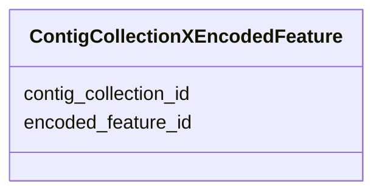

# Class: ContigCollectionXEncodedFeature 


URI: [https://w3id.org/kbase/kbase_genomes/ContigCollectionXEncodedFeature](https://w3id.org/kbase/kbase_genomes/ContigCollectionXEncodedFeature)





<!-- no inheritance hierarchy -->


## Slots

| Name | Cardinality and Range | Description | Inheritance |
| ---  | --- | --- | --- |
| [contig_collection_id](contig_collection_id.md) | 0..1 <br/> [String](String.md) |  | direct |
| [encoded_feature_id](encoded_feature_id.md) | 0..1 <br/> [String](String.md) |  | direct |


## Identifier and Mapping Information


### Annotations

| property | value |
| --- | --- |
| source_table | contig_collection_x_encoded_feature |


### Schema Source


* from schema: https://w3id.org/kbase/kbase_genomes


## Mappings

| Mapping Type | Mapped Value |
| ---  | ---  |
| self | https://w3id.org/kbase/kbase_genomes/ContigCollectionXEncodedFeature |
| native | https://w3id.org/kbase/kbase_genomes/ContigCollectionXEncodedFeature |


## LinkML Source

<!-- TODO: investigate https://stackoverflow.com/questions/37606292/how-to-create-tabbed-code-blocks-in-mkdocs-or-sphinx -->

### Direct

<details>
```yaml
name: ContigCollectionXEncodedFeature
annotations:
  source_table:
    tag: source_table
    value: contig_collection_x_encoded_feature
from_schema: https://w3id.org/kbase/kbase_genomes
attributes:
  contig_collection_id:
    name: contig_collection_id
    from_schema: https://w3id.org/kbase/kbase_genomes
    identifier: false
    domain_of:
    - ContigCollection
    - ContigXContigCollection
    - ContigCollectionXEncodedFeature
    - ContigCollectionXFeature
    - ContigCollectionXProtein
    range: string
  encoded_feature_id:
    name: encoded_feature_id
    from_schema: https://w3id.org/kbase/kbase_genomes
    rank: 1000
    identifier: false
    domain_of:
    - ContigCollectionXEncodedFeature
    - ContigXEncodedFeature
    - EncodedFeatureXFeature
    - EncodedFeatureXProtein
    - EncodedFeature
    range: string

```
</details>

### Induced

<details>
```yaml
name: ContigCollectionXEncodedFeature
annotations:
  source_table:
    tag: source_table
    value: contig_collection_x_encoded_feature
from_schema: https://w3id.org/kbase/kbase_genomes
attributes:
  contig_collection_id:
    name: contig_collection_id
    from_schema: https://w3id.org/kbase/kbase_genomes
    identifier: false
    alias: contig_collection_id
    owner: ContigCollectionXEncodedFeature
    domain_of:
    - ContigCollection
    - ContigXContigCollection
    - ContigCollectionXEncodedFeature
    - ContigCollectionXFeature
    - ContigCollectionXProtein
    range: string
  encoded_feature_id:
    name: encoded_feature_id
    from_schema: https://w3id.org/kbase/kbase_genomes
    rank: 1000
    identifier: false
    alias: encoded_feature_id
    owner: ContigCollectionXEncodedFeature
    domain_of:
    - ContigCollectionXEncodedFeature
    - ContigXEncodedFeature
    - EncodedFeatureXFeature
    - EncodedFeatureXProtein
    - EncodedFeature
    range: string

```
</details>