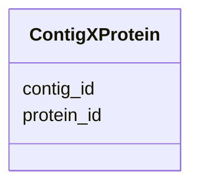

# Class: ContigXProtein 


URI: [https://w3id.org/kbase/kbase_genomes/ContigXProtein](https://w3id.org/kbase/kbase_genomes/ContigXProtein)





<!-- no inheritance hierarchy -->


## Slots

| Name | Cardinality and Range | Description | Inheritance |
| ---  | --- | --- | --- |
| [contig_id](contig_id.md) | 0..1 <br/> [String](String.md) |  | direct |
| [protein_id](protein_id.md) | 0..1 <br/> [String](String.md) |  | direct |


## Identifier and Mapping Information


### Annotations

| property | value |
| --- | --- |
| source_table | contig_x_protein |


### Schema Source


* from schema: https://w3id.org/kbase/kbase_genomes


## Mappings

| Mapping Type | Mapped Value |
| ---  | ---  |
| self | https://w3id.org/kbase/kbase_genomes/ContigXProtein |
| native | https://w3id.org/kbase/kbase_genomes/ContigXProtein |


## LinkML Source

<!-- TODO: investigate https://stackoverflow.com/questions/37606292/how-to-create-tabbed-code-blocks-in-mkdocs-or-sphinx -->

### Direct

<details>
```yaml
name: ContigXProtein
annotations:
  source_table:
    tag: source_table
    value: contig_x_protein
from_schema: https://w3id.org/kbase/kbase_genomes
attributes:
  contig_id:
    name: contig_id
    from_schema: https://w3id.org/kbase/kbase_genomes
    identifier: false
    domain_of:
    - Contig
    - ContigXContigCollection
    - ContigXFeature
    - ContigXEncodedFeature
    - ContigXProtein
    range: string
  protein_id:
    name: protein_id
    from_schema: https://w3id.org/kbase/kbase_genomes
    rank: 1000
    identifier: false
    domain_of:
    - ContigXProtein
    - ContigCollectionXProtein
    - FeatureXProtein
    - EncodedFeatureXProtein
    - Protein
    range: string

```
</details>

### Induced

<details>
```yaml
name: ContigXProtein
annotations:
  source_table:
    tag: source_table
    value: contig_x_protein
from_schema: https://w3id.org/kbase/kbase_genomes
attributes:
  contig_id:
    name: contig_id
    from_schema: https://w3id.org/kbase/kbase_genomes
    identifier: false
    alias: contig_id
    owner: ContigXProtein
    domain_of:
    - Contig
    - ContigXContigCollection
    - ContigXFeature
    - ContigXEncodedFeature
    - ContigXProtein
    range: string
  protein_id:
    name: protein_id
    from_schema: https://w3id.org/kbase/kbase_genomes
    rank: 1000
    identifier: false
    alias: protein_id
    owner: ContigXProtein
    domain_of:
    - ContigXProtein
    - ContigCollectionXProtein
    - FeatureXProtein
    - EncodedFeatureXProtein
    - Protein
    range: string

```
</details>