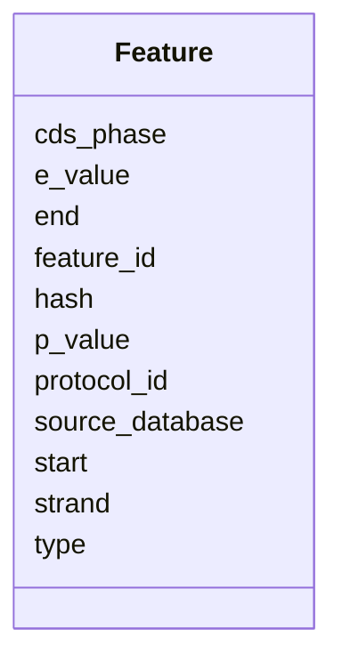

# Class: Feature 


URI: [https://w3id.org/kbase/kbase_genomes/Feature](https://w3id.org/kbase/kbase_genomes/Feature)





<!-- no inheritance hierarchy -->


## Slots

| Name | Cardinality and Range | Description | Inheritance |
| ---  | --- | --- | --- |
| [feature_id](feature_id.md) | 1 <br/> [String](String.md) |  | direct |
| [hash](hash.md) | 0..1 <br/> [String](String.md) |  | direct |
| [cds_phase](cds_phase.md) | 0..1 <br/> [String](String.md) |  | direct |
| [e_value](e_value.md) | 0..1 <br/> [String](String.md) |  | direct |
| [p_value](p_value.md) | 0..1 <br/> [String](String.md) |  | direct |
| [start](start.md) | 0..1 <br/> [String](String.md) |  | direct |
| [end](end.md) | 0..1 <br/> [String](String.md) |  | direct |
| [strand](strand.md) | 0..1 <br/> [String](String.md) |  | direct |
| [source_database](source_database.md) | 0..1 <br/> [String](String.md) |  | direct |
| [protocol_id](protocol_id.md) | 0..1 <br/> [String](String.md) |  | direct |
| [type](type.md) | 0..1 <br/> [String](String.md) |  | direct |


## Identifier and Mapping Information


### Annotations

| property | value |
| --- | --- |
| source_table | feature |


### Schema Source


* from schema: https://w3id.org/kbase/kbase_genomes


## Mappings

| Mapping Type | Mapped Value |
| ---  | ---  |
| self | https://w3id.org/kbase/kbase_genomes/Feature |
| native | https://w3id.org/kbase/kbase_genomes/Feature |


## LinkML Source

<!-- TODO: investigate https://stackoverflow.com/questions/37606292/how-to-create-tabbed-code-blocks-in-mkdocs-or-sphinx -->

### Direct

<details>
```yaml
name: Feature
annotations:
  source_table:
    tag: source_table
    value: feature
from_schema: https://w3id.org/kbase/kbase_genomes
attributes:
  feature_id:
    name: feature_id
    from_schema: https://w3id.org/kbase/kbase_genomes
    rank: 1000
    identifier: true
    domain_of:
    - Feature
    - ContigCollectionXFeature
    - ContigXFeature
    - EncodedFeatureXFeature
    - FeatureXProtein
    range: string
    required: true
  hash:
    name: hash
    from_schema: https://w3id.org/kbase/kbase_genomes
    domain_of:
    - Contig
    - ContigCollection
    - Feature
    - EncodedFeature
    - Protein
    range: string
  cds_phase:
    name: cds_phase
    from_schema: https://w3id.org/kbase/kbase_genomes
    rank: 1000
    domain_of:
    - Feature
    range: string
  e_value:
    name: e_value
    from_schema: https://w3id.org/kbase/kbase_genomes
    rank: 1000
    domain_of:
    - Feature
    range: string
  p_value:
    name: p_value
    from_schema: https://w3id.org/kbase/kbase_genomes
    rank: 1000
    domain_of:
    - Feature
    range: string
  start:
    name: start
    from_schema: https://w3id.org/kbase/kbase_genomes
    rank: 1000
    domain_of:
    - Feature
    range: string
  end:
    name: end
    from_schema: https://w3id.org/kbase/kbase_genomes
    rank: 1000
    domain_of:
    - Feature
    range: string
  strand:
    name: strand
    from_schema: https://w3id.org/kbase/kbase_genomes
    rank: 1000
    domain_of:
    - Feature
    range: string
  source_database:
    name: source_database
    from_schema: https://w3id.org/kbase/kbase_genomes
    rank: 1000
    domain_of:
    - Feature
    range: string
  protocol_id:
    name: protocol_id
    from_schema: https://w3id.org/kbase/kbase_genomes
    rank: 1000
    identifier: false
    domain_of:
    - Feature
    range: string
  type:
    name: type
    from_schema: https://w3id.org/kbase/kbase_genomes
    rank: 1000
    domain_of:
    - Feature
    - EncodedFeature
    range: string

```
</details>

### Induced

<details>
```yaml
name: Feature
annotations:
  source_table:
    tag: source_table
    value: feature
from_schema: https://w3id.org/kbase/kbase_genomes
attributes:
  feature_id:
    name: feature_id
    from_schema: https://w3id.org/kbase/kbase_genomes
    rank: 1000
    identifier: true
    alias: feature_id
    owner: Feature
    domain_of:
    - Feature
    - ContigCollectionXFeature
    - ContigXFeature
    - EncodedFeatureXFeature
    - FeatureXProtein
    range: string
    required: true
  hash:
    name: hash
    from_schema: https://w3id.org/kbase/kbase_genomes
    alias: hash
    owner: Feature
    domain_of:
    - Contig
    - ContigCollection
    - Feature
    - EncodedFeature
    - Protein
    range: string
  cds_phase:
    name: cds_phase
    from_schema: https://w3id.org/kbase/kbase_genomes
    rank: 1000
    alias: cds_phase
    owner: Feature
    domain_of:
    - Feature
    range: string
  e_value:
    name: e_value
    from_schema: https://w3id.org/kbase/kbase_genomes
    rank: 1000
    alias: e_value
    owner: Feature
    domain_of:
    - Feature
    range: string
  p_value:
    name: p_value
    from_schema: https://w3id.org/kbase/kbase_genomes
    rank: 1000
    alias: p_value
    owner: Feature
    domain_of:
    - Feature
    range: string
  start:
    name: start
    from_schema: https://w3id.org/kbase/kbase_genomes
    rank: 1000
    alias: start
    owner: Feature
    domain_of:
    - Feature
    range: string
  end:
    name: end
    from_schema: https://w3id.org/kbase/kbase_genomes
    rank: 1000
    alias: end
    owner: Feature
    domain_of:
    - Feature
    range: string
  strand:
    name: strand
    from_schema: https://w3id.org/kbase/kbase_genomes
    rank: 1000
    alias: strand
    owner: Feature
    domain_of:
    - Feature
    range: string
  source_database:
    name: source_database
    from_schema: https://w3id.org/kbase/kbase_genomes
    rank: 1000
    alias: source_database
    owner: Feature
    domain_of:
    - Feature
    range: string
  protocol_id:
    name: protocol_id
    from_schema: https://w3id.org/kbase/kbase_genomes
    rank: 1000
    identifier: false
    alias: protocol_id
    owner: Feature
    domain_of:
    - Feature
    range: string
  type:
    name: type
    from_schema: https://w3id.org/kbase/kbase_genomes
    rank: 1000
    alias: type
    owner: Feature
    domain_of:
    - Feature
    - EncodedFeature
    range: string

```
</details>