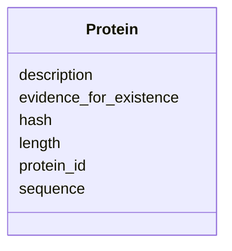

# Class: Protein 


URI: [https://w3id.org/kbase/kbase_genomes/Protein](https://w3id.org/kbase/kbase_genomes/Protein)





<!-- no inheritance hierarchy -->


## Slots

| Name | Cardinality and Range | Description | Inheritance |
| ---  | --- | --- | --- |
| [protein_id](protein_id.md) | 1 <br/> [String](String.md) |  | direct |
| [hash](hash.md) | 0..1 <br/> [String](String.md) |  | direct |
| [description](description.md) | 0..1 <br/> [String](String.md) |  | direct |
| [evidence_for_existence](evidence_for_existence.md) | 0..1 <br/> [String](String.md) |  | direct |
| [length](length.md) | 0..1 <br/> [String](String.md) |  | direct |
| [sequence](sequence.md) | 0..1 <br/> [String](String.md) |  | direct |


## Identifier and Mapping Information


### Annotations

| property | value |
| --- | --- |
| source_table | protein |


### Schema Source


* from schema: https://w3id.org/kbase/kbase_genomes


## Mappings

| Mapping Type | Mapped Value |
| ---  | ---  |
| self | https://w3id.org/kbase/kbase_genomes/Protein |
| native | https://w3id.org/kbase/kbase_genomes/Protein |


## LinkML Source

<!-- TODO: investigate https://stackoverflow.com/questions/37606292/how-to-create-tabbed-code-blocks-in-mkdocs-or-sphinx -->

### Direct

<details>
```yaml
name: Protein
annotations:
  source_table:
    tag: source_table
    value: protein
from_schema: https://w3id.org/kbase/kbase_genomes
attributes:
  protein_id:
    name: protein_id
    from_schema: https://w3id.org/kbase/kbase_genomes
    identifier: true
    domain_of:
    - ContigXProtein
    - ContigCollectionXProtein
    - FeatureXProtein
    - EncodedFeatureXProtein
    - Protein
    range: string
    required: true
  hash:
    name: hash
    from_schema: https://w3id.org/kbase/kbase_genomes
    domain_of:
    - Contig
    - ContigCollection
    - Feature
    - EncodedFeature
    - Protein
    range: string
  description:
    name: description
    from_schema: https://w3id.org/kbase/kbase_genomes
    domain_of:
    - Name
    - Protein
    range: string
  evidence_for_existence:
    name: evidence_for_existence
    from_schema: https://w3id.org/kbase/kbase_genomes
    rank: 1000
    domain_of:
    - Protein
    range: string
  length:
    name: length
    from_schema: https://w3id.org/kbase/kbase_genomes
    domain_of:
    - Contig
    - Protein
    range: string
  sequence:
    name: sequence
    from_schema: https://w3id.org/kbase/kbase_genomes
    rank: 1000
    domain_of:
    - Protein
    range: string

```
</details>

### Induced

<details>
```yaml
name: Protein
annotations:
  source_table:
    tag: source_table
    value: protein
from_schema: https://w3id.org/kbase/kbase_genomes
attributes:
  protein_id:
    name: protein_id
    from_schema: https://w3id.org/kbase/kbase_genomes
    identifier: true
    alias: protein_id
    owner: Protein
    domain_of:
    - ContigXProtein
    - ContigCollectionXProtein
    - FeatureXProtein
    - EncodedFeatureXProtein
    - Protein
    range: string
    required: true
  hash:
    name: hash
    from_schema: https://w3id.org/kbase/kbase_genomes
    alias: hash
    owner: Protein
    domain_of:
    - Contig
    - ContigCollection
    - Feature
    - EncodedFeature
    - Protein
    range: string
  description:
    name: description
    from_schema: https://w3id.org/kbase/kbase_genomes
    alias: description
    owner: Protein
    domain_of:
    - Name
    - Protein
    range: string
  evidence_for_existence:
    name: evidence_for_existence
    from_schema: https://w3id.org/kbase/kbase_genomes
    rank: 1000
    alias: evidence_for_existence
    owner: Protein
    domain_of:
    - Protein
    range: string
  length:
    name: length
    from_schema: https://w3id.org/kbase/kbase_genomes
    alias: length
    owner: Protein
    domain_of:
    - Contig
    - Protein
    range: string
  sequence:
    name: sequence
    from_schema: https://w3id.org/kbase/kbase_genomes
    rank: 1000
    alias: sequence
    owner: Protein
    domain_of:
    - Protein
    range: string

```
</details>