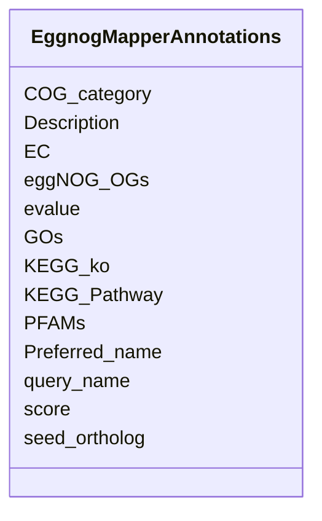

# Class: EggnogMapperAnnotations 


_EggNOG-mapper v2 functional annotations for genes. Provides: - COG functional categories - GO term annotations - KEGG pathway/ortholog mappings - EC enzyme numbers - PFAM domain annotations_

_COVERAGE: 93,558,330 annotated genes (~9% of total)_

_COG CATEGORY DISTRIBUTION (most common): - S (function unknown): Most common - J (translation): ~8% - K (transcription): ~6% - C (energy): ~5% - E (amino acid metabolism): ~5%_


URI: [https://w3id.org/kbase/kbase_ke_pangenome/EggnogMapperAnnotations](https://w3id.org/kbase/kbase_ke_pangenome/EggnogMapperAnnotations)





<!-- no inheritance hierarchy -->


## Slots

| Name | Cardinality and Range | Description | Inheritance |
| ---  | --- | --- | --- |
| [query_name](query_name.md) | 1 <br/> [String](String.md) | Gene ID - links to Gene | direct |
| [seed_ortholog](seed_ortholog.md) | 0..1 <br/> [String](String.md) | Best matching seed ortholog from eggNOG database | direct |
| [evalue](evalue.md) | 0..1 <br/> [Float](Float.md) | E-value of seed ortholog match (lower = better match) | direct |
| [score](score.md) | 0..1 <br/> [Float](Float.md) | Bit score of seed ortholog alignment | direct |
| [eggNOG_OGs](eggNOG_OGs.md) | 0..1 <br/> [String](String.md) | Hierarchical EggNOG ortholog groups from root to most specific | direct |
| [COG_category](COG_category.md) | 0..1 <br/> [String](String.md) | COG functional category code(s) | direct |
| [Description](Description.md) | 0..1 <br/> [String](String.md) | Functional description from seed ortholog | direct |
| [Preferred_name](Preferred_name.md) | 0..1 <br/> [String](String.md) | Gene symbol when available, "-" if none | direct |
| [GOs](GOs.md) | 0..1 <br/> [String](String.md) | GO terms, comma-separated | direct |
| [EC](EC.md) | 0..1 <br/> [String](String.md) | EC enzyme numbers, comma-separated | direct |
| [KEGG_ko](KEGG_ko.md) | 0..1 <br/> [String](String.md) | KEGG Orthology IDs | direct |
| [KEGG_Pathway](KEGG_Pathway.md) | 0..1 <br/> [String](String.md) | KEGG pathway IDs, comma-separated | direct |
| [PFAMs](PFAMs.md) | 0..1 <br/> [String](String.md) | PFAM domain annotations, comma-separated | direct |


## Identifier and Mapping Information


### Annotations

| property | value |
| --- | --- |
| source_table | eggnog_mapper_annotations |
| row_count | 93558330 |


### Schema Source


* from schema: https://w3id.org/kbase/kbase_ke_pangenome


## Mappings

| Mapping Type | Mapped Value |
| ---  | ---  |
| self | https://w3id.org/kbase/kbase_ke_pangenome/EggnogMapperAnnotations |
| native | https://w3id.org/kbase/kbase_ke_pangenome/EggnogMapperAnnotations |


## LinkML Source

<!-- TODO: investigate https://stackoverflow.com/questions/37606292/how-to-create-tabbed-code-blocks-in-mkdocs-or-sphinx -->

### Direct

<details>
```yaml
name: EggnogMapperAnnotations
annotations:
  source_table:
    tag: source_table
    value: eggnog_mapper_annotations
  row_count:
    tag: row_count
    value: '93558330'
description: 'EggNOG-mapper v2 functional annotations for genes. Provides: - COG functional
  categories - GO term annotations - KEGG pathway/ortholog mappings - EC enzyme numbers
  - PFAM domain annotations

  COVERAGE: 93,558,330 annotated genes (~9% of total)

  COG CATEGORY DISTRIBUTION (most common): - S (function unknown): Most common - J
  (translation): ~8% - K (transcription): ~6% - C (energy): ~5% - E (amino acid metabolism):
  ~5%'
from_schema: https://w3id.org/kbase/kbase_ke_pangenome
attributes:
  query_name:
    name: query_name
    description: Gene ID - links to Gene.gene_id
    comments:
    - 'Foreign key: Gene.gene_id'
    examples:
    - value: DBFF01000060.1_2
    - value: CALVBM010000003.1_96
    from_schema: https://w3id.org/kbase/kbase_ke_pangenome
    rank: 1000
    identifier: true
    domain_of:
    - EggnogMapperAnnotations
    range: string
    required: true
  seed_ortholog:
    name: seed_ortholog
    description: 'Best matching seed ortholog from eggNOG database. Format: taxon_id.locus_tag'
    examples:
    - value: 42256.RradSPS_0079
    - value: 1548153.LR59_00700
    from_schema: https://w3id.org/kbase/kbase_ke_pangenome
    rank: 1000
    domain_of:
    - EggnogMapperAnnotations
    range: string
  evalue:
    name: evalue
    description: E-value of seed ortholog match (lower = better match)
    examples:
    - value: '3.06e-109'
    - value: '0.0'
      description: Exact match
    - value: 1e-50
    from_schema: https://w3id.org/kbase/kbase_ke_pangenome
    rank: 1000
    domain_of:
    - EggnogMapperAnnotations
    range: float
    minimum_value: 0.0
  score:
    name: score
    description: Bit score of seed ortholog alignment
    examples:
    - value: '339.0'
    - value: '876.0'
    from_schema: https://w3id.org/kbase/kbase_ke_pangenome
    rank: 1000
    domain_of:
    - EggnogMapperAnnotations
    - GapmindPathways
    range: float
  eggNOG_OGs:
    name: eggNOG_OGs
    description: 'Hierarchical EggNOG ortholog groups from root to most specific.
      Format: COG@level|taxon pairs, comma-separated.'
    examples:
    - value: COG0154@1|root,COG0154@2|Bacteria,2GKPZ@201174|Actinobacteria,4CPJR@84995|Rubrobacteria
    - value: COG0439@1|root,COG0439@2|Bacteria,1MU4H@1224|Proteobacteria
    from_schema: https://w3id.org/kbase/kbase_ke_pangenome
    rank: 1000
    domain_of:
    - EggnogMapperAnnotations
    range: string
  COG_category:
    name: COG_category
    description: COG functional category code(s). Single letter or combinations. See
      CogFunctionalCategory enum for meanings.
    examples:
    - value: J
      description: Translation/ribosome
    - value: I
      description: Lipid metabolism
    - value: CG
      description: Energy + Carbohydrate
    - value: S
      description: Function unknown
    from_schema: https://w3id.org/kbase/kbase_ke_pangenome
    rank: 1000
    domain_of:
    - EggnogMapperAnnotations
    range: string
  Description:
    name: Description
    description: Functional description from seed ortholog
    examples:
    - value: Belongs to the amidase family
    - value: Biotin carboxylase
    - value: DNA-directed RNA polymerase subunit beta
    from_schema: https://w3id.org/kbase/kbase_ke_pangenome
    rank: 1000
    domain_of:
    - EggnogMapperAnnotations
    range: string
  Preferred_name:
    name: Preferred_name
    description: Gene symbol when available, "-" if none
    examples:
    - value: pycA
    - value: rpoB
    - value: '-'
    from_schema: https://w3id.org/kbase/kbase_ke_pangenome
    rank: 1000
    domain_of:
    - EggnogMapperAnnotations
    range: string
  GOs:
    name: GOs
    description: GO terms, comma-separated. "-" if none.
    examples:
    - value: GO:0003824,GO:0016021
    - value: GO:0005524,GO:0004329,GO:0006633
    - value: '-'
    from_schema: https://w3id.org/kbase/kbase_ke_pangenome
    rank: 1000
    domain_of:
    - EggnogMapperAnnotations
    range: string
  EC:
    name: EC
    description: EC enzyme numbers, comma-separated
    examples:
    - value: 3.5.1.4
    - value: 6.3.4.14,6.4.1.1,6.4.1.2
    - value: 2.7.7.6
    from_schema: https://w3id.org/kbase/kbase_ke_pangenome
    rank: 1000
    domain_of:
    - EggnogMapperAnnotations
    range: string
  KEGG_ko:
    name: KEGG_ko
    description: KEGG Orthology IDs
    examples:
    - value: ko:K01426
    - value: ko:K01959,ko:K01961
    from_schema: https://w3id.org/kbase/kbase_ke_pangenome
    rank: 1000
    domain_of:
    - EggnogMapperAnnotations
    range: string
  KEGG_Pathway:
    name: KEGG_Pathway
    description: KEGG pathway IDs, comma-separated
    examples:
    - value: ko00330,ko00360,map00330,map00360
    - value: ko00020,ko00061,ko00620,ko00640
    from_schema: https://w3id.org/kbase/kbase_ke_pangenome
    rank: 1000
    domain_of:
    - EggnogMapperAnnotations
    range: string
  PFAMs:
    name: PFAMs
    description: PFAM domain annotations, comma-separated
    examples:
    - value: Amidase
    - value: Biotin_carb_C,Biotin_carb_N,CPSase_L_D2
    - value: RNA_pol_Rpb2_1,RNA_pol_Rpb2_2
    from_schema: https://w3id.org/kbase/kbase_ke_pangenome
    rank: 1000
    domain_of:
    - EggnogMapperAnnotations
    range: string

```
</details>

### Induced

<details>
```yaml
name: EggnogMapperAnnotations
annotations:
  source_table:
    tag: source_table
    value: eggnog_mapper_annotations
  row_count:
    tag: row_count
    value: '93558330'
description: 'EggNOG-mapper v2 functional annotations for genes. Provides: - COG functional
  categories - GO term annotations - KEGG pathway/ortholog mappings - EC enzyme numbers
  - PFAM domain annotations

  COVERAGE: 93,558,330 annotated genes (~9% of total)

  COG CATEGORY DISTRIBUTION (most common): - S (function unknown): Most common - J
  (translation): ~8% - K (transcription): ~6% - C (energy): ~5% - E (amino acid metabolism):
  ~5%'
from_schema: https://w3id.org/kbase/kbase_ke_pangenome
attributes:
  query_name:
    name: query_name
    description: Gene ID - links to Gene.gene_id
    comments:
    - 'Foreign key: Gene.gene_id'
    examples:
    - value: DBFF01000060.1_2
    - value: CALVBM010000003.1_96
    from_schema: https://w3id.org/kbase/kbase_ke_pangenome
    rank: 1000
    identifier: true
    alias: query_name
    owner: EggnogMapperAnnotations
    domain_of:
    - EggnogMapperAnnotations
    range: string
    required: true
  seed_ortholog:
    name: seed_ortholog
    description: 'Best matching seed ortholog from eggNOG database. Format: taxon_id.locus_tag'
    examples:
    - value: 42256.RradSPS_0079
    - value: 1548153.LR59_00700
    from_schema: https://w3id.org/kbase/kbase_ke_pangenome
    rank: 1000
    alias: seed_ortholog
    owner: EggnogMapperAnnotations
    domain_of:
    - EggnogMapperAnnotations
    range: string
  evalue:
    name: evalue
    description: E-value of seed ortholog match (lower = better match)
    examples:
    - value: '3.06e-109'
    - value: '0.0'
      description: Exact match
    - value: 1e-50
    from_schema: https://w3id.org/kbase/kbase_ke_pangenome
    rank: 1000
    alias: evalue
    owner: EggnogMapperAnnotations
    domain_of:
    - EggnogMapperAnnotations
    range: float
    minimum_value: 0.0
  score:
    name: score
    description: Bit score of seed ortholog alignment
    examples:
    - value: '339.0'
    - value: '876.0'
    from_schema: https://w3id.org/kbase/kbase_ke_pangenome
    rank: 1000
    alias: score
    owner: EggnogMapperAnnotations
    domain_of:
    - EggnogMapperAnnotations
    - GapmindPathways
    range: float
  eggNOG_OGs:
    name: eggNOG_OGs
    description: 'Hierarchical EggNOG ortholog groups from root to most specific.
      Format: COG@level|taxon pairs, comma-separated.'
    examples:
    - value: COG0154@1|root,COG0154@2|Bacteria,2GKPZ@201174|Actinobacteria,4CPJR@84995|Rubrobacteria
    - value: COG0439@1|root,COG0439@2|Bacteria,1MU4H@1224|Proteobacteria
    from_schema: https://w3id.org/kbase/kbase_ke_pangenome
    rank: 1000
    alias: eggNOG_OGs
    owner: EggnogMapperAnnotations
    domain_of:
    - EggnogMapperAnnotations
    range: string
  COG_category:
    name: COG_category
    description: COG functional category code(s). Single letter or combinations. See
      CogFunctionalCategory enum for meanings.
    examples:
    - value: J
      description: Translation/ribosome
    - value: I
      description: Lipid metabolism
    - value: CG
      description: Energy + Carbohydrate
    - value: S
      description: Function unknown
    from_schema: https://w3id.org/kbase/kbase_ke_pangenome
    rank: 1000
    alias: COG_category
    owner: EggnogMapperAnnotations
    domain_of:
    - EggnogMapperAnnotations
    range: string
  Description:
    name: Description
    description: Functional description from seed ortholog
    examples:
    - value: Belongs to the amidase family
    - value: Biotin carboxylase
    - value: DNA-directed RNA polymerase subunit beta
    from_schema: https://w3id.org/kbase/kbase_ke_pangenome
    rank: 1000
    alias: Description
    owner: EggnogMapperAnnotations
    domain_of:
    - EggnogMapperAnnotations
    range: string
  Preferred_name:
    name: Preferred_name
    description: Gene symbol when available, "-" if none
    examples:
    - value: pycA
    - value: rpoB
    - value: '-'
    from_schema: https://w3id.org/kbase/kbase_ke_pangenome
    rank: 1000
    alias: Preferred_name
    owner: EggnogMapperAnnotations
    domain_of:
    - EggnogMapperAnnotations
    range: string
  GOs:
    name: GOs
    description: GO terms, comma-separated. "-" if none.
    examples:
    - value: GO:0003824,GO:0016021
    - value: GO:0005524,GO:0004329,GO:0006633
    - value: '-'
    from_schema: https://w3id.org/kbase/kbase_ke_pangenome
    rank: 1000
    alias: GOs
    owner: EggnogMapperAnnotations
    domain_of:
    - EggnogMapperAnnotations
    range: string
  EC:
    name: EC
    description: EC enzyme numbers, comma-separated
    examples:
    - value: 3.5.1.4
    - value: 6.3.4.14,6.4.1.1,6.4.1.2
    - value: 2.7.7.6
    from_schema: https://w3id.org/kbase/kbase_ke_pangenome
    rank: 1000
    alias: EC
    owner: EggnogMapperAnnotations
    domain_of:
    - EggnogMapperAnnotations
    range: string
  KEGG_ko:
    name: KEGG_ko
    description: KEGG Orthology IDs
    examples:
    - value: ko:K01426
    - value: ko:K01959,ko:K01961
    from_schema: https://w3id.org/kbase/kbase_ke_pangenome
    rank: 1000
    alias: KEGG_ko
    owner: EggnogMapperAnnotations
    domain_of:
    - EggnogMapperAnnotations
    range: string
  KEGG_Pathway:
    name: KEGG_Pathway
    description: KEGG pathway IDs, comma-separated
    examples:
    - value: ko00330,ko00360,map00330,map00360
    - value: ko00020,ko00061,ko00620,ko00640
    from_schema: https://w3id.org/kbase/kbase_ke_pangenome
    rank: 1000
    alias: KEGG_Pathway
    owner: EggnogMapperAnnotations
    domain_of:
    - EggnogMapperAnnotations
    range: string
  PFAMs:
    name: PFAMs
    description: PFAM domain annotations, comma-separated
    examples:
    - value: Amidase
    - value: Biotin_carb_C,Biotin_carb_N,CPSase_L_D2
    - value: RNA_pol_Rpb2_1,RNA_pol_Rpb2_2
    from_schema: https://w3id.org/kbase/kbase_ke_pangenome
    rank: 1000
    alias: PFAMs
    owner: EggnogMapperAnnotations
    domain_of:
    - EggnogMapperAnnotations
    range: string

```
</details>