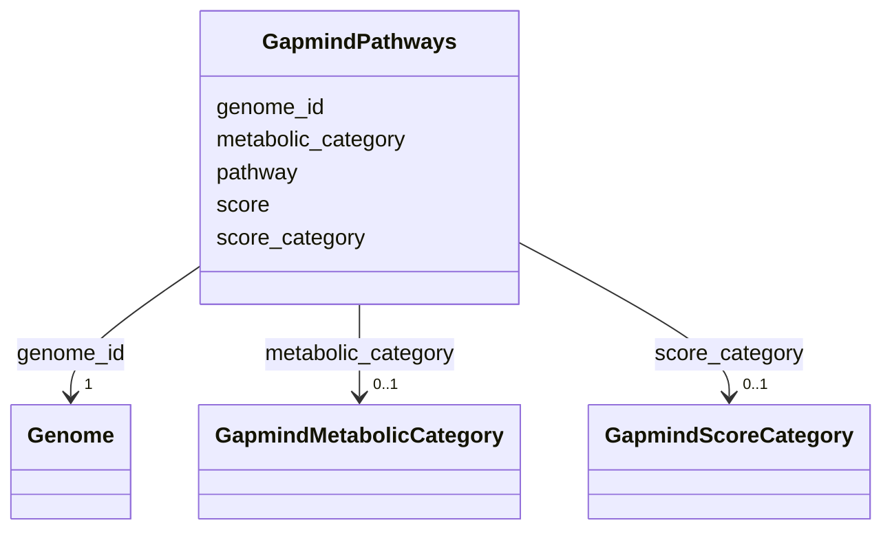

# Class: GapmindPathways 


_GapMind metabolic pathway completeness scores. Indicates genome capability for amino acid biosynthesis/catabolism and carbon utilization._

_PATHWAY FREQUENCY (most assessed): - phenylalanine: 12,267,024 genomes - arginine: 10,514,592 genomes - threonine, tryptophan: 9,638,376 each - sucrose, lactose: 8,762,160 each_

_INTERPRETATION: - "complete": Genome can synthesize/utilize this compound - "not_present": Genome cannot, must acquire externally_


URI: [https://w3id.org/kbase/kbase_ke_pangenome/GapmindPathways](https://w3id.org/kbase/kbase_ke_pangenome/GapmindPathways)





<!-- no inheritance hierarchy -->


## Slots

| Name | Cardinality and Range | Description | Inheritance |
| ---  | --- | --- | --- |
| [genome_id](genome_id.md) | 1 <br/> [Genome](Genome.md) | Genome assessed for pathway completeness | direct |
| [pathway](pathway.md) | 0..1 <br/> [String](String.md) | Pathway/compound name | direct |
| [metabolic_category](metabolic_category.md) | 0..1 <br/> [GapmindMetabolicCategory](GapmindMetabolicCategory.md) | Category - amino acid (aa) or carbon source | direct |
| [score](score.md) | 0..1 <br/> [Float](Float.md) | Pathway completeness score (0-1) | direct |
| [score_category](score_category.md) | 0..1 <br/> [GapmindScoreCategory](GapmindScoreCategory.md) | Categorical assessment of pathway completeness | direct |


## Identifier and Mapping Information


### Annotations

| property | value |
| --- | --- |
| source_table | gapmind_pathways |


### Schema Source


* from schema: https://w3id.org/kbase/kbase_ke_pangenome


## Mappings

| Mapping Type | Mapped Value |
| ---  | ---  |
| self | https://w3id.org/kbase/kbase_ke_pangenome/GapmindPathways |
| native | https://w3id.org/kbase/kbase_ke_pangenome/GapmindPathways |


## LinkML Source

<!-- TODO: investigate https://stackoverflow.com/questions/37606292/how-to-create-tabbed-code-blocks-in-mkdocs-or-sphinx -->

### Direct

<details>
```yaml
name: GapmindPathways
annotations:
  source_table:
    tag: source_table
    value: gapmind_pathways
description: 'GapMind metabolic pathway completeness scores. Indicates genome capability
  for amino acid biosynthesis/catabolism and carbon utilization.

  PATHWAY FREQUENCY (most assessed): - phenylalanine: 12,267,024 genomes - arginine:
  10,514,592 genomes - threonine, tryptophan: 9,638,376 each - sucrose, lactose: 8,762,160
  each

  INTERPRETATION: - "complete": Genome can synthesize/utilize this compound - "not_present":
  Genome cannot, must acquire externally'
from_schema: https://w3id.org/kbase/kbase_ke_pangenome
attributes:
  genome_id:
    name: genome_id
    description: Genome assessed for pathway completeness
    comments:
    - 'Foreign key: Genome.genome_id'
    from_schema: https://w3id.org/kbase/kbase_ke_pangenome
    domain_of:
    - Genome
    - Gene
    - GtdbTaxonomyR214v1
    - Sample
    - GapmindPathways
    range: Genome
    required: true
  pathway:
    name: pathway
    description: Pathway/compound name. Amino acids or carbon sources.
    examples:
    - value: alanine
    - value: phenylalanine
    - value: tryptophan
    - value: glucose
    - value: lactose
    - value: citrate
    - value: acetate
    from_schema: https://w3id.org/kbase/kbase_ke_pangenome
    rank: 1000
    domain_of:
    - GapmindPathways
    range: string
  metabolic_category:
    name: metabolic_category
    description: Category - amino acid (aa) or carbon source
    examples:
    - value: aa
    - value: carbon
    from_schema: https://w3id.org/kbase/kbase_ke_pangenome
    rank: 1000
    domain_of:
    - GapmindPathways
    range: GapmindMetabolicCategory
  score:
    name: score
    description: Pathway completeness score (0-1)
    examples:
    - value: '1.0'
      description: Complete pathway
    - value: '0.8'
      description: Mostly complete
    - value: '0.0'
      description: Not present
    from_schema: https://w3id.org/kbase/kbase_ke_pangenome
    domain_of:
    - EggnogMapperAnnotations
    - GapmindPathways
    range: float
    minimum_value: 0.0
    maximum_value: 1.0
  score_category:
    name: score_category
    description: Categorical assessment of pathway completeness
    examples:
    - value: complete
    - value: likely_complete
    - value: steps_missing_low
    - value: not_present
    from_schema: https://w3id.org/kbase/kbase_ke_pangenome
    rank: 1000
    domain_of:
    - GapmindPathways
    range: GapmindScoreCategory

```
</details>

### Induced

<details>
```yaml
name: GapmindPathways
annotations:
  source_table:
    tag: source_table
    value: gapmind_pathways
description: 'GapMind metabolic pathway completeness scores. Indicates genome capability
  for amino acid biosynthesis/catabolism and carbon utilization.

  PATHWAY FREQUENCY (most assessed): - phenylalanine: 12,267,024 genomes - arginine:
  10,514,592 genomes - threonine, tryptophan: 9,638,376 each - sucrose, lactose: 8,762,160
  each

  INTERPRETATION: - "complete": Genome can synthesize/utilize this compound - "not_present":
  Genome cannot, must acquire externally'
from_schema: https://w3id.org/kbase/kbase_ke_pangenome
attributes:
  genome_id:
    name: genome_id
    description: Genome assessed for pathway completeness
    comments:
    - 'Foreign key: Genome.genome_id'
    from_schema: https://w3id.org/kbase/kbase_ke_pangenome
    alias: genome_id
    owner: GapmindPathways
    domain_of:
    - Genome
    - Gene
    - GtdbTaxonomyR214v1
    - Sample
    - GapmindPathways
    range: Genome
    required: true
  pathway:
    name: pathway
    description: Pathway/compound name. Amino acids or carbon sources.
    examples:
    - value: alanine
    - value: phenylalanine
    - value: tryptophan
    - value: glucose
    - value: lactose
    - value: citrate
    - value: acetate
    from_schema: https://w3id.org/kbase/kbase_ke_pangenome
    rank: 1000
    alias: pathway
    owner: GapmindPathways
    domain_of:
    - GapmindPathways
    range: string
  metabolic_category:
    name: metabolic_category
    description: Category - amino acid (aa) or carbon source
    examples:
    - value: aa
    - value: carbon
    from_schema: https://w3id.org/kbase/kbase_ke_pangenome
    rank: 1000
    alias: metabolic_category
    owner: GapmindPathways
    domain_of:
    - GapmindPathways
    range: GapmindMetabolicCategory
  score:
    name: score
    description: Pathway completeness score (0-1)
    examples:
    - value: '1.0'
      description: Complete pathway
    - value: '0.8'
      description: Mostly complete
    - value: '0.0'
      description: Not present
    from_schema: https://w3id.org/kbase/kbase_ke_pangenome
    alias: score
    owner: GapmindPathways
    domain_of:
    - EggnogMapperAnnotations
    - GapmindPathways
    range: float
    minimum_value: 0.0
    maximum_value: 1.0
  score_category:
    name: score_category
    description: Categorical assessment of pathway completeness
    examples:
    - value: complete
    - value: likely_complete
    - value: steps_missing_low
    - value: not_present
    from_schema: https://w3id.org/kbase/kbase_ke_pangenome
    rank: 1000
    alias: score_category
    owner: GapmindPathways
    domain_of:
    - GapmindPathways
    range: GapmindScoreCategory

```
</details>