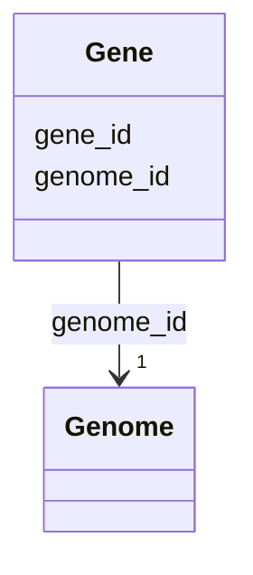

# Class: Gene 


_Gene/CDS within a genome. Identified by contig accession and CDS number. Links to GeneCluster through junction table._

_SCALE: 1,011,650,903 genes in database (>1 billion)_

_GENE ID FORMAT: {contig_accession}_{cds_number} - Contig accession: NCBI nucleotide accession (NC_, NZ_, etc.) - CDS number: Sequential 1-based index on that contig_


URI: [https://w3id.org/kbase/kbase_ke_pangenome/Gene](https://w3id.org/kbase/kbase_ke_pangenome/Gene)





<!-- no inheritance hierarchy -->


## Slots

| Name | Cardinality and Range | Description | Inheritance |
| ---  | --- | --- | --- |
| [gene_id](gene_id.md) | 1 <br/> [String](String.md) | Composite gene identifier constructed from NCBI nucleotide accession and CDS ... | direct |
| [genome_id](genome_id.md) | 1 <br/> [Genome](Genome.md) | Parent genome containing this gene | direct |


## Usages

| used by | used in | type | used |
| ---  | --- | --- | --- |
| [GeneGeneclusterJunction](GeneGeneclusterJunction.md) | [gene_id](gene_id.md) | range | [Gene](Gene.md) |


## Identifier and Mapping Information


### Annotations

| property | value |
| --- | --- |
| source_table | gene |
| row_count | 1011650903 |


### Schema Source


* from schema: https://w3id.org/kbase/kbase_ke_pangenome


## Mappings

| Mapping Type | Mapped Value |
| ---  | ---  |
| self | https://w3id.org/kbase/kbase_ke_pangenome/Gene |
| native | https://w3id.org/kbase/kbase_ke_pangenome/Gene |


## LinkML Source

<!-- TODO: investigate https://stackoverflow.com/questions/37606292/how-to-create-tabbed-code-blocks-in-mkdocs-or-sphinx -->

### Direct

<details>
```yaml
name: Gene
annotations:
  source_table:
    tag: source_table
    value: gene
  row_count:
    tag: row_count
    value: '1011650903'
description: 'Gene/CDS within a genome. Identified by contig accession and CDS number.
  Links to GeneCluster through junction table.

  SCALE: 1,011,650,903 genes in database (>1 billion)

  GENE ID FORMAT: {contig_accession}_{cds_number} - Contig accession: NCBI nucleotide
  accession (NC_, NZ_, etc.) - CDS number: Sequential 1-based index on that contig'
from_schema: https://w3id.org/kbase/kbase_ke_pangenome
attributes:
  gene_id:
    name: gene_id
    description: 'Composite gene identifier constructed from NCBI nucleotide accession
      and CDS position. NOT an NCBI Gene ID (which are integers linking to Entrez
      Gene database).

      Format: {NCBI_nucleotide_accession}_{CDS_number} - The nucleotide accession
      is from NCBI GenBank/RefSeq - CDS_number is a 1-based sequential index of coding
      sequences on that contig

      NCBI NUCLEOTIDE ACCESSION PREFIXES: - NC_: RefSeq complete genomic molecules
      - NZ_: RefSeq annotated genomic sequences (often WGS) - CP: Complete plasmids/chromosomes
      - {4-letter}: WGS contigs (e.g., UTEP, DXZZ)

      To look up the source sequence, extract the accession part before the underscore-number
      suffix and query NCBI Nucleotide database.'
    examples:
    - value: NZ_UTEP01000078.1_260
      description: WGS contig NZ_UTEP01000078.1, 260th CDS
    - value: NC_012808.1_2957
      description: Complete genome NC_012808.1, 2957th CDS
    - value: NZ_CP014762.1_1
      description: Complete plasmid NZ_CP014762.1, first CDS
    - value: DXZZ01000056.1_1
      description: Draft assembly contig, first CDS
    from_schema: https://w3id.org/kbase/kbase_ke_pangenome
    see_also:
    - https://www.ncbi.nlm.nih.gov/nuccore/
    rank: 1000
    identifier: true
    domain_of:
    - Gene
    - GeneGeneclusterJunction
    range: string
    required: true
    pattern: '[A-Z]{1,4}_?[A-Z]*\d+\.\d+_\d+'
  genome_id:
    name: genome_id
    description: Parent genome containing this gene
    comments:
    - 'Foreign key: Genome.genome_id'
    examples:
    - value: RS_GCF_900581555.1
    - value: GB_GCA_902835305.1
    from_schema: https://w3id.org/kbase/kbase_ke_pangenome
    domain_of:
    - Genome
    - Gene
    - GtdbTaxonomyR214v1
    - Sample
    - GapmindPathways
    range: Genome
    required: true

```
</details>

### Induced

<details>
```yaml
name: Gene
annotations:
  source_table:
    tag: source_table
    value: gene
  row_count:
    tag: row_count
    value: '1011650903'
description: 'Gene/CDS within a genome. Identified by contig accession and CDS number.
  Links to GeneCluster through junction table.

  SCALE: 1,011,650,903 genes in database (>1 billion)

  GENE ID FORMAT: {contig_accession}_{cds_number} - Contig accession: NCBI nucleotide
  accession (NC_, NZ_, etc.) - CDS number: Sequential 1-based index on that contig'
from_schema: https://w3id.org/kbase/kbase_ke_pangenome
attributes:
  gene_id:
    name: gene_id
    description: 'Composite gene identifier constructed from NCBI nucleotide accession
      and CDS position. NOT an NCBI Gene ID (which are integers linking to Entrez
      Gene database).

      Format: {NCBI_nucleotide_accession}_{CDS_number} - The nucleotide accession
      is from NCBI GenBank/RefSeq - CDS_number is a 1-based sequential index of coding
      sequences on that contig

      NCBI NUCLEOTIDE ACCESSION PREFIXES: - NC_: RefSeq complete genomic molecules
      - NZ_: RefSeq annotated genomic sequences (often WGS) - CP: Complete plasmids/chromosomes
      - {4-letter}: WGS contigs (e.g., UTEP, DXZZ)

      To look up the source sequence, extract the accession part before the underscore-number
      suffix and query NCBI Nucleotide database.'
    examples:
    - value: NZ_UTEP01000078.1_260
      description: WGS contig NZ_UTEP01000078.1, 260th CDS
    - value: NC_012808.1_2957
      description: Complete genome NC_012808.1, 2957th CDS
    - value: NZ_CP014762.1_1
      description: Complete plasmid NZ_CP014762.1, first CDS
    - value: DXZZ01000056.1_1
      description: Draft assembly contig, first CDS
    from_schema: https://w3id.org/kbase/kbase_ke_pangenome
    see_also:
    - https://www.ncbi.nlm.nih.gov/nuccore/
    rank: 1000
    identifier: true
    alias: gene_id
    owner: Gene
    domain_of:
    - Gene
    - GeneGeneclusterJunction
    range: string
    required: true
    pattern: '[A-Z]{1,4}_?[A-Z]*\d+\.\d+_\d+'
  genome_id:
    name: genome_id
    description: Parent genome containing this gene
    comments:
    - 'Foreign key: Genome.genome_id'
    examples:
    - value: RS_GCF_900581555.1
    - value: GB_GCA_902835305.1
    from_schema: https://w3id.org/kbase/kbase_ke_pangenome
    alias: genome_id
    owner: Gene
    domain_of:
    - Genome
    - Gene
    - GtdbTaxonomyR214v1
    - Sample
    - GapmindPathways
    range: Genome
    required: true

```
</details>