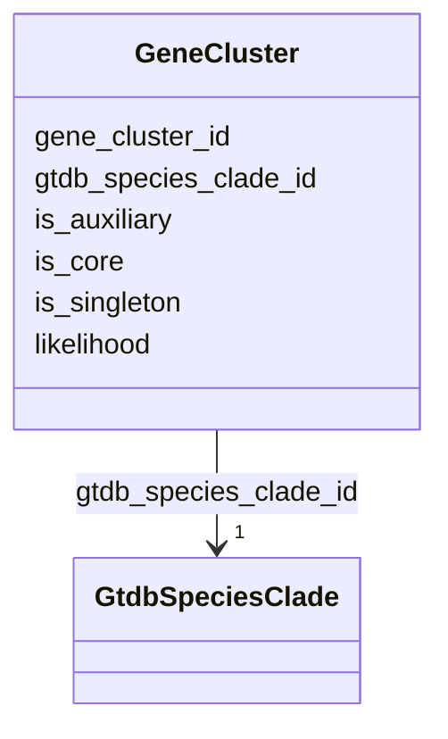

# Class: GeneCluster 


_Ortholog cluster at species level. Clusters are classified as: - CORE: Present in all (or nearly all) genomes - AUXILIARY: Present in some genomes (shell genes) - SINGLETON: Present in only one genome (cloud genes)_

_SCALE: 132,531,501 gene clusters_

_PANGENOME STRUCTURE EXAMPLES: - K. pneumoniae: 4,199 core + 438,925 auxiliary = 443,124 total - S. aureus: 2,083 core + 145,831 auxiliary = 147,914 total_

_The core/auxiliary/singleton partition follows PPanGGOLiN methodology._


URI: [https://w3id.org/kbase/kbase_ke_pangenome/GeneCluster](https://w3id.org/kbase/kbase_ke_pangenome/GeneCluster)





<!-- no inheritance hierarchy -->


## Slots

| Name | Cardinality and Range | Description | Inheritance |
| ---  | --- | --- | --- |
| [gene_cluster_id](gene_cluster_id.md) | 1 <br/> [String](String.md) | Unique cluster identifier | direct |
| [gtdb_species_clade_id](gtdb_species_clade_id.md) | 1 <br/> [GtdbSpeciesClade](GtdbSpeciesClade.md) | Species clade this cluster belongs to | direct |
| [is_core](is_core.md) | 0..1 <br/> [Boolean](Boolean.md) | Present in all (or nearly all) genomes | direct |
| [is_auxiliary](is_auxiliary.md) | 0..1 <br/> [Boolean](Boolean.md) | Present in some but not all genomes | direct |
| [is_singleton](is_singleton.md) | 0..1 <br/> [Boolean](Boolean.md) | Present in only one genome | direct |
| [likelihood](likelihood.md) | 0..1 <br/> [Float](Float.md) | Log-likelihood from PPanGGOLiN Bayesian partitioning model | direct |


## Usages

| used by | used in | type | used |
| ---  | --- | --- | --- |
| [GeneGeneclusterJunction](GeneGeneclusterJunction.md) | [gene_cluster_id](gene_cluster_id.md) | range | [GeneCluster](GeneCluster.md) |


## Identifier and Mapping Information


### Annotations

| property | value |
| --- | --- |
| source_table | gene_cluster |
| row_count | 132531501 |


### Schema Source


* from schema: https://w3id.org/kbase/kbase_ke_pangenome


## Mappings

| Mapping Type | Mapped Value |
| ---  | ---  |
| self | https://w3id.org/kbase/kbase_ke_pangenome/GeneCluster |
| native | https://w3id.org/kbase/kbase_ke_pangenome/GeneCluster |


## LinkML Source

<!-- TODO: investigate https://stackoverflow.com/questions/37606292/how-to-create-tabbed-code-blocks-in-mkdocs-or-sphinx -->

### Direct

<details>
```yaml
name: GeneCluster
annotations:
  source_table:
    tag: source_table
    value: gene_cluster
  row_count:
    tag: row_count
    value: '132531501'
description: 'Ortholog cluster at species level. Clusters are classified as: - CORE:
  Present in all (or nearly all) genomes - AUXILIARY: Present in some genomes (shell
  genes) - SINGLETON: Present in only one genome (cloud genes)

  SCALE: 132,531,501 gene clusters

  PANGENOME STRUCTURE EXAMPLES: - K. pneumoniae: 4,199 core + 438,925 auxiliary =
  443,124 total - S. aureus: 2,083 core + 145,831 auxiliary = 147,914 total

  The core/auxiliary/singleton partition follows PPanGGOLiN methodology.'
from_schema: https://w3id.org/kbase/kbase_ke_pangenome
attributes:
  gene_cluster_id:
    name: gene_cluster_id
    description: Unique cluster identifier. Often derived from seed gene ID.
    examples:
    - value: DXZZ01000056.1_1
    - value: NC_012808.1_2957
    from_schema: https://w3id.org/kbase/kbase_ke_pangenome
    rank: 1000
    identifier: true
    domain_of:
    - GeneCluster
    - GeneGeneclusterJunction
    range: string
    required: true
  gtdb_species_clade_id:
    name: gtdb_species_clade_id
    description: Species clade this cluster belongs to
    comments:
    - 'Foreign key: GtdbSpeciesClade.gtdb_species_clade_id'
    examples:
    - value: s__Collinsella_sp902835305--GB_GCA_902835305.1
    from_schema: https://w3id.org/kbase/kbase_ke_pangenome
    domain_of:
    - GtdbSpeciesClade
    - Genome
    - GeneCluster
    - Pangenome
    range: GtdbSpeciesClade
    required: true
  is_core:
    name: is_core
    description: Present in all (or nearly all) genomes. Core genes define species-level
      functions. Usually 10-20% of clusters.
    examples:
    - value: 'True'
      description: Essential housekeeping gene
    - value: 'False'
      description: Accessory gene
    from_schema: https://w3id.org/kbase/kbase_ke_pangenome
    rank: 1000
    domain_of:
    - GeneCluster
    range: boolean
  is_auxiliary:
    name: is_auxiliary
    description: Present in some but not all genomes. Shell/cloud genes. May include
      mobile elements, strain-specific adaptations.
    examples:
    - value: 'True'
    - value: 'False'
    from_schema: https://w3id.org/kbase/kbase_ke_pangenome
    rank: 1000
    domain_of:
    - GeneCluster
    range: boolean
  is_singleton:
    name: is_singleton
    description: Present in only one genome. Often recently acquired genes, pseudogenes,
      or annotation artifacts. Usually 30-50% of clusters.
    examples:
    - value: 'True'
    - value: 'False'
    from_schema: https://w3id.org/kbase/kbase_ke_pangenome
    rank: 1000
    domain_of:
    - GeneCluster
    range: boolean
  likelihood:
    name: likelihood
    description: Log-likelihood from PPanGGOLiN Bayesian partitioning model. More
      negative = stronger evidence for partition assignment.
    examples:
    - value: '-5.167393657456563'
    - value: '-2.5'
    - value: '-10.3'
    from_schema: https://w3id.org/kbase/kbase_ke_pangenome
    rank: 1000
    domain_of:
    - GeneCluster
    range: float

```
</details>

### Induced

<details>
```yaml
name: GeneCluster
annotations:
  source_table:
    tag: source_table
    value: gene_cluster
  row_count:
    tag: row_count
    value: '132531501'
description: 'Ortholog cluster at species level. Clusters are classified as: - CORE:
  Present in all (or nearly all) genomes - AUXILIARY: Present in some genomes (shell
  genes) - SINGLETON: Present in only one genome (cloud genes)

  SCALE: 132,531,501 gene clusters

  PANGENOME STRUCTURE EXAMPLES: - K. pneumoniae: 4,199 core + 438,925 auxiliary =
  443,124 total - S. aureus: 2,083 core + 145,831 auxiliary = 147,914 total

  The core/auxiliary/singleton partition follows PPanGGOLiN methodology.'
from_schema: https://w3id.org/kbase/kbase_ke_pangenome
attributes:
  gene_cluster_id:
    name: gene_cluster_id
    description: Unique cluster identifier. Often derived from seed gene ID.
    examples:
    - value: DXZZ01000056.1_1
    - value: NC_012808.1_2957
    from_schema: https://w3id.org/kbase/kbase_ke_pangenome
    rank: 1000
    identifier: true
    alias: gene_cluster_id
    owner: GeneCluster
    domain_of:
    - GeneCluster
    - GeneGeneclusterJunction
    range: string
    required: true
  gtdb_species_clade_id:
    name: gtdb_species_clade_id
    description: Species clade this cluster belongs to
    comments:
    - 'Foreign key: GtdbSpeciesClade.gtdb_species_clade_id'
    examples:
    - value: s__Collinsella_sp902835305--GB_GCA_902835305.1
    from_schema: https://w3id.org/kbase/kbase_ke_pangenome
    alias: gtdb_species_clade_id
    owner: GeneCluster
    domain_of:
    - GtdbSpeciesClade
    - Genome
    - GeneCluster
    - Pangenome
    range: GtdbSpeciesClade
    required: true
  is_core:
    name: is_core
    description: Present in all (or nearly all) genomes. Core genes define species-level
      functions. Usually 10-20% of clusters.
    examples:
    - value: 'True'
      description: Essential housekeeping gene
    - value: 'False'
      description: Accessory gene
    from_schema: https://w3id.org/kbase/kbase_ke_pangenome
    rank: 1000
    alias: is_core
    owner: GeneCluster
    domain_of:
    - GeneCluster
    range: boolean
  is_auxiliary:
    name: is_auxiliary
    description: Present in some but not all genomes. Shell/cloud genes. May include
      mobile elements, strain-specific adaptations.
    examples:
    - value: 'True'
    - value: 'False'
    from_schema: https://w3id.org/kbase/kbase_ke_pangenome
    rank: 1000
    alias: is_auxiliary
    owner: GeneCluster
    domain_of:
    - GeneCluster
    range: boolean
  is_singleton:
    name: is_singleton
    description: Present in only one genome. Often recently acquired genes, pseudogenes,
      or annotation artifacts. Usually 30-50% of clusters.
    examples:
    - value: 'True'
    - value: 'False'
    from_schema: https://w3id.org/kbase/kbase_ke_pangenome
    rank: 1000
    alias: is_singleton
    owner: GeneCluster
    domain_of:
    - GeneCluster
    range: boolean
  likelihood:
    name: likelihood
    description: Log-likelihood from PPanGGOLiN Bayesian partitioning model. More
      negative = stronger evidence for partition assignment.
    examples:
    - value: '-5.167393657456563'
    - value: '-2.5'
    - value: '-10.3'
    from_schema: https://w3id.org/kbase/kbase_ke_pangenome
    rank: 1000
    alias: likelihood
    owner: GeneCluster
    domain_of:
    - GeneCluster
    range: float

```
</details>