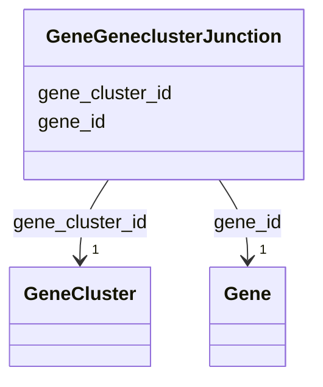

# Class: GeneGeneclusterJunction 


_Junction table linking genes to gene clusters. Each gene belongs to exactly one cluster within its species pangenome._

_SCALE: 1,011,650,762 gene-cluster assignments (nearly 1:1 with genes - some genes unassigned)_

_This table enables: - Finding all genes in a cluster - Finding which cluster a gene belongs to_


URI: [https://w3id.org/kbase/kbase_ke_pangenome/GeneGeneclusterJunction](https://w3id.org/kbase/kbase_ke_pangenome/GeneGeneclusterJunction)





<!-- no inheritance hierarchy -->


## Slots

| Name | Cardinality and Range | Description | Inheritance |
| ---  | --- | --- | --- |
| [gene_id](gene_id.md) | 1 <br/> [Gene](Gene.md) | Gene member of this cluster | direct |
| [gene_cluster_id](gene_cluster_id.md) | 1 <br/> [GeneCluster](GeneCluster.md) | Cluster containing this gene | direct |


## Identifier and Mapping Information


### Annotations

| property | value |
| --- | --- |
| source_table | gene_genecluster_junction |
| row_count | 1011650762 |


### Schema Source


* from schema: https://w3id.org/kbase/kbase_ke_pangenome


## Mappings

| Mapping Type | Mapped Value |
| ---  | ---  |
| self | https://w3id.org/kbase/kbase_ke_pangenome/GeneGeneclusterJunction |
| native | https://w3id.org/kbase/kbase_ke_pangenome/GeneGeneclusterJunction |


## LinkML Source

<!-- TODO: investigate https://stackoverflow.com/questions/37606292/how-to-create-tabbed-code-blocks-in-mkdocs-or-sphinx -->

### Direct

<details>
```yaml
name: GeneGeneclusterJunction
annotations:
  source_table:
    tag: source_table
    value: gene_genecluster_junction
  row_count:
    tag: row_count
    value: '1011650762'
description: 'Junction table linking genes to gene clusters. Each gene belongs to
  exactly one cluster within its species pangenome.

  SCALE: 1,011,650,762 gene-cluster assignments (nearly 1:1 with genes - some genes
  unassigned)

  This table enables: - Finding all genes in a cluster - Finding which cluster a gene
  belongs to'
from_schema: https://w3id.org/kbase/kbase_ke_pangenome
attributes:
  gene_id:
    name: gene_id
    description: Gene member of this cluster
    comments:
    - 'Foreign key: Gene.gene_id'
    from_schema: https://w3id.org/kbase/kbase_ke_pangenome
    domain_of:
    - Gene
    - GeneGeneclusterJunction
    range: Gene
    required: true
  gene_cluster_id:
    name: gene_cluster_id
    description: Cluster containing this gene
    comments:
    - 'Foreign key: GeneCluster.gene_cluster_id'
    from_schema: https://w3id.org/kbase/kbase_ke_pangenome
    domain_of:
    - GeneCluster
    - GeneGeneclusterJunction
    range: GeneCluster
    required: true

```
</details>

### Induced

<details>
```yaml
name: GeneGeneclusterJunction
annotations:
  source_table:
    tag: source_table
    value: gene_genecluster_junction
  row_count:
    tag: row_count
    value: '1011650762'
description: 'Junction table linking genes to gene clusters. Each gene belongs to
  exactly one cluster within its species pangenome.

  SCALE: 1,011,650,762 gene-cluster assignments (nearly 1:1 with genes - some genes
  unassigned)

  This table enables: - Finding all genes in a cluster - Finding which cluster a gene
  belongs to'
from_schema: https://w3id.org/kbase/kbase_ke_pangenome
attributes:
  gene_id:
    name: gene_id
    description: Gene member of this cluster
    comments:
    - 'Foreign key: Gene.gene_id'
    from_schema: https://w3id.org/kbase/kbase_ke_pangenome
    alias: gene_id
    owner: GeneGeneclusterJunction
    domain_of:
    - Gene
    - GeneGeneclusterJunction
    range: Gene
    required: true
  gene_cluster_id:
    name: gene_cluster_id
    description: Cluster containing this gene
    comments:
    - 'Foreign key: GeneCluster.gene_cluster_id'
    from_schema: https://w3id.org/kbase/kbase_ke_pangenome
    alias: gene_cluster_id
    owner: GeneGeneclusterJunction
    domain_of:
    - GeneCluster
    - GeneGeneclusterJunction
    range: GeneCluster
    required: true

```
</details>