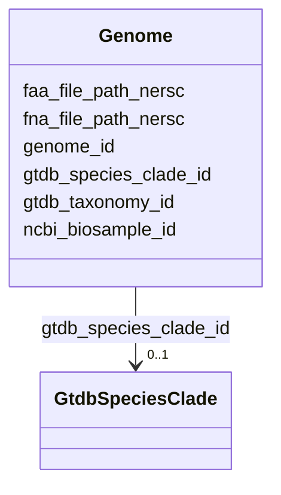

# Class: Genome 


_Individual genome assembly from NCBI RefSeq or GenBank. Each genome belongs to exactly one GTDB species clade and contains many genes._

_GENOME SOURCES: - RS_ prefix: RefSeq assemblies (curated, higher quality) - GB_ prefix: GenBank assemblies (all submissions)_

_USAGE: Link to Gene for CDS, to GtdbMetadata for quality metrics, to Sample for NCBI BioSample/BioProject accessions._


URI: [https://w3id.org/kbase/kbase_ke_pangenome/Genome](https://w3id.org/kbase/kbase_ke_pangenome/Genome)





<!-- no inheritance hierarchy -->


## Slots

| Name | Cardinality and Range | Description | Inheritance |
| ---  | --- | --- | --- |
| [genome_id](genome_id.md) | 1 <br/> [String](String.md) | Genome accession with source prefix and version | direct |
| [gtdb_species_clade_id](gtdb_species_clade_id.md) | 0..1 <br/> [GtdbSpeciesClade](GtdbSpeciesClade.md) | Species clade this genome belongs to | direct |
| [gtdb_taxonomy_id](gtdb_taxonomy_id.md) | 0..1 <br/> [String](String.md) | Full GTDB taxonomy lineage string for this genome | direct |
| [ncbi_biosample_id](ncbi_biosample_id.md) | 0..1 <br/> [String](String.md) | NCBI BioSample accession linking to sample metadata including isolation sourc... | direct |
| [fna_file_path_nersc](fna_file_path_nersc.md) | 0..1 <br/> [String](String.md) | Absolute path to nucleotide FASTA file at NERSC filesystem | direct |
| [faa_file_path_nersc](faa_file_path_nersc.md) | 0..1 <br/> [String](String.md) | Absolute path to protein FASTA file at NERSC filesystem | direct |


## Usages

| used by | used in | type | used |
| ---  | --- | --- | --- |
| [GtdbSpeciesClade](GtdbSpeciesClade.md) | [representative_genome_id](representative_genome_id.md) | range | [Genome](Genome.md) |
| [Gene](Gene.md) | [genome_id](genome_id.md) | range | [Genome](Genome.md) |
| [GtdbTaxonomyR214v1](GtdbTaxonomyR214v1.md) | [genome_id](genome_id.md) | range | [Genome](Genome.md) |
| [Sample](Sample.md) | [genome_id](genome_id.md) | range | [Genome](Genome.md) |
| [GenomeAni](GenomeAni.md) | [genome1_id](genome1_id.md) | range | [Genome](Genome.md) |
| [GenomeAni](GenomeAni.md) | [genome2_id](genome2_id.md) | range | [Genome](Genome.md) |
| [GapmindPathways](GapmindPathways.md) | [genome_id](genome_id.md) | range | [Genome](Genome.md) |


## Identifier and Mapping Information


### Annotations

| property | value |
| --- | --- |
| source_table | genome |


### Schema Source


* from schema: https://w3id.org/kbase/kbase_ke_pangenome


## Mappings

| Mapping Type | Mapped Value |
| ---  | ---  |
| self | https://w3id.org/kbase/kbase_ke_pangenome/Genome |
| native | https://w3id.org/kbase/kbase_ke_pangenome/Genome |


## LinkML Source

<!-- TODO: investigate https://stackoverflow.com/questions/37606292/how-to-create-tabbed-code-blocks-in-mkdocs-or-sphinx -->

### Direct

<details>
```yaml
name: Genome
annotations:
  source_table:
    tag: source_table
    value: genome
description: 'Individual genome assembly from NCBI RefSeq or GenBank. Each genome
  belongs to exactly one GTDB species clade and contains many genes.

  GENOME SOURCES: - RS_ prefix: RefSeq assemblies (curated, higher quality) - GB_
  prefix: GenBank assemblies (all submissions)

  USAGE: Link to Gene for CDS, to GtdbMetadata for quality metrics, to Sample for
  NCBI BioSample/BioProject accessions.'
from_schema: https://w3id.org/kbase/kbase_ke_pangenome
attributes:
  genome_id:
    name: genome_id
    description: Genome accession with source prefix and version. RS_ = RefSeq (GCF
      accessions), GB_ = GenBank (GCA accessions).
    examples:
    - value: RS_GCF_022568935.1
      description: RefSeq assembly version 1
    - value: RS_GCF_000005845.2
      description: E. coli K-12 MG1655 (version 2)
    - value: GB_GCA_902835305.1
      description: GenBank assembly
    - value: RS_GCF_000742135.1
      description: K. pneumoniae reference
    from_schema: https://w3id.org/kbase/kbase_ke_pangenome
    rank: 1000
    identifier: true
    domain_of:
    - Genome
    - Gene
    - GtdbTaxonomyR214v1
    - Sample
    - GapmindPathways
    range: string
    required: true
    pattern: (RS|GB)_GC[AF]_\d+\.\d+
  gtdb_species_clade_id:
    name: gtdb_species_clade_id
    description: Species clade this genome belongs to
    comments:
    - 'Foreign key: GtdbSpeciesClade.gtdb_species_clade_id'
    examples:
    - value: s__Staphylococcus_lugdunensis--RS_GCF_002901705.1
    - value: s__Escherichia_coli--RS_GCF_000005845.2
    from_schema: https://w3id.org/kbase/kbase_ke_pangenome
    domain_of:
    - GtdbSpeciesClade
    - Genome
    - GeneCluster
    - Pangenome
    range: GtdbSpeciesClade
  gtdb_taxonomy_id:
    name: gtdb_taxonomy_id
    description: Full GTDB taxonomy lineage string for this genome
    examples:
    - value: d__Bacteria;p__Bacillota;c__Bacilli;o__Staphylococcales;f__Staphylococcaceae;g__Staphylococcus
    - value: d__Bacteria;p__Pseudomonadota;c__Gammaproteobacteria;o__Enterobacterales;f__Enterobacteriaceae;g__Escherichia;s__Escherichia_fergusonii
    from_schema: https://w3id.org/kbase/kbase_ke_pangenome
    rank: 1000
    domain_of:
    - Genome
    - GtdbTaxonomyR214v1
    range: string
  ncbi_biosample_id:
    name: ncbi_biosample_id
    description: NCBI BioSample accession linking to sample metadata including isolation
      source, collection date, geographic location.
    examples:
    - value: SAMN24838659
    - value: SAMN02603679
    - value: SAMEA2272191
    from_schema: https://w3id.org/kbase/kbase_ke_pangenome
    rank: 1000
    domain_of:
    - Genome
    range: string
    pattern: SAM[NED][A-Z]?\d+
  fna_file_path_nersc:
    name: fna_file_path_nersc
    description: Absolute path to nucleotide FASTA file at NERSC filesystem. Contains
      genomic contigs/scaffolds.
    examples:
    - value: /global/cfs/cdirs/kbase/jungbluth/Projects/Project_Pangenome_GTDB/GTDB_v214_download/ftp.ncbi.nlm.nih.gov/genomes/all/GCF/022/568/935/GCF_022568935.1_ASM2256893v1/GCF_022568935.1_ASM2256893v1_genomic.fna.gz
    from_schema: https://w3id.org/kbase/kbase_ke_pangenome
    rank: 1000
    domain_of:
    - Genome
    range: string
  faa_file_path_nersc:
    name: faa_file_path_nersc
    description: Absolute path to protein FASTA file at NERSC filesystem. Contains
      predicted protein sequences.
    examples:
    - value: /global/cfs/cdirs/kbase/jungbluth/Projects/Project_Pangenome_GTDB/GTDB_r214_by_spcluster/s__Staphylococcus_lugdunensis--RS_GCF_002901705.1/GCF_022568935.1_protein.faa.gz
    from_schema: https://w3id.org/kbase/kbase_ke_pangenome
    rank: 1000
    domain_of:
    - Genome
    range: string

```
</details>

### Induced

<details>
```yaml
name: Genome
annotations:
  source_table:
    tag: source_table
    value: genome
description: 'Individual genome assembly from NCBI RefSeq or GenBank. Each genome
  belongs to exactly one GTDB species clade and contains many genes.

  GENOME SOURCES: - RS_ prefix: RefSeq assemblies (curated, higher quality) - GB_
  prefix: GenBank assemblies (all submissions)

  USAGE: Link to Gene for CDS, to GtdbMetadata for quality metrics, to Sample for
  NCBI BioSample/BioProject accessions.'
from_schema: https://w3id.org/kbase/kbase_ke_pangenome
attributes:
  genome_id:
    name: genome_id
    description: Genome accession with source prefix and version. RS_ = RefSeq (GCF
      accessions), GB_ = GenBank (GCA accessions).
    examples:
    - value: RS_GCF_022568935.1
      description: RefSeq assembly version 1
    - value: RS_GCF_000005845.2
      description: E. coli K-12 MG1655 (version 2)
    - value: GB_GCA_902835305.1
      description: GenBank assembly
    - value: RS_GCF_000742135.1
      description: K. pneumoniae reference
    from_schema: https://w3id.org/kbase/kbase_ke_pangenome
    rank: 1000
    identifier: true
    alias: genome_id
    owner: Genome
    domain_of:
    - Genome
    - Gene
    - GtdbTaxonomyR214v1
    - Sample
    - GapmindPathways
    range: string
    required: true
    pattern: (RS|GB)_GC[AF]_\d+\.\d+
  gtdb_species_clade_id:
    name: gtdb_species_clade_id
    description: Species clade this genome belongs to
    comments:
    - 'Foreign key: GtdbSpeciesClade.gtdb_species_clade_id'
    examples:
    - value: s__Staphylococcus_lugdunensis--RS_GCF_002901705.1
    - value: s__Escherichia_coli--RS_GCF_000005845.2
    from_schema: https://w3id.org/kbase/kbase_ke_pangenome
    alias: gtdb_species_clade_id
    owner: Genome
    domain_of:
    - GtdbSpeciesClade
    - Genome
    - GeneCluster
    - Pangenome
    range: GtdbSpeciesClade
  gtdb_taxonomy_id:
    name: gtdb_taxonomy_id
    description: Full GTDB taxonomy lineage string for this genome
    examples:
    - value: d__Bacteria;p__Bacillota;c__Bacilli;o__Staphylococcales;f__Staphylococcaceae;g__Staphylococcus
    - value: d__Bacteria;p__Pseudomonadota;c__Gammaproteobacteria;o__Enterobacterales;f__Enterobacteriaceae;g__Escherichia;s__Escherichia_fergusonii
    from_schema: https://w3id.org/kbase/kbase_ke_pangenome
    rank: 1000
    alias: gtdb_taxonomy_id
    owner: Genome
    domain_of:
    - Genome
    - GtdbTaxonomyR214v1
    range: string
  ncbi_biosample_id:
    name: ncbi_biosample_id
    description: NCBI BioSample accession linking to sample metadata including isolation
      source, collection date, geographic location.
    examples:
    - value: SAMN24838659
    - value: SAMN02603679
    - value: SAMEA2272191
    from_schema: https://w3id.org/kbase/kbase_ke_pangenome
    rank: 1000
    alias: ncbi_biosample_id
    owner: Genome
    domain_of:
    - Genome
    range: string
    pattern: SAM[NED][A-Z]?\d+
  fna_file_path_nersc:
    name: fna_file_path_nersc
    description: Absolute path to nucleotide FASTA file at NERSC filesystem. Contains
      genomic contigs/scaffolds.
    examples:
    - value: /global/cfs/cdirs/kbase/jungbluth/Projects/Project_Pangenome_GTDB/GTDB_v214_download/ftp.ncbi.nlm.nih.gov/genomes/all/GCF/022/568/935/GCF_022568935.1_ASM2256893v1/GCF_022568935.1_ASM2256893v1_genomic.fna.gz
    from_schema: https://w3id.org/kbase/kbase_ke_pangenome
    rank: 1000
    alias: fna_file_path_nersc
    owner: Genome
    domain_of:
    - Genome
    range: string
  faa_file_path_nersc:
    name: faa_file_path_nersc
    description: Absolute path to protein FASTA file at NERSC filesystem. Contains
      predicted protein sequences.
    examples:
    - value: /global/cfs/cdirs/kbase/jungbluth/Projects/Project_Pangenome_GTDB/GTDB_r214_by_spcluster/s__Staphylococcus_lugdunensis--RS_GCF_002901705.1/GCF_022568935.1_protein.faa.gz
    from_schema: https://w3id.org/kbase/kbase_ke_pangenome
    rank: 1000
    alias: faa_file_path_nersc
    owner: Genome
    domain_of:
    - Genome
    range: string

```
</details>