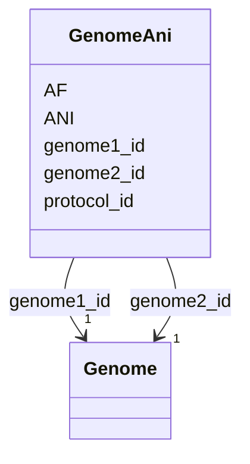

# Class: GenomeAni 


_Pairwise Average Nucleotide Identity (ANI) between genomes within species clades. Used for species boundary determination and strain typing._

_ANI INTERPRETATION: - >99%: Same strain - 97-99%: Same species, different strains - 95-97%: Species boundary region - <95%: Different species_


URI: [https://w3id.org/kbase/kbase_ke_pangenome/GenomeAni](https://w3id.org/kbase/kbase_ke_pangenome/GenomeAni)





<!-- no inheritance hierarchy -->


## Slots

| Name | Cardinality and Range | Description | Inheritance |
| ---  | --- | --- | --- |
| [genome1_id](genome1_id.md) | 1 <br/> [Genome](Genome.md) | First genome in pairwise comparison | direct |
| [genome2_id](genome2_id.md) | 1 <br/> [Genome](Genome.md) | Second genome in pairwise comparison | direct |
| [protocol_id](protocol_id.md) | 0..1 <br/> [String](String.md) | ANI calculation method/version identifier | direct |
| [ANI](ANI.md) | 0..1 <br/> [Float](Float.md) | Average Nucleotide Identity as percentage | direct |
| [AF](AF.md) | 0..1 <br/> [Float](Float.md) | Alignment Fraction - proportion of genome that aligned | direct |


## Identifier and Mapping Information


### Annotations

| property | value |
| --- | --- |
| source_table | genome_ani |


### Schema Source


* from schema: https://w3id.org/kbase/kbase_ke_pangenome


## Mappings

| Mapping Type | Mapped Value |
| ---  | ---  |
| self | https://w3id.org/kbase/kbase_ke_pangenome/GenomeAni |
| native | https://w3id.org/kbase/kbase_ke_pangenome/GenomeAni |


## LinkML Source

<!-- TODO: investigate https://stackoverflow.com/questions/37606292/how-to-create-tabbed-code-blocks-in-mkdocs-or-sphinx -->

### Direct

<details>
```yaml
name: GenomeAni
annotations:
  source_table:
    tag: source_table
    value: genome_ani
description: 'Pairwise Average Nucleotide Identity (ANI) between genomes within species
  clades. Used for species boundary determination and strain typing.

  ANI INTERPRETATION: - >99%: Same strain - 97-99%: Same species, different strains
  - 95-97%: Species boundary region - <95%: Different species'
from_schema: https://w3id.org/kbase/kbase_ke_pangenome
attributes:
  genome1_id:
    name: genome1_id
    description: First genome in pairwise comparison
    comments:
    - 'Foreign key: Genome.genome_id'
    examples:
    - value: RS_GCF_002186895.1
    from_schema: https://w3id.org/kbase/kbase_ke_pangenome
    rank: 1000
    domain_of:
    - GenomeAni
    range: Genome
    required: true
  genome2_id:
    name: genome2_id
    description: Second genome in pairwise comparison
    comments:
    - 'Foreign key: Genome.genome_id'
    examples:
    - value: RS_GCF_001645745.1
    from_schema: https://w3id.org/kbase/kbase_ke_pangenome
    rank: 1000
    domain_of:
    - GenomeAni
    range: Genome
    required: true
  protocol_id:
    name: protocol_id
    description: ANI calculation method/version identifier. NOT a foreign key - this
      is a version string that identifies the ANI computation pipeline and date. Different
      from pangenome protocol_id as ANI may be computed separately.
    examples:
    - value: PGNKEMCM012024
      description: Protocol string (PGNKE=project, MCM=method?, 012024=Jan 2024?)
    from_schema: https://w3id.org/kbase/kbase_ke_pangenome
    domain_of:
    - Pangenome
    - GenomeAni
    range: string
  ANI:
    name: ANI
    description: Average Nucleotide Identity as percentage. Based on aligned fragments
      between genomes.
    examples:
    - value: '99.0353'
      description: Same species, different strains
    - value: '99.0835'
    - value: '95.5'
      description: Near species boundary
    from_schema: https://w3id.org/kbase/kbase_ke_pangenome
    rank: 1000
    domain_of:
    - GenomeAni
    range: float
    minimum_value: 0.0
    maximum_value: 100.0
  AF:
    name: AF
    description: Alignment Fraction - proportion of genome that aligned. Low AF with
      high ANI may indicate incomplete genomes or large accessory genome differences.
    examples:
    - value: '0.9070455891059799'
    - value: '0.9182027649769585'
    - value: '0.75'
      description: Lower AF due to accessory genome
    from_schema: https://w3id.org/kbase/kbase_ke_pangenome
    rank: 1000
    domain_of:
    - GenomeAni
    range: float
    minimum_value: 0.0
    maximum_value: 1.0

```
</details>

### Induced

<details>
```yaml
name: GenomeAni
annotations:
  source_table:
    tag: source_table
    value: genome_ani
description: 'Pairwise Average Nucleotide Identity (ANI) between genomes within species
  clades. Used for species boundary determination and strain typing.

  ANI INTERPRETATION: - >99%: Same strain - 97-99%: Same species, different strains
  - 95-97%: Species boundary region - <95%: Different species'
from_schema: https://w3id.org/kbase/kbase_ke_pangenome
attributes:
  genome1_id:
    name: genome1_id
    description: First genome in pairwise comparison
    comments:
    - 'Foreign key: Genome.genome_id'
    examples:
    - value: RS_GCF_002186895.1
    from_schema: https://w3id.org/kbase/kbase_ke_pangenome
    rank: 1000
    alias: genome1_id
    owner: GenomeAni
    domain_of:
    - GenomeAni
    range: Genome
    required: true
  genome2_id:
    name: genome2_id
    description: Second genome in pairwise comparison
    comments:
    - 'Foreign key: Genome.genome_id'
    examples:
    - value: RS_GCF_001645745.1
    from_schema: https://w3id.org/kbase/kbase_ke_pangenome
    rank: 1000
    alias: genome2_id
    owner: GenomeAni
    domain_of:
    - GenomeAni
    range: Genome
    required: true
  protocol_id:
    name: protocol_id
    description: ANI calculation method/version identifier. NOT a foreign key - this
      is a version string that identifies the ANI computation pipeline and date. Different
      from pangenome protocol_id as ANI may be computed separately.
    examples:
    - value: PGNKEMCM012024
      description: Protocol string (PGNKE=project, MCM=method?, 012024=Jan 2024?)
    from_schema: https://w3id.org/kbase/kbase_ke_pangenome
    alias: protocol_id
    owner: GenomeAni
    domain_of:
    - Pangenome
    - GenomeAni
    range: string
  ANI:
    name: ANI
    description: Average Nucleotide Identity as percentage. Based on aligned fragments
      between genomes.
    examples:
    - value: '99.0353'
      description: Same species, different strains
    - value: '99.0835'
    - value: '95.5'
      description: Near species boundary
    from_schema: https://w3id.org/kbase/kbase_ke_pangenome
    rank: 1000
    alias: ANI
    owner: GenomeAni
    domain_of:
    - GenomeAni
    range: float
    minimum_value: 0.0
    maximum_value: 100.0
  AF:
    name: AF
    description: Alignment Fraction - proportion of genome that aligned. Low AF with
      high ANI may indicate incomplete genomes or large accessory genome differences.
    examples:
    - value: '0.9070455891059799'
    - value: '0.9182027649769585'
    - value: '0.75'
      description: Lower AF due to accessory genome
    from_schema: https://w3id.org/kbase/kbase_ke_pangenome
    rank: 1000
    alias: AF
    owner: GenomeAni
    domain_of:
    - GenomeAni
    range: float
    minimum_value: 0.0
    maximum_value: 1.0

```
</details>