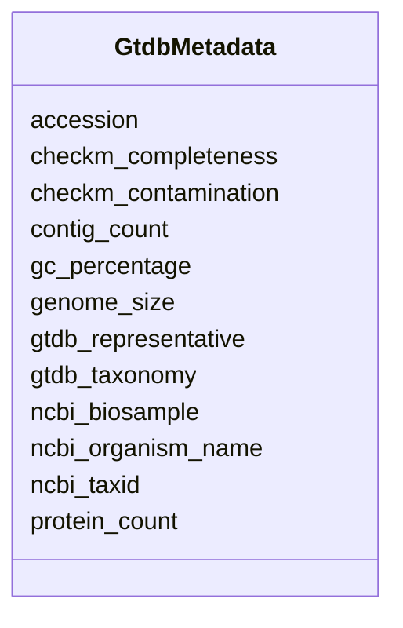

# Class: GtdbMetadata 


_Comprehensive GTDB metadata with quality metrics, genome statistics, and NCBI cross-references. Contains ~100 columns from GTDB metadata._

_KEY QUALITY METRICS: - checkm_completeness: >90% for inclusion - checkm_contamination: <5% for inclusion - genome_size: typically 0.5-10 Mbp for bacteria_


URI: [https://w3id.org/kbase/kbase_ke_pangenome/GtdbMetadata](https://w3id.org/kbase/kbase_ke_pangenome/GtdbMetadata)





<!-- no inheritance hierarchy -->


## Slots

| Name | Cardinality and Range | Description | Inheritance |
| ---  | --- | --- | --- |
| [accession](accession.md) | 1 <br/> [String](String.md) | NCBI assembly accession with RS_/GB_ prefix | direct |
| [checkm_completeness](checkm_completeness.md) | 0..1 <br/> [Float](Float.md) | CheckM genome completeness estimate | direct |
| [checkm_contamination](checkm_contamination.md) | 0..1 <br/> [Float](Float.md) | CheckM contamination estimate | direct |
| [genome_size](genome_size.md) | 0..1 <br/> [Integer](Integer.md) | Total genome size in base pairs | direct |
| [gc_percentage](gc_percentage.md) | 0..1 <br/> [Float](Float.md) | GC content percentage | direct |
| [contig_count](contig_count.md) | 0..1 <br/> [Integer](Integer.md) | Number of contigs in assembly | direct |
| [protein_count](protein_count.md) | 0..1 <br/> [Integer](Integer.md) | Number of predicted protein-coding genes | direct |
| [gtdb_taxonomy](gtdb_taxonomy.md) | 0..1 <br/> [String](String.md) | Full GTDB taxonomy string | direct |
| [gtdb_representative](gtdb_representative.md) | 0..1 <br/> [Boolean](Boolean.md) | Whether this genome is the GTDB species representative | direct |
| [ncbi_organism_name](ncbi_organism_name.md) | 0..1 <br/> [String](String.md) | NCBI organism name including strain | direct |
| [ncbi_biosample](ncbi_biosample.md) | 0..1 <br/> [String](String.md) | NCBI BioSample accession | direct |
| [ncbi_taxid](ncbi_taxid.md) | 0..1 <br/> [Integer](Integer.md) | NCBI taxonomy ID | direct |


## Identifier and Mapping Information


### Annotations

| property | value |
| --- | --- |
| source_table | gtdb_metadata |


### Schema Source


* from schema: https://w3id.org/kbase/kbase_ke_pangenome


## Mappings

| Mapping Type | Mapped Value |
| ---  | ---  |
| self | https://w3id.org/kbase/kbase_ke_pangenome/GtdbMetadata |
| native | https://w3id.org/kbase/kbase_ke_pangenome/GtdbMetadata |


## LinkML Source

<!-- TODO: investigate https://stackoverflow.com/questions/37606292/how-to-create-tabbed-code-blocks-in-mkdocs-or-sphinx -->

### Direct

<details>
```yaml
name: GtdbMetadata
annotations:
  source_table:
    tag: source_table
    value: gtdb_metadata
description: 'Comprehensive GTDB metadata with quality metrics, genome statistics,
  and NCBI cross-references. Contains ~100 columns from GTDB metadata.

  KEY QUALITY METRICS: - checkm_completeness: >90% for inclusion - checkm_contamination:
  <5% for inclusion - genome_size: typically 0.5-10 Mbp for bacteria'
from_schema: https://w3id.org/kbase/kbase_ke_pangenome
attributes:
  accession:
    name: accession
    description: NCBI assembly accession with RS_/GB_ prefix
    examples:
    - value: RS_GCF_000246985.2
    - value: RS_GCF_000980135.1
    from_schema: https://w3id.org/kbase/kbase_ke_pangenome
    rank: 1000
    identifier: true
    domain_of:
    - GtdbMetadata
    range: string
    required: true
  checkm_completeness:
    name: checkm_completeness
    description: CheckM genome completeness estimate. Minimum 90% for GTDB. Based
      on single-copy marker genes.
    examples:
    - value: '99.5'
    - value: '100.0'
    - value: '95.0'
    from_schema: https://w3id.org/kbase/kbase_ke_pangenome
    rank: 1000
    domain_of:
    - GtdbMetadata
    range: float
    minimum_value: 0.0
    maximum_value: 100.0
  checkm_contamination:
    name: checkm_contamination
    description: CheckM contamination estimate. Maximum 5% for GTDB. Based on duplicate
      single-copy markers.
    examples:
    - value: '0.5'
    - value: '0.65'
    - value: '0.0'
    from_schema: https://w3id.org/kbase/kbase_ke_pangenome
    rank: 1000
    domain_of:
    - GtdbMetadata
    range: float
    minimum_value: 0.0
    maximum_value: 100.0
  genome_size:
    name: genome_size
    description: 'Total genome size in base pairs. Varies widely: - Minimal bacteria:
      ~500 kbp - Typical bacteria: 2-6 Mbp - Large bacteria: >10 Mbp'
    examples:
    - value: '2215172'
      description: Small archaeal genome
    - value: '4077567'
      description: Medium bacterial genome
    - value: '6500000'
      description: Large bacterial genome
    from_schema: https://w3id.org/kbase/kbase_ke_pangenome
    rank: 1000
    domain_of:
    - GtdbMetadata
    range: integer
    minimum_value: 100000
  gc_percentage:
    name: gc_percentage
    description: 'GC content percentage. Varies by lineage: - Low GC (Firmicutes):
      30-40% - Medium GC: 40-60% - High GC (Actinobacteria): 60-75%'
    examples:
    - value: '43.08802922449628'
    - value: '41.57088540809451'
    - value: '67.5'
    from_schema: https://w3id.org/kbase/kbase_ke_pangenome
    rank: 1000
    domain_of:
    - GtdbMetadata
    range: float
    minimum_value: 0.0
    maximum_value: 100.0
  contig_count:
    name: contig_count
    description: Number of contigs in assembly. Complete genomes = 1-5, drafts may
      have hundreds.
    examples:
    - value: '1'
      description: Complete genome
    - value: '193'
      description: Draft assembly
    from_schema: https://w3id.org/kbase/kbase_ke_pangenome
    rank: 1000
    domain_of:
    - GtdbMetadata
    range: integer
    minimum_value: 1
  protein_count:
    name: protein_count
    description: Number of predicted protein-coding genes
    examples:
    - value: '2497'
    - value: '3513'
    from_schema: https://w3id.org/kbase/kbase_ke_pangenome
    rank: 1000
    domain_of:
    - GtdbMetadata
    range: integer
    minimum_value: 0
  gtdb_taxonomy:
    name: gtdb_taxonomy
    description: Full GTDB taxonomy string
    from_schema: https://w3id.org/kbase/kbase_ke_pangenome
    rank: 1000
    domain_of:
    - GtdbMetadata
    range: string
  gtdb_representative:
    name: gtdb_representative
    description: Whether this genome is the GTDB species representative. Only one
      genome per species is representative.
    examples:
    - value: 'True'
    - value: 'False'
    from_schema: https://w3id.org/kbase/kbase_ke_pangenome
    rank: 1000
    domain_of:
    - GtdbMetadata
    range: boolean
  ncbi_organism_name:
    name: ncbi_organism_name
    description: NCBI organism name including strain
    examples:
    - value: Thermococcus litoralis DSM 5473
    - value: Methanosarcina mazei
    - value: Escherichia coli K-12
    from_schema: https://w3id.org/kbase/kbase_ke_pangenome
    rank: 1000
    domain_of:
    - GtdbMetadata
    range: string
  ncbi_biosample:
    name: ncbi_biosample
    description: NCBI BioSample accession
    examples:
    - value: SAMN02603679
    - value: SAMN02708973
    from_schema: https://w3id.org/kbase/kbase_ke_pangenome
    rank: 1000
    domain_of:
    - GtdbMetadata
    range: string
  ncbi_taxid:
    name: ncbi_taxid
    description: NCBI taxonomy ID
    examples:
    - value: '523849'
    - value: '2209'
    - value: '83333'
    from_schema: https://w3id.org/kbase/kbase_ke_pangenome
    rank: 1000
    domain_of:
    - GtdbMetadata
    range: integer

```
</details>

### Induced

<details>
```yaml
name: GtdbMetadata
annotations:
  source_table:
    tag: source_table
    value: gtdb_metadata
description: 'Comprehensive GTDB metadata with quality metrics, genome statistics,
  and NCBI cross-references. Contains ~100 columns from GTDB metadata.

  KEY QUALITY METRICS: - checkm_completeness: >90% for inclusion - checkm_contamination:
  <5% for inclusion - genome_size: typically 0.5-10 Mbp for bacteria'
from_schema: https://w3id.org/kbase/kbase_ke_pangenome
attributes:
  accession:
    name: accession
    description: NCBI assembly accession with RS_/GB_ prefix
    examples:
    - value: RS_GCF_000246985.2
    - value: RS_GCF_000980135.1
    from_schema: https://w3id.org/kbase/kbase_ke_pangenome
    rank: 1000
    identifier: true
    alias: accession
    owner: GtdbMetadata
    domain_of:
    - GtdbMetadata
    range: string
    required: true
  checkm_completeness:
    name: checkm_completeness
    description: CheckM genome completeness estimate. Minimum 90% for GTDB. Based
      on single-copy marker genes.
    examples:
    - value: '99.5'
    - value: '100.0'
    - value: '95.0'
    from_schema: https://w3id.org/kbase/kbase_ke_pangenome
    rank: 1000
    alias: checkm_completeness
    owner: GtdbMetadata
    domain_of:
    - GtdbMetadata
    range: float
    minimum_value: 0.0
    maximum_value: 100.0
  checkm_contamination:
    name: checkm_contamination
    description: CheckM contamination estimate. Maximum 5% for GTDB. Based on duplicate
      single-copy markers.
    examples:
    - value: '0.5'
    - value: '0.65'
    - value: '0.0'
    from_schema: https://w3id.org/kbase/kbase_ke_pangenome
    rank: 1000
    alias: checkm_contamination
    owner: GtdbMetadata
    domain_of:
    - GtdbMetadata
    range: float
    minimum_value: 0.0
    maximum_value: 100.0
  genome_size:
    name: genome_size
    description: 'Total genome size in base pairs. Varies widely: - Minimal bacteria:
      ~500 kbp - Typical bacteria: 2-6 Mbp - Large bacteria: >10 Mbp'
    examples:
    - value: '2215172'
      description: Small archaeal genome
    - value: '4077567'
      description: Medium bacterial genome
    - value: '6500000'
      description: Large bacterial genome
    from_schema: https://w3id.org/kbase/kbase_ke_pangenome
    rank: 1000
    alias: genome_size
    owner: GtdbMetadata
    domain_of:
    - GtdbMetadata
    range: integer
    minimum_value: 100000
  gc_percentage:
    name: gc_percentage
    description: 'GC content percentage. Varies by lineage: - Low GC (Firmicutes):
      30-40% - Medium GC: 40-60% - High GC (Actinobacteria): 60-75%'
    examples:
    - value: '43.08802922449628'
    - value: '41.57088540809451'
    - value: '67.5'
    from_schema: https://w3id.org/kbase/kbase_ke_pangenome
    rank: 1000
    alias: gc_percentage
    owner: GtdbMetadata
    domain_of:
    - GtdbMetadata
    range: float
    minimum_value: 0.0
    maximum_value: 100.0
  contig_count:
    name: contig_count
    description: Number of contigs in assembly. Complete genomes = 1-5, drafts may
      have hundreds.
    examples:
    - value: '1'
      description: Complete genome
    - value: '193'
      description: Draft assembly
    from_schema: https://w3id.org/kbase/kbase_ke_pangenome
    rank: 1000
    alias: contig_count
    owner: GtdbMetadata
    domain_of:
    - GtdbMetadata
    range: integer
    minimum_value: 1
  protein_count:
    name: protein_count
    description: Number of predicted protein-coding genes
    examples:
    - value: '2497'
    - value: '3513'
    from_schema: https://w3id.org/kbase/kbase_ke_pangenome
    rank: 1000
    alias: protein_count
    owner: GtdbMetadata
    domain_of:
    - GtdbMetadata
    range: integer
    minimum_value: 0
  gtdb_taxonomy:
    name: gtdb_taxonomy
    description: Full GTDB taxonomy string
    from_schema: https://w3id.org/kbase/kbase_ke_pangenome
    rank: 1000
    alias: gtdb_taxonomy
    owner: GtdbMetadata
    domain_of:
    - GtdbMetadata
    range: string
  gtdb_representative:
    name: gtdb_representative
    description: Whether this genome is the GTDB species representative. Only one
      genome per species is representative.
    examples:
    - value: 'True'
    - value: 'False'
    from_schema: https://w3id.org/kbase/kbase_ke_pangenome
    rank: 1000
    alias: gtdb_representative
    owner: GtdbMetadata
    domain_of:
    - GtdbMetadata
    range: boolean
  ncbi_organism_name:
    name: ncbi_organism_name
    description: NCBI organism name including strain
    examples:
    - value: Thermococcus litoralis DSM 5473
    - value: Methanosarcina mazei
    - value: Escherichia coli K-12
    from_schema: https://w3id.org/kbase/kbase_ke_pangenome
    rank: 1000
    alias: ncbi_organism_name
    owner: GtdbMetadata
    domain_of:
    - GtdbMetadata
    range: string
  ncbi_biosample:
    name: ncbi_biosample
    description: NCBI BioSample accession
    examples:
    - value: SAMN02603679
    - value: SAMN02708973
    from_schema: https://w3id.org/kbase/kbase_ke_pangenome
    rank: 1000
    alias: ncbi_biosample
    owner: GtdbMetadata
    domain_of:
    - GtdbMetadata
    range: string
  ncbi_taxid:
    name: ncbi_taxid
    description: NCBI taxonomy ID
    examples:
    - value: '523849'
    - value: '2209'
    - value: '83333'
    from_schema: https://w3id.org/kbase/kbase_ke_pangenome
    rank: 1000
    alias: ncbi_taxid
    owner: GtdbMetadata
    domain_of:
    - GtdbMetadata
    range: integer

```
</details>