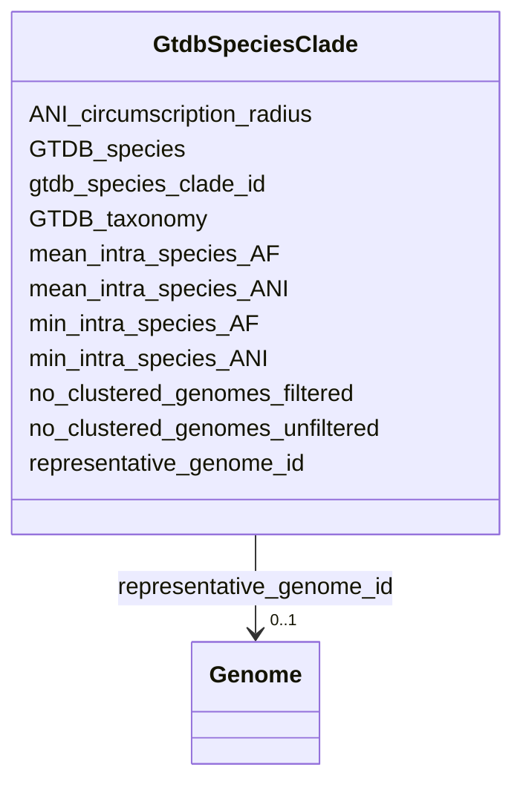

# Class: GtdbSpeciesClade 


_GTDB species-level grouping with representative genome. Each clade represents a species cluster defined by 95% ANI threshold following GTDB taxonomy._

_A species clade contains all genomes that cluster together at >95% ANI with the representative genome. The representative is typically the highest-quality or type strain genome._

_EXAMPLE CLADES (by genome count): - s__Staphylococcus_aureus--RS_GCF_001027105.1: 14,526 genomes - s__Klebsiella_pneumoniae--RS_GCF_000742135.1: 14,240 genomes - s__Salmonella_enterica--RS_GCF_000006945.2: 11,402 genomes_

_USAGE: Start here to explore pangenomes. Join to Pangenome for statistics, to Genome for individual assemblies, to GeneCluster for gene families._


URI: [https://w3id.org/kbase/kbase_ke_pangenome/GtdbSpeciesClade](https://w3id.org/kbase/kbase_ke_pangenome/GtdbSpeciesClade)





<!-- no inheritance hierarchy -->


## Slots

| Name | Cardinality and Range | Description | Inheritance |
| ---  | --- | --- | --- |
| [gtdb_species_clade_id](gtdb_species_clade_id.md) | 1 <br/> [String](String.md) | Species clade ID combining species name and representative genome | direct |
| [representative_genome_id](representative_genome_id.md) | 0..1 <br/> [Genome](Genome.md) | Reference genome for this species | direct |
| [GTDB_species](GTDB_species.md) | 0..1 <br/> [String](String.md) | GTDB species name with s__ prefix | direct |
| [GTDB_taxonomy](GTDB_taxonomy.md) | 0..1 <br/> [String](String.md) | Full GTDB lineage from domain to genus (species not repeated) | direct |
| [ANI_circumscription_radius](ANI_circumscription_radius.md) | 0..1 <br/> [Float](Float.md) | ANI threshold for species membership | direct |
| [mean_intra_species_ANI](mean_intra_species_ANI.md) | 0..1 <br/> [Float](Float.md) | Mean pairwise ANI among all genomes | direct |
| [min_intra_species_ANI](min_intra_species_ANI.md) | 0..1 <br/> [Float](Float.md) | Minimum pairwise ANI observed | direct |
| [mean_intra_species_AF](mean_intra_species_AF.md) | 0..1 <br/> [Float](Float.md) | Mean alignment fraction - proportion of genome aligning in ANI calculations | direct |
| [min_intra_species_AF](min_intra_species_AF.md) | 0..1 <br/> [Float](Float.md) | Minimum alignment fraction observed between any two genomes | direct |
| [no_clustered_genomes_unfiltered](no_clustered_genomes_unfiltered.md) | 0..1 <br/> [Integer](Integer.md) | Total genomes assigned to species before quality filtering | direct |
| [no_clustered_genomes_filtered](no_clustered_genomes_filtered.md) | 0..1 <br/> [Integer](Integer.md) | Genomes passing quality filters used in pangenome analysis | direct |


## Usages

| used by | used in | type | used |
| ---  | --- | --- | --- |
| [Genome](Genome.md) | [gtdb_species_clade_id](gtdb_species_clade_id.md) | range | [GtdbSpeciesClade](GtdbSpeciesClade.md) |
| [GeneCluster](GeneCluster.md) | [gtdb_species_clade_id](gtdb_species_clade_id.md) | range | [GtdbSpeciesClade](GtdbSpeciesClade.md) |
| [Pangenome](Pangenome.md) | [gtdb_species_clade_id](gtdb_species_clade_id.md) | range | [GtdbSpeciesClade](GtdbSpeciesClade.md) |


## Identifier and Mapping Information


### Annotations

| property | value |
| --- | --- |
| source_table | gtdb_species_clade |


### Schema Source


* from schema: https://w3id.org/kbase/kbase_ke_pangenome


## Mappings

| Mapping Type | Mapped Value |
| ---  | ---  |
| self | https://w3id.org/kbase/kbase_ke_pangenome/GtdbSpeciesClade |
| native | https://w3id.org/kbase/kbase_ke_pangenome/GtdbSpeciesClade |


## LinkML Source

<!-- TODO: investigate https://stackoverflow.com/questions/37606292/how-to-create-tabbed-code-blocks-in-mkdocs-or-sphinx -->

### Direct

<details>
```yaml
name: GtdbSpeciesClade
annotations:
  source_table:
    tag: source_table
    value: gtdb_species_clade
description: 'GTDB species-level grouping with representative genome. Each clade represents
  a species cluster defined by 95% ANI threshold following GTDB taxonomy.

  A species clade contains all genomes that cluster together at >95% ANI with the
  representative genome. The representative is typically the highest-quality or type
  strain genome.

  EXAMPLE CLADES (by genome count): - s__Staphylococcus_aureus--RS_GCF_001027105.1:
  14,526 genomes - s__Klebsiella_pneumoniae--RS_GCF_000742135.1: 14,240 genomes -
  s__Salmonella_enterica--RS_GCF_000006945.2: 11,402 genomes

  USAGE: Start here to explore pangenomes. Join to Pangenome for statistics, to Genome
  for individual assemblies, to GeneCluster for gene families.'
from_schema: https://w3id.org/kbase/kbase_ke_pangenome
attributes:
  gtdb_species_clade_id:
    name: gtdb_species_clade_id
    description: 'Species clade ID combining species name and representative genome.
      Format: s__Genus_species--{RS|GB}_GC{F|A}_XXXXXXXXX.X

      The ID encodes: species name (s__prefix), representative source (RS=RefSeq,
      GB=GenBank), and assembly accession.'
    examples:
    - value: s__Klebsiella_pneumoniae--RS_GCF_000742135.1
      description: K. pneumoniae - major human pathogen, 14K+ genomes
    - value: s__Staphylococcus_aureus--RS_GCF_001027105.1
      description: S. aureus - most genomes in database
    - value: s__Escherichia_coli--RS_GCF_000005845.2
      description: E. coli K-12 - model organism
    - value: s__Mycobacterium_tuberculosis--RS_GCF_000195955.2
      description: TB pathogen - highly clonal species
    - value: s__Pseudomonas_aeruginosa--RS_GCF_001457615.1
      description: Opportunistic pathogen with large pangenome
    from_schema: https://w3id.org/kbase/kbase_ke_pangenome
    rank: 1000
    identifier: true
    domain_of:
    - GtdbSpeciesClade
    - Genome
    - GeneCluster
    - Pangenome
    range: string
    required: true
    pattern: s__[A-Za-z0-9_]+--[A-Z]{2}_GC[AF]_\d+\.\d+
  representative_genome_id:
    name: representative_genome_id
    description: Reference genome for this species. Typically highest quality assembly
      or type strain. Used as anchor for ANI calculations.
    comments:
    - 'Foreign key: Genome.genome_id'
    examples:
    - value: RS_GCF_000742135.1
    - value: RS_GCF_001027105.1
    from_schema: https://w3id.org/kbase/kbase_ke_pangenome
    rank: 1000
    domain_of:
    - GtdbSpeciesClade
    range: Genome
  GTDB_species:
    name: GTDB_species
    description: GTDB species name with s__ prefix. May differ from NCBI species name
      due to GTDB's genome-based taxonomy.
    examples:
    - value: s__Klebsiella_pneumoniae
    - value: s__Staphylococcus_aureus
    - value: s__Escherichia_coli
    - value: s__Bacillus_subtilis
    from_schema: https://w3id.org/kbase/kbase_ke_pangenome
    rank: 1000
    domain_of:
    - GtdbSpeciesClade
    range: string
    pattern: s__[A-Za-z0-9_]+
  GTDB_taxonomy:
    name: GTDB_taxonomy
    description: 'Full GTDB lineage from domain to genus (species not repeated). Semicolon-separated
      with rank prefixes: d__, p__, c__, o__, f__, g__'
    examples:
    - value: d__Bacteria;p__Pseudomonadota;c__Gammaproteobacteria;o__Enterobacterales;f__Enterobacteriaceae;g__Klebsiella
    - value: d__Bacteria;p__Bacillota;c__Bacilli;o__Staphylococcales;f__Staphylococcaceae;g__Staphylococcus
    - value: d__Archaea;p__Methanobacteriota_B;c__Thermococci;o__Thermococcales;f__Thermococcaceae;g__Thermococcus_A
    from_schema: https://w3id.org/kbase/kbase_ke_pangenome
    rank: 1000
    domain_of:
    - GtdbSpeciesClade
    range: string
  ANI_circumscription_radius:
    name: ANI_circumscription_radius
    description: ANI threshold for species membership. Typically 95% for most species.
      Some species have tighter boundaries (higher values).
    examples:
    - value: '95.0'
      description: Standard species threshold
    - value: '95.239'
      description: K. pneumoniae threshold
    - value: '97.08'
      description: Tighter threshold for clonal species
    from_schema: https://w3id.org/kbase/kbase_ke_pangenome
    rank: 1000
    domain_of:
    - GtdbSpeciesClade
    range: float
    minimum_value: 90.0
    maximum_value: 100.0
    unit:
      ucum_code: '%'
  mean_intra_species_ANI:
    name: mean_intra_species_ANI
    description: Mean pairwise ANI among all genomes. Higher values indicate more
      clonal/homogeneous species. Lower values suggest higher diversity.
    examples:
    - value: '98.97'
      description: K. pneumoniae - moderately diverse
    - value: '99.5'
      description: Highly clonal species (e.g., M. tuberculosis)
    - value: '96.5'
      description: Highly diverse species
    from_schema: https://w3id.org/kbase/kbase_ke_pangenome
    rank: 1000
    domain_of:
    - GtdbSpeciesClade
    range: float
    minimum_value: 95.0
    maximum_value: 100.0
  min_intra_species_ANI:
    name: min_intra_species_ANI
    description: Minimum pairwise ANI observed. Low values near 95% indicate species
      at boundary of splitting into subspecies.
    examples:
    - value: '95.28'
    - value: '97.08'
    from_schema: https://w3id.org/kbase/kbase_ke_pangenome
    rank: 1000
    domain_of:
    - GtdbSpeciesClade
    range: float
    minimum_value: 90.0
    maximum_value: 100.0
  mean_intra_species_AF:
    name: mean_intra_species_AF
    description: Mean alignment fraction - proportion of genome aligning in ANI calculations.
      Low AF may indicate accessory genome differences.
    examples:
    - value: '0.88'
    - value: '0.95'
    from_schema: https://w3id.org/kbase/kbase_ke_pangenome
    rank: 1000
    domain_of:
    - GtdbSpeciesClade
    range: float
    minimum_value: 0.0
    maximum_value: 1.0
  min_intra_species_AF:
    name: min_intra_species_AF
    description: Minimum alignment fraction observed between any two genomes
    examples:
    - value: '0.76'
    - value: '0.82'
    from_schema: https://w3id.org/kbase/kbase_ke_pangenome
    rank: 1000
    domain_of:
    - GtdbSpeciesClade
    range: float
    minimum_value: 0.0
    maximum_value: 1.0
  no_clustered_genomes_unfiltered:
    name: no_clustered_genomes_unfiltered
    description: Total genomes assigned to species before quality filtering. Difference
      from filtered count indicates low-quality genomes removed.
    examples:
    - value: '14975'
      description: K. pneumoniae unfiltered
    - value: '14959'
      description: S. aureus unfiltered
    from_schema: https://w3id.org/kbase/kbase_ke_pangenome
    rank: 1000
    domain_of:
    - GtdbSpeciesClade
    range: integer
    minimum_value: 1
  no_clustered_genomes_filtered:
    name: no_clustered_genomes_filtered
    description: Genomes passing quality filters used in pangenome analysis. These
      genomes have sufficient completeness and low contamination.
    examples:
    - value: '14240'
      description: K. pneumoniae after filtering
    - value: '14526'
      description: S. aureus after filtering
    from_schema: https://w3id.org/kbase/kbase_ke_pangenome
    rank: 1000
    domain_of:
    - GtdbSpeciesClade
    range: integer
    minimum_value: 1

```
</details>

### Induced

<details>
```yaml
name: GtdbSpeciesClade
annotations:
  source_table:
    tag: source_table
    value: gtdb_species_clade
description: 'GTDB species-level grouping with representative genome. Each clade represents
  a species cluster defined by 95% ANI threshold following GTDB taxonomy.

  A species clade contains all genomes that cluster together at >95% ANI with the
  representative genome. The representative is typically the highest-quality or type
  strain genome.

  EXAMPLE CLADES (by genome count): - s__Staphylococcus_aureus--RS_GCF_001027105.1:
  14,526 genomes - s__Klebsiella_pneumoniae--RS_GCF_000742135.1: 14,240 genomes -
  s__Salmonella_enterica--RS_GCF_000006945.2: 11,402 genomes

  USAGE: Start here to explore pangenomes. Join to Pangenome for statistics, to Genome
  for individual assemblies, to GeneCluster for gene families.'
from_schema: https://w3id.org/kbase/kbase_ke_pangenome
attributes:
  gtdb_species_clade_id:
    name: gtdb_species_clade_id
    description: 'Species clade ID combining species name and representative genome.
      Format: s__Genus_species--{RS|GB}_GC{F|A}_XXXXXXXXX.X

      The ID encodes: species name (s__prefix), representative source (RS=RefSeq,
      GB=GenBank), and assembly accession.'
    examples:
    - value: s__Klebsiella_pneumoniae--RS_GCF_000742135.1
      description: K. pneumoniae - major human pathogen, 14K+ genomes
    - value: s__Staphylococcus_aureus--RS_GCF_001027105.1
      description: S. aureus - most genomes in database
    - value: s__Escherichia_coli--RS_GCF_000005845.2
      description: E. coli K-12 - model organism
    - value: s__Mycobacterium_tuberculosis--RS_GCF_000195955.2
      description: TB pathogen - highly clonal species
    - value: s__Pseudomonas_aeruginosa--RS_GCF_001457615.1
      description: Opportunistic pathogen with large pangenome
    from_schema: https://w3id.org/kbase/kbase_ke_pangenome
    rank: 1000
    identifier: true
    alias: gtdb_species_clade_id
    owner: GtdbSpeciesClade
    domain_of:
    - GtdbSpeciesClade
    - Genome
    - GeneCluster
    - Pangenome
    range: string
    required: true
    pattern: s__[A-Za-z0-9_]+--[A-Z]{2}_GC[AF]_\d+\.\d+
  representative_genome_id:
    name: representative_genome_id
    description: Reference genome for this species. Typically highest quality assembly
      or type strain. Used as anchor for ANI calculations.
    comments:
    - 'Foreign key: Genome.genome_id'
    examples:
    - value: RS_GCF_000742135.1
    - value: RS_GCF_001027105.1
    from_schema: https://w3id.org/kbase/kbase_ke_pangenome
    rank: 1000
    alias: representative_genome_id
    owner: GtdbSpeciesClade
    domain_of:
    - GtdbSpeciesClade
    range: Genome
  GTDB_species:
    name: GTDB_species
    description: GTDB species name with s__ prefix. May differ from NCBI species name
      due to GTDB's genome-based taxonomy.
    examples:
    - value: s__Klebsiella_pneumoniae
    - value: s__Staphylococcus_aureus
    - value: s__Escherichia_coli
    - value: s__Bacillus_subtilis
    from_schema: https://w3id.org/kbase/kbase_ke_pangenome
    rank: 1000
    alias: GTDB_species
    owner: GtdbSpeciesClade
    domain_of:
    - GtdbSpeciesClade
    range: string
    pattern: s__[A-Za-z0-9_]+
  GTDB_taxonomy:
    name: GTDB_taxonomy
    description: 'Full GTDB lineage from domain to genus (species not repeated). Semicolon-separated
      with rank prefixes: d__, p__, c__, o__, f__, g__'
    examples:
    - value: d__Bacteria;p__Pseudomonadota;c__Gammaproteobacteria;o__Enterobacterales;f__Enterobacteriaceae;g__Klebsiella
    - value: d__Bacteria;p__Bacillota;c__Bacilli;o__Staphylococcales;f__Staphylococcaceae;g__Staphylococcus
    - value: d__Archaea;p__Methanobacteriota_B;c__Thermococci;o__Thermococcales;f__Thermococcaceae;g__Thermococcus_A
    from_schema: https://w3id.org/kbase/kbase_ke_pangenome
    rank: 1000
    alias: GTDB_taxonomy
    owner: GtdbSpeciesClade
    domain_of:
    - GtdbSpeciesClade
    range: string
  ANI_circumscription_radius:
    name: ANI_circumscription_radius
    description: ANI threshold for species membership. Typically 95% for most species.
      Some species have tighter boundaries (higher values).
    examples:
    - value: '95.0'
      description: Standard species threshold
    - value: '95.239'
      description: K. pneumoniae threshold
    - value: '97.08'
      description: Tighter threshold for clonal species
    from_schema: https://w3id.org/kbase/kbase_ke_pangenome
    rank: 1000
    alias: ANI_circumscription_radius
    owner: GtdbSpeciesClade
    domain_of:
    - GtdbSpeciesClade
    range: float
    minimum_value: 90.0
    maximum_value: 100.0
    unit:
      ucum_code: '%'
  mean_intra_species_ANI:
    name: mean_intra_species_ANI
    description: Mean pairwise ANI among all genomes. Higher values indicate more
      clonal/homogeneous species. Lower values suggest higher diversity.
    examples:
    - value: '98.97'
      description: K. pneumoniae - moderately diverse
    - value: '99.5'
      description: Highly clonal species (e.g., M. tuberculosis)
    - value: '96.5'
      description: Highly diverse species
    from_schema: https://w3id.org/kbase/kbase_ke_pangenome
    rank: 1000
    alias: mean_intra_species_ANI
    owner: GtdbSpeciesClade
    domain_of:
    - GtdbSpeciesClade
    range: float
    minimum_value: 95.0
    maximum_value: 100.0
  min_intra_species_ANI:
    name: min_intra_species_ANI
    description: Minimum pairwise ANI observed. Low values near 95% indicate species
      at boundary of splitting into subspecies.
    examples:
    - value: '95.28'
    - value: '97.08'
    from_schema: https://w3id.org/kbase/kbase_ke_pangenome
    rank: 1000
    alias: min_intra_species_ANI
    owner: GtdbSpeciesClade
    domain_of:
    - GtdbSpeciesClade
    range: float
    minimum_value: 90.0
    maximum_value: 100.0
  mean_intra_species_AF:
    name: mean_intra_species_AF
    description: Mean alignment fraction - proportion of genome aligning in ANI calculations.
      Low AF may indicate accessory genome differences.
    examples:
    - value: '0.88'
    - value: '0.95'
    from_schema: https://w3id.org/kbase/kbase_ke_pangenome
    rank: 1000
    alias: mean_intra_species_AF
    owner: GtdbSpeciesClade
    domain_of:
    - GtdbSpeciesClade
    range: float
    minimum_value: 0.0
    maximum_value: 1.0
  min_intra_species_AF:
    name: min_intra_species_AF
    description: Minimum alignment fraction observed between any two genomes
    examples:
    - value: '0.76'
    - value: '0.82'
    from_schema: https://w3id.org/kbase/kbase_ke_pangenome
    rank: 1000
    alias: min_intra_species_AF
    owner: GtdbSpeciesClade
    domain_of:
    - GtdbSpeciesClade
    range: float
    minimum_value: 0.0
    maximum_value: 1.0
  no_clustered_genomes_unfiltered:
    name: no_clustered_genomes_unfiltered
    description: Total genomes assigned to species before quality filtering. Difference
      from filtered count indicates low-quality genomes removed.
    examples:
    - value: '14975'
      description: K. pneumoniae unfiltered
    - value: '14959'
      description: S. aureus unfiltered
    from_schema: https://w3id.org/kbase/kbase_ke_pangenome
    rank: 1000
    alias: no_clustered_genomes_unfiltered
    owner: GtdbSpeciesClade
    domain_of:
    - GtdbSpeciesClade
    range: integer
    minimum_value: 1
  no_clustered_genomes_filtered:
    name: no_clustered_genomes_filtered
    description: Genomes passing quality filters used in pangenome analysis. These
      genomes have sufficient completeness and low contamination.
    examples:
    - value: '14240'
      description: K. pneumoniae after filtering
    - value: '14526'
      description: S. aureus after filtering
    from_schema: https://w3id.org/kbase/kbase_ke_pangenome
    rank: 1000
    alias: no_clustered_genomes_filtered
    owner: GtdbSpeciesClade
    domain_of:
    - GtdbSpeciesClade
    range: integer
    minimum_value: 1

```
</details>