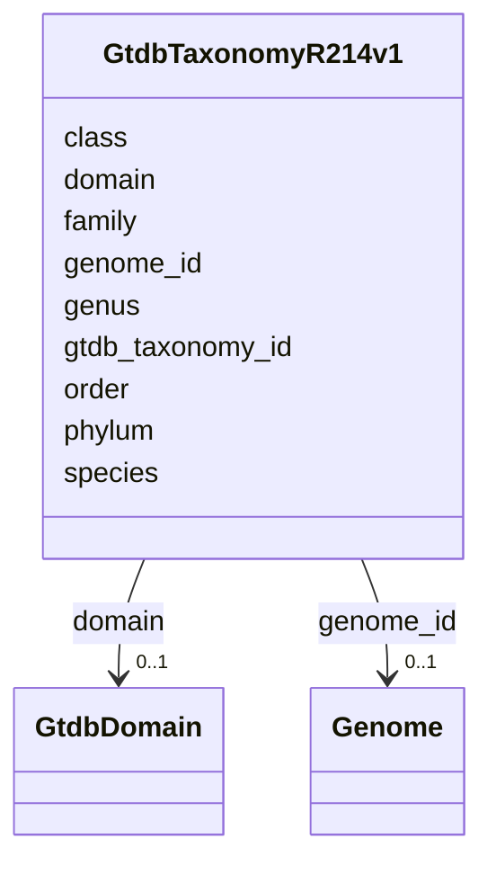

# Class: GtdbTaxonomyR214v1 


_GTDB release 214 taxonomy with parsed rank assignments. Each genome has one row with full taxonomic lineage._

_GTDB PHYLA (top 5 by genome count): - p__Pseudomonadota: 117,619 genomes (was Proteobacteria) - p__Bacillota: 67,072 genomes (was Firmicutes) - p__Actinomycetota: 26,949 genomes (was Actinobacteria) - p__Bacillota_A: 24,581 genomes (split from Firmicutes) - p__Bacteroidota: 20,615 genomes_


URI: [https://w3id.org/kbase/kbase_ke_pangenome/GtdbTaxonomyR214v1](https://w3id.org/kbase/kbase_ke_pangenome/GtdbTaxonomyR214v1)





<!-- no inheritance hierarchy -->


## Slots

| Name | Cardinality and Range | Description | Inheritance |
| ---  | --- | --- | --- |
| [genome_id](genome_id.md) | 0..1 <br/> [Genome](Genome.md) | Genome this taxonomy applies to | direct |
| [gtdb_taxonomy_id](gtdb_taxonomy_id.md) | 1 <br/> [String](String.md) | Full semicolon-separated taxonomy string | direct |
| [domain](domain.md) | 0..1 <br/> [GtdbDomain](GtdbDomain.md) | Domain rank (d__Archaea or d__Bacteria) | direct |
| [phylum](phylum.md) | 0..1 <br/> [String](String.md) | Phylum name with p__ prefix | direct |
| [class](class.md) | 0..1 <br/> [String](String.md) | Class name with c__ prefix | direct |
| [order](order.md) | 0..1 <br/> [String](String.md) | Order name with o__ prefix | direct |
| [family](family.md) | 0..1 <br/> [String](String.md) | Family name with f__ prefix | direct |
| [genus](genus.md) | 0..1 <br/> [String](String.md) | Genus name with g__ prefix | direct |
| [species](species.md) | 0..1 <br/> [String](String.md) | Species name with s__ prefix | direct |


## Identifier and Mapping Information


### Annotations

| property | value |
| --- | --- |
| source_table | gtdb_taxonomy_r214v1 |


### Schema Source


* from schema: https://w3id.org/kbase/kbase_ke_pangenome


## Mappings

| Mapping Type | Mapped Value |
| ---  | ---  |
| self | https://w3id.org/kbase/kbase_ke_pangenome/GtdbTaxonomyR214v1 |
| native | https://w3id.org/kbase/kbase_ke_pangenome/GtdbTaxonomyR214v1 |


## LinkML Source

<!-- TODO: investigate https://stackoverflow.com/questions/37606292/how-to-create-tabbed-code-blocks-in-mkdocs-or-sphinx -->

### Direct

<details>
```yaml
name: GtdbTaxonomyR214v1
annotations:
  source_table:
    tag: source_table
    value: gtdb_taxonomy_r214v1
description: 'GTDB release 214 taxonomy with parsed rank assignments. Each genome
  has one row with full taxonomic lineage.

  GTDB PHYLA (top 5 by genome count): - p__Pseudomonadota: 117,619 genomes (was Proteobacteria)
  - p__Bacillota: 67,072 genomes (was Firmicutes) - p__Actinomycetota: 26,949 genomes
  (was Actinobacteria) - p__Bacillota_A: 24,581 genomes (split from Firmicutes) -
  p__Bacteroidota: 20,615 genomes'
from_schema: https://w3id.org/kbase/kbase_ke_pangenome
attributes:
  genome_id:
    name: genome_id
    description: Genome this taxonomy applies to
    comments:
    - 'Foreign key: Genome.genome_id'
    examples:
    - value: RS_GCF_020034805.1
    from_schema: https://w3id.org/kbase/kbase_ke_pangenome
    domain_of:
    - Genome
    - Gene
    - GtdbTaxonomyR214v1
    - Sample
    - GapmindPathways
    range: Genome
  gtdb_taxonomy_id:
    name: gtdb_taxonomy_id
    description: Full semicolon-separated taxonomy string
    examples:
    - value: d__Bacteria;p__Pseudomonadota;c__Gammaproteobacteria;o__Enterobacterales;f__Enterobacteriaceae;g__Escherichia;s__Escherichia
        fergusonii
    from_schema: https://w3id.org/kbase/kbase_ke_pangenome
    identifier: true
    domain_of:
    - Genome
    - GtdbTaxonomyR214v1
    range: string
    required: true
  domain:
    name: domain
    description: Domain rank (d__Archaea or d__Bacteria)
    examples:
    - value: d__Bacteria
    - value: d__Archaea
    from_schema: https://w3id.org/kbase/kbase_ke_pangenome
    rank: 1000
    domain_of:
    - GtdbTaxonomyR214v1
    range: GtdbDomain
  phylum:
    name: phylum
    description: Phylum name with p__ prefix. GTDB uses standardized names that may
      differ from NCBI (e.g., Pseudomonadota vs Proteobacteria)
    examples:
    - value: p__Pseudomonadota
      description: Formerly Proteobacteria
    - value: p__Bacillota
      description: Formerly Firmicutes
    - value: p__Actinomycetota
      description: Formerly Actinobacteria
    - value: p__Halobacteriota
      description: Archaeal phylum
    from_schema: https://w3id.org/kbase/kbase_ke_pangenome
    rank: 1000
    domain_of:
    - GtdbTaxonomyR214v1
    range: string
  class:
    name: class
    description: Class name with c__ prefix
    examples:
    - value: c__Gammaproteobacteria
    - value: c__Bacilli
    - value: c__Clostridia
    from_schema: https://w3id.org/kbase/kbase_ke_pangenome
    rank: 1000
    domain_of:
    - GtdbTaxonomyR214v1
    range: string
  order:
    name: order
    description: Order name with o__ prefix
    examples:
    - value: o__Enterobacterales
    - value: o__Staphylococcales
    - value: o__Lactobacillales
    from_schema: https://w3id.org/kbase/kbase_ke_pangenome
    rank: 1000
    domain_of:
    - GtdbTaxonomyR214v1
    range: string
  family:
    name: family
    description: Family name with f__ prefix
    examples:
    - value: f__Enterobacteriaceae
    - value: f__Staphylococcaceae
    - value: f__Pseudomonadaceae
    from_schema: https://w3id.org/kbase/kbase_ke_pangenome
    rank: 1000
    domain_of:
    - GtdbTaxonomyR214v1
    range: string
  genus:
    name: genus
    description: Genus name with g__ prefix
    examples:
    - value: g__Escherichia
    - value: g__Klebsiella
    - value: g__Staphylococcus
    from_schema: https://w3id.org/kbase/kbase_ke_pangenome
    rank: 1000
    domain_of:
    - GtdbTaxonomyR214v1
    range: string
  species:
    name: species
    description: Species name with s__ prefix
    examples:
    - value: s__Escherichia_coli
    - value: s__Escherichia_fergusonii
    - value: s__Klebsiella_pneumoniae
    from_schema: https://w3id.org/kbase/kbase_ke_pangenome
    rank: 1000
    domain_of:
    - GtdbTaxonomyR214v1
    range: string

```
</details>

### Induced

<details>
```yaml
name: GtdbTaxonomyR214v1
annotations:
  source_table:
    tag: source_table
    value: gtdb_taxonomy_r214v1
description: 'GTDB release 214 taxonomy with parsed rank assignments. Each genome
  has one row with full taxonomic lineage.

  GTDB PHYLA (top 5 by genome count): - p__Pseudomonadota: 117,619 genomes (was Proteobacteria)
  - p__Bacillota: 67,072 genomes (was Firmicutes) - p__Actinomycetota: 26,949 genomes
  (was Actinobacteria) - p__Bacillota_A: 24,581 genomes (split from Firmicutes) -
  p__Bacteroidota: 20,615 genomes'
from_schema: https://w3id.org/kbase/kbase_ke_pangenome
attributes:
  genome_id:
    name: genome_id
    description: Genome this taxonomy applies to
    comments:
    - 'Foreign key: Genome.genome_id'
    examples:
    - value: RS_GCF_020034805.1
    from_schema: https://w3id.org/kbase/kbase_ke_pangenome
    alias: genome_id
    owner: GtdbTaxonomyR214v1
    domain_of:
    - Genome
    - Gene
    - GtdbTaxonomyR214v1
    - Sample
    - GapmindPathways
    range: Genome
  gtdb_taxonomy_id:
    name: gtdb_taxonomy_id
    description: Full semicolon-separated taxonomy string
    examples:
    - value: d__Bacteria;p__Pseudomonadota;c__Gammaproteobacteria;o__Enterobacterales;f__Enterobacteriaceae;g__Escherichia;s__Escherichia
        fergusonii
    from_schema: https://w3id.org/kbase/kbase_ke_pangenome
    identifier: true
    alias: gtdb_taxonomy_id
    owner: GtdbTaxonomyR214v1
    domain_of:
    - Genome
    - GtdbTaxonomyR214v1
    range: string
    required: true
  domain:
    name: domain
    description: Domain rank (d__Archaea or d__Bacteria)
    examples:
    - value: d__Bacteria
    - value: d__Archaea
    from_schema: https://w3id.org/kbase/kbase_ke_pangenome
    rank: 1000
    alias: domain
    owner: GtdbTaxonomyR214v1
    domain_of:
    - GtdbTaxonomyR214v1
    range: GtdbDomain
  phylum:
    name: phylum
    description: Phylum name with p__ prefix. GTDB uses standardized names that may
      differ from NCBI (e.g., Pseudomonadota vs Proteobacteria)
    examples:
    - value: p__Pseudomonadota
      description: Formerly Proteobacteria
    - value: p__Bacillota
      description: Formerly Firmicutes
    - value: p__Actinomycetota
      description: Formerly Actinobacteria
    - value: p__Halobacteriota
      description: Archaeal phylum
    from_schema: https://w3id.org/kbase/kbase_ke_pangenome
    rank: 1000
    alias: phylum
    owner: GtdbTaxonomyR214v1
    domain_of:
    - GtdbTaxonomyR214v1
    range: string
  class:
    name: class
    description: Class name with c__ prefix
    examples:
    - value: c__Gammaproteobacteria
    - value: c__Bacilli
    - value: c__Clostridia
    from_schema: https://w3id.org/kbase/kbase_ke_pangenome
    rank: 1000
    alias: class
    owner: GtdbTaxonomyR214v1
    domain_of:
    - GtdbTaxonomyR214v1
    range: string
  order:
    name: order
    description: Order name with o__ prefix
    examples:
    - value: o__Enterobacterales
    - value: o__Staphylococcales
    - value: o__Lactobacillales
    from_schema: https://w3id.org/kbase/kbase_ke_pangenome
    rank: 1000
    alias: order
    owner: GtdbTaxonomyR214v1
    domain_of:
    - GtdbTaxonomyR214v1
    range: string
  family:
    name: family
    description: Family name with f__ prefix
    examples:
    - value: f__Enterobacteriaceae
    - value: f__Staphylococcaceae
    - value: f__Pseudomonadaceae
    from_schema: https://w3id.org/kbase/kbase_ke_pangenome
    rank: 1000
    alias: family
    owner: GtdbTaxonomyR214v1
    domain_of:
    - GtdbTaxonomyR214v1
    range: string
  genus:
    name: genus
    description: Genus name with g__ prefix
    examples:
    - value: g__Escherichia
    - value: g__Klebsiella
    - value: g__Staphylococcus
    from_schema: https://w3id.org/kbase/kbase_ke_pangenome
    rank: 1000
    alias: genus
    owner: GtdbTaxonomyR214v1
    domain_of:
    - GtdbTaxonomyR214v1
    range: string
  species:
    name: species
    description: Species name with s__ prefix
    examples:
    - value: s__Escherichia_coli
    - value: s__Escherichia_fergusonii
    - value: s__Klebsiella_pneumoniae
    from_schema: https://w3id.org/kbase/kbase_ke_pangenome
    rank: 1000
    alias: species
    owner: GtdbTaxonomyR214v1
    domain_of:
    - GtdbTaxonomyR214v1
    range: string

```
</details>