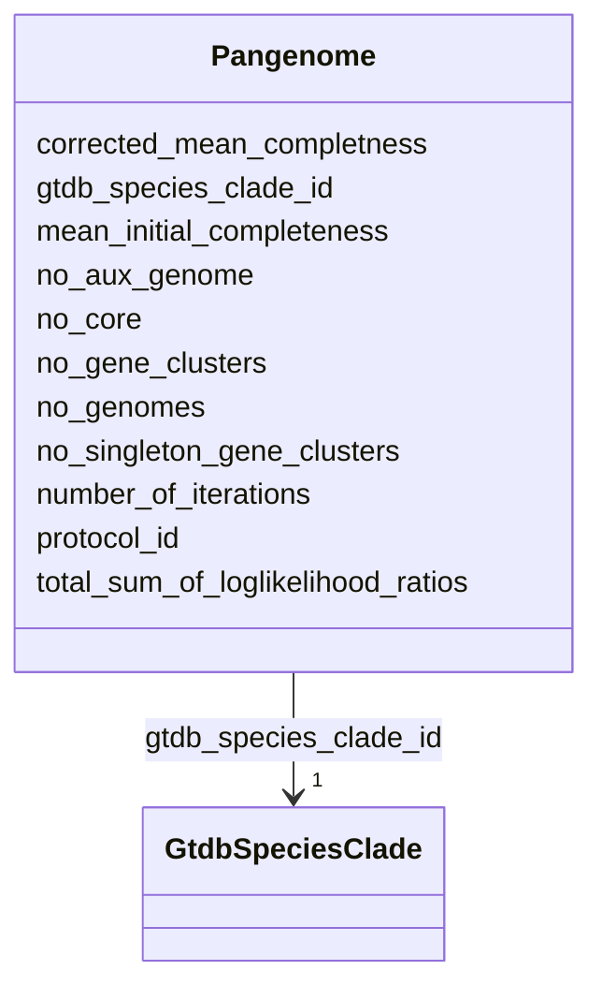

# Class: Pangenome 


_Summary statistics for a species pangenome. One row per species. Contains counts of core/auxiliary/singleton genes and quality metrics._

_EXAMPLE PANGENOME STATISTICS: | Species          | Genomes | Core  | Aux     | Total   | |------------------|---------|-------|---------|---------| | K. pneumoniae    | 14,240  | 4,199 | 438,925 | 443,124 | | S. aureus        | 14,526  | 2,083 | 145,831 | 147,914 | | S. enterica      | 11,402  | 3,639 | 262,732 | 266,371 | | P. aeruginosa    | 6,760   | 5,199 | 250,894 | 256,093 |_


URI: [https://w3id.org/kbase/kbase_ke_pangenome/Pangenome](https://w3id.org/kbase/kbase_ke_pangenome/Pangenome)





<!-- no inheritance hierarchy -->


## Slots

| Name | Cardinality and Range | Description | Inheritance |
| ---  | --- | --- | --- |
| [gtdb_species_clade_id](gtdb_species_clade_id.md) | 1 <br/> [GtdbSpeciesClade](GtdbSpeciesClade.md) | Species clade this pangenome summarizes | direct |
| [protocol_id](protocol_id.md) | 0..1 <br/> [String](String.md) | Analysis protocol version identifier | direct |
| [number_of_iterations](number_of_iterations.md) | 0..1 <br/> [Integer](Integer.md) | PPanGGOLiN model training iterations (0 = converged early) | direct |
| [mean_initial_completeness](mean_initial_completeness.md) | 0..1 <br/> [Float](Float.md) | Mean CheckM completeness of input genomes before filtering | direct |
| [total_sum_of_loglikelihood_ratios](total_sum_of_loglikelihood_ratios.md) | 0..1 <br/> [Float](Float.md) | Model fit quality metric | direct |
| [corrected_mean_completness](corrected_mean_completness.md) | 0..1 <br/> [Float](Float.md) | Completeness after pangenome-based correction | direct |
| [no_aux_genome](no_aux_genome.md) | 0..1 <br/> [Integer](Integer.md) | Number of auxiliary (shell) gene clusters | direct |
| [no_core](no_core.md) | 0..1 <br/> [Integer](Integer.md) | Number of core gene clusters | direct |
| [no_singleton_gene_clusters](no_singleton_gene_clusters.md) | 0..1 <br/> [Integer](Integer.md) | Number of singleton clusters | direct |
| [no_gene_clusters](no_gene_clusters.md) | 0..1 <br/> [Integer](Integer.md) | Total gene clusters (core + auxiliary + singleton) | direct |
| [no_genomes](no_genomes.md) | 0..1 <br/> [Integer](Integer.md) | Number of genomes in pangenome analysis | direct |


## Identifier and Mapping Information


### Annotations

| property | value |
| --- | --- |
| source_table | pangenome |


### Schema Source


* from schema: https://w3id.org/kbase/kbase_ke_pangenome


## Mappings

| Mapping Type | Mapped Value |
| ---  | ---  |
| self | https://w3id.org/kbase/kbase_ke_pangenome/Pangenome |
| native | https://w3id.org/kbase/kbase_ke_pangenome/Pangenome |


## LinkML Source

<!-- TODO: investigate https://stackoverflow.com/questions/37606292/how-to-create-tabbed-code-blocks-in-mkdocs-or-sphinx -->

### Direct

<details>
```yaml
name: Pangenome
annotations:
  source_table:
    tag: source_table
    value: pangenome
description: 'Summary statistics for a species pangenome. One row per species. Contains
  counts of core/auxiliary/singleton genes and quality metrics.

  EXAMPLE PANGENOME STATISTICS: | Species          | Genomes | Core  | Aux     | Total   |
  |------------------|---------|-------|---------|---------| | K. pneumoniae    |
  14,240  | 4,199 | 438,925 | 443,124 | | S. aureus        | 14,526  | 2,083 | 145,831
  | 147,914 | | S. enterica      | 11,402  | 3,639 | 262,732 | 266,371 | | P. aeruginosa    |
  6,760   | 5,199 | 250,894 | 256,093 |'
from_schema: https://w3id.org/kbase/kbase_ke_pangenome
attributes:
  gtdb_species_clade_id:
    name: gtdb_species_clade_id
    description: Species clade this pangenome summarizes
    comments:
    - 'Foreign key: GtdbSpeciesClade.gtdb_species_clade_id'
    examples:
    - value: s__Klebsiella_pneumoniae--RS_GCF_000742135.1
    - value: s__Staphylococcus_aureus--RS_GCF_001027105.1
    from_schema: https://w3id.org/kbase/kbase_ke_pangenome
    identifier: true
    domain_of:
    - GtdbSpeciesClade
    - Genome
    - GeneCluster
    - Pangenome
    range: GtdbSpeciesClade
    required: true
  protocol_id:
    name: protocol_id
    description: 'Analysis protocol version identifier. NOT a foreign key - this is
      a version string constant that identifies the pangenome computation pipeline
      and date.

      Format breakdown: PGNKE_MMS90_V01_DEC2024 - PGNKE: Pangenome KBase project prefix
      - MMS90: Method/parameter set identifier (MMSeqs2-based, 90% identity?) - V01:
      Version 01 - DEC2024: Analysis run date (December 2024)

      Currently all pangenomes in the database share the same protocol_id value, indicating
      they were computed in a single batch analysis run.'
    examples:
    - value: PGNKE_MMS90_V01_DEC2024
      description: Current protocol - all pangenomes use this value
    from_schema: https://w3id.org/kbase/kbase_ke_pangenome
    rank: 1000
    domain_of:
    - Pangenome
    - GenomeAni
    range: string
  number_of_iterations:
    name: number_of_iterations
    description: PPanGGOLiN model training iterations (0 = converged early)
    examples:
    - value: '0'
    from_schema: https://w3id.org/kbase/kbase_ke_pangenome
    rank: 1000
    domain_of:
    - Pangenome
    range: integer
    minimum_value: 0
  mean_initial_completeness:
    name: mean_initial_completeness
    description: Mean CheckM completeness of input genomes before filtering. Quality
      threshold typically 90%.
    examples:
    - value: '95.0'
    from_schema: https://w3id.org/kbase/kbase_ke_pangenome
    rank: 1000
    domain_of:
    - Pangenome
    range: float
    minimum_value: 0.0
    maximum_value: 100.0
  total_sum_of_loglikelihood_ratios:
    name: total_sum_of_loglikelihood_ratios
    description: Model fit quality metric. Larger negative values indicate larger
      species with more genes.
    examples:
    - value: '-14186263623.030312'
      description: Large pangenome (K. pneumoniae)
    - value: '-5100735177.719256'
      description: Medium pangenome (S. aureus)
    from_schema: https://w3id.org/kbase/kbase_ke_pangenome
    rank: 1000
    domain_of:
    - Pangenome
    range: float
  corrected_mean_completness:
    name: corrected_mean_completness
    description: Completeness after pangenome-based correction. Usually higher than
      initial because some "missing" genes are species-absent.
    examples:
    - value: '99.24400808378776'
    - value: '99.36403620861542'
    from_schema: https://w3id.org/kbase/kbase_ke_pangenome
    rank: 1000
    domain_of:
    - Pangenome
    range: float
    minimum_value: 0.0
    maximum_value: 100.0
  no_aux_genome:
    name: no_aux_genome
    description: Number of auxiliary (shell) gene clusters
    examples:
    - value: '438925'
      description: K. pneumoniae - open pangenome
    - value: '145831'
      description: S. aureus - more closed pangenome
    from_schema: https://w3id.org/kbase/kbase_ke_pangenome
    rank: 1000
    domain_of:
    - Pangenome
    range: integer
    minimum_value: 0
  no_core:
    name: no_core
    description: Number of core gene clusters. Essential species functions. Core genome
      size correlates with genome size.
    examples:
    - value: '4199'
      description: K. pneumoniae
    - value: '2083'
      description: S. aureus (smaller genome)
    - value: '5199'
      description: P. aeruginosa (larger genome)
    from_schema: https://w3id.org/kbase/kbase_ke_pangenome
    rank: 1000
    domain_of:
    - Pangenome
    range: integer
    minimum_value: 0
  no_singleton_gene_clusters:
    name: no_singleton_gene_clusters
    description: Number of singleton clusters. High counts indicate diverse accessory
      genome or sequencing artifacts.
    examples:
    - value: '276743'
    - value: '86127'
    from_schema: https://w3id.org/kbase/kbase_ke_pangenome
    rank: 1000
    domain_of:
    - Pangenome
    range: integer
    minimum_value: 0
  no_gene_clusters:
    name: no_gene_clusters
    description: Total gene clusters (core + auxiliary + singleton)
    examples:
    - value: '443124'
    - value: '147914'
    from_schema: https://w3id.org/kbase/kbase_ke_pangenome
    rank: 1000
    domain_of:
    - Pangenome
    range: integer
    minimum_value: 1
  no_genomes:
    name: no_genomes
    description: Number of genomes in pangenome analysis
    examples:
    - value: '14240'
    - value: '14526'
    from_schema: https://w3id.org/kbase/kbase_ke_pangenome
    rank: 1000
    domain_of:
    - Pangenome
    range: integer
    minimum_value: 1

```
</details>

### Induced

<details>
```yaml
name: Pangenome
annotations:
  source_table:
    tag: source_table
    value: pangenome
description: 'Summary statistics for a species pangenome. One row per species. Contains
  counts of core/auxiliary/singleton genes and quality metrics.

  EXAMPLE PANGENOME STATISTICS: | Species          | Genomes | Core  | Aux     | Total   |
  |------------------|---------|-------|---------|---------| | K. pneumoniae    |
  14,240  | 4,199 | 438,925 | 443,124 | | S. aureus        | 14,526  | 2,083 | 145,831
  | 147,914 | | S. enterica      | 11,402  | 3,639 | 262,732 | 266,371 | | P. aeruginosa    |
  6,760   | 5,199 | 250,894 | 256,093 |'
from_schema: https://w3id.org/kbase/kbase_ke_pangenome
attributes:
  gtdb_species_clade_id:
    name: gtdb_species_clade_id
    description: Species clade this pangenome summarizes
    comments:
    - 'Foreign key: GtdbSpeciesClade.gtdb_species_clade_id'
    examples:
    - value: s__Klebsiella_pneumoniae--RS_GCF_000742135.1
    - value: s__Staphylococcus_aureus--RS_GCF_001027105.1
    from_schema: https://w3id.org/kbase/kbase_ke_pangenome
    identifier: true
    alias: gtdb_species_clade_id
    owner: Pangenome
    domain_of:
    - GtdbSpeciesClade
    - Genome
    - GeneCluster
    - Pangenome
    range: GtdbSpeciesClade
    required: true
  protocol_id:
    name: protocol_id
    description: 'Analysis protocol version identifier. NOT a foreign key - this is
      a version string constant that identifies the pangenome computation pipeline
      and date.

      Format breakdown: PGNKE_MMS90_V01_DEC2024 - PGNKE: Pangenome KBase project prefix
      - MMS90: Method/parameter set identifier (MMSeqs2-based, 90% identity?) - V01:
      Version 01 - DEC2024: Analysis run date (December 2024)

      Currently all pangenomes in the database share the same protocol_id value, indicating
      they were computed in a single batch analysis run.'
    examples:
    - value: PGNKE_MMS90_V01_DEC2024
      description: Current protocol - all pangenomes use this value
    from_schema: https://w3id.org/kbase/kbase_ke_pangenome
    rank: 1000
    alias: protocol_id
    owner: Pangenome
    domain_of:
    - Pangenome
    - GenomeAni
    range: string
  number_of_iterations:
    name: number_of_iterations
    description: PPanGGOLiN model training iterations (0 = converged early)
    examples:
    - value: '0'
    from_schema: https://w3id.org/kbase/kbase_ke_pangenome
    rank: 1000
    alias: number_of_iterations
    owner: Pangenome
    domain_of:
    - Pangenome
    range: integer
    minimum_value: 0
  mean_initial_completeness:
    name: mean_initial_completeness
    description: Mean CheckM completeness of input genomes before filtering. Quality
      threshold typically 90%.
    examples:
    - value: '95.0'
    from_schema: https://w3id.org/kbase/kbase_ke_pangenome
    rank: 1000
    alias: mean_initial_completeness
    owner: Pangenome
    domain_of:
    - Pangenome
    range: float
    minimum_value: 0.0
    maximum_value: 100.0
  total_sum_of_loglikelihood_ratios:
    name: total_sum_of_loglikelihood_ratios
    description: Model fit quality metric. Larger negative values indicate larger
      species with more genes.
    examples:
    - value: '-14186263623.030312'
      description: Large pangenome (K. pneumoniae)
    - value: '-5100735177.719256'
      description: Medium pangenome (S. aureus)
    from_schema: https://w3id.org/kbase/kbase_ke_pangenome
    rank: 1000
    alias: total_sum_of_loglikelihood_ratios
    owner: Pangenome
    domain_of:
    - Pangenome
    range: float
  corrected_mean_completness:
    name: corrected_mean_completness
    description: Completeness after pangenome-based correction. Usually higher than
      initial because some "missing" genes are species-absent.
    examples:
    - value: '99.24400808378776'
    - value: '99.36403620861542'
    from_schema: https://w3id.org/kbase/kbase_ke_pangenome
    rank: 1000
    alias: corrected_mean_completness
    owner: Pangenome
    domain_of:
    - Pangenome
    range: float
    minimum_value: 0.0
    maximum_value: 100.0
  no_aux_genome:
    name: no_aux_genome
    description: Number of auxiliary (shell) gene clusters
    examples:
    - value: '438925'
      description: K. pneumoniae - open pangenome
    - value: '145831'
      description: S. aureus - more closed pangenome
    from_schema: https://w3id.org/kbase/kbase_ke_pangenome
    rank: 1000
    alias: no_aux_genome
    owner: Pangenome
    domain_of:
    - Pangenome
    range: integer
    minimum_value: 0
  no_core:
    name: no_core
    description: Number of core gene clusters. Essential species functions. Core genome
      size correlates with genome size.
    examples:
    - value: '4199'
      description: K. pneumoniae
    - value: '2083'
      description: S. aureus (smaller genome)
    - value: '5199'
      description: P. aeruginosa (larger genome)
    from_schema: https://w3id.org/kbase/kbase_ke_pangenome
    rank: 1000
    alias: no_core
    owner: Pangenome
    domain_of:
    - Pangenome
    range: integer
    minimum_value: 0
  no_singleton_gene_clusters:
    name: no_singleton_gene_clusters
    description: Number of singleton clusters. High counts indicate diverse accessory
      genome or sequencing artifacts.
    examples:
    - value: '276743'
    - value: '86127'
    from_schema: https://w3id.org/kbase/kbase_ke_pangenome
    rank: 1000
    alias: no_singleton_gene_clusters
    owner: Pangenome
    domain_of:
    - Pangenome
    range: integer
    minimum_value: 0
  no_gene_clusters:
    name: no_gene_clusters
    description: Total gene clusters (core + auxiliary + singleton)
    examples:
    - value: '443124'
    - value: '147914'
    from_schema: https://w3id.org/kbase/kbase_ke_pangenome
    rank: 1000
    alias: no_gene_clusters
    owner: Pangenome
    domain_of:
    - Pangenome
    range: integer
    minimum_value: 1
  no_genomes:
    name: no_genomes
    description: Number of genomes in pangenome analysis
    examples:
    - value: '14240'
    - value: '14526'
    from_schema: https://w3id.org/kbase/kbase_ke_pangenome
    rank: 1000
    alias: no_genomes
    owner: Pangenome
    domain_of:
    - Pangenome
    range: integer
    minimum_value: 1

```
</details>