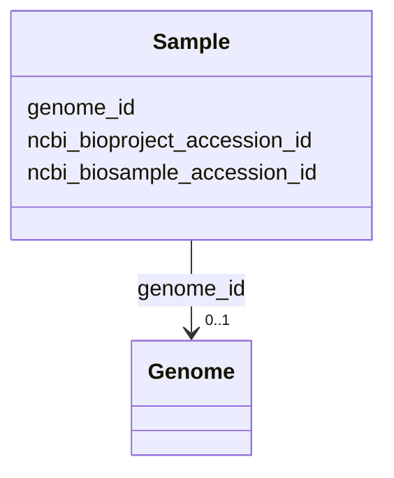

# Class: Sample 


_Links genomes to NCBI BioProject and BioSample accessions. Enables finding related genomes from same study or sample source._


URI: [https://w3id.org/kbase/kbase_ke_pangenome/Sample](https://w3id.org/kbase/kbase_ke_pangenome/Sample)





<!-- no inheritance hierarchy -->


## Slots

| Name | Cardinality and Range | Description | Inheritance |
| ---  | --- | --- | --- |
| [genome_id](genome_id.md) | 0..1 <br/> [Genome](Genome.md) | Genome associated with this sample | direct |
| [ncbi_bioproject_accession_id](ncbi_bioproject_accession_id.md) | 0..1 <br/> [String](String.md) | NCBI BioProject accession | direct |
| [ncbi_biosample_accession_id](ncbi_biosample_accession_id.md) | 0..1 <br/> [String](String.md) | NCBI BioSample accession with sample metadata | direct |


## Identifier and Mapping Information


### Annotations

| property | value |
| --- | --- |
| source_table | sample |


### Schema Source


* from schema: https://w3id.org/kbase/kbase_ke_pangenome


## Mappings

| Mapping Type | Mapped Value |
| ---  | ---  |
| self | https://w3id.org/kbase/kbase_ke_pangenome/Sample |
| native | https://w3id.org/kbase/kbase_ke_pangenome/Sample |


## LinkML Source

<!-- TODO: investigate https://stackoverflow.com/questions/37606292/how-to-create-tabbed-code-blocks-in-mkdocs-or-sphinx -->

### Direct

<details>
```yaml
name: Sample
annotations:
  source_table:
    tag: source_table
    value: sample
description: Links genomes to NCBI BioProject and BioSample accessions. Enables finding
  related genomes from same study or sample source.
from_schema: https://w3id.org/kbase/kbase_ke_pangenome
attributes:
  genome_id:
    name: genome_id
    description: Genome associated with this sample
    comments:
    - 'Foreign key: Genome.genome_id'
    from_schema: https://w3id.org/kbase/kbase_ke_pangenome
    domain_of:
    - Genome
    - Gene
    - GtdbTaxonomyR214v1
    - Sample
    - GapmindPathways
    range: Genome
  ncbi_bioproject_accession_id:
    name: ncbi_bioproject_accession_id
    description: NCBI BioProject accession. Groups related genomes from same study.
    examples:
    - value: PRJNA224116
      description: RefSeq reference genomes project
    - value: PRJNA13883
      description: Human microbiome project
    from_schema: https://w3id.org/kbase/kbase_ke_pangenome
    rank: 1000
    domain_of:
    - Sample
    range: string
    pattern: PRJ[A-Z]{2}\d+
  ncbi_biosample_accession_id:
    name: ncbi_biosample_accession_id
    description: NCBI BioSample accession with sample metadata
    examples:
    - value: SAMN02603679
    - value: SAMEA2272191
    from_schema: https://w3id.org/kbase/kbase_ke_pangenome
    rank: 1000
    domain_of:
    - Sample
    range: string
    pattern: SAM[NED][A-Z]?\d+

```
</details>

### Induced

<details>
```yaml
name: Sample
annotations:
  source_table:
    tag: source_table
    value: sample
description: Links genomes to NCBI BioProject and BioSample accessions. Enables finding
  related genomes from same study or sample source.
from_schema: https://w3id.org/kbase/kbase_ke_pangenome
attributes:
  genome_id:
    name: genome_id
    description: Genome associated with this sample
    comments:
    - 'Foreign key: Genome.genome_id'
    from_schema: https://w3id.org/kbase/kbase_ke_pangenome
    alias: genome_id
    owner: Sample
    domain_of:
    - Genome
    - Gene
    - GtdbTaxonomyR214v1
    - Sample
    - GapmindPathways
    range: Genome
  ncbi_bioproject_accession_id:
    name: ncbi_bioproject_accession_id
    description: NCBI BioProject accession. Groups related genomes from same study.
    examples:
    - value: PRJNA224116
      description: RefSeq reference genomes project
    - value: PRJNA13883
      description: Human microbiome project
    from_schema: https://w3id.org/kbase/kbase_ke_pangenome
    rank: 1000
    alias: ncbi_bioproject_accession_id
    owner: Sample
    domain_of:
    - Sample
    range: string
    pattern: PRJ[A-Z]{2}\d+
  ncbi_biosample_accession_id:
    name: ncbi_biosample_accession_id
    description: NCBI BioSample accession with sample metadata
    examples:
    - value: SAMN02603679
    - value: SAMEA2272191
    from_schema: https://w3id.org/kbase/kbase_ke_pangenome
    rank: 1000
    alias: ncbi_biosample_accession_id
    owner: Sample
    domain_of:
    - Sample
    range: string
    pattern: SAM[NED][A-Z]?\d+

```
</details>