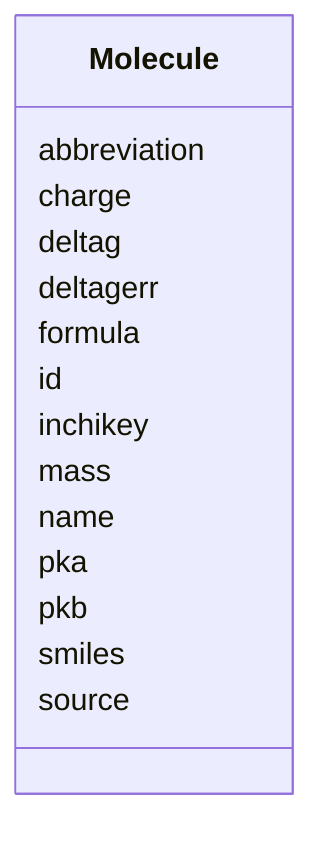

# Class: Molecule 


URI: [https://w3id.org/kbase/kbase_msd_biochemistry/Molecule](https://w3id.org/kbase/kbase_msd_biochemistry/Molecule)





<!-- no inheritance hierarchy -->


## Slots

| Name | Cardinality and Range | Description | Inheritance |
| ---  | --- | --- | --- |
| [abbreviation](abbreviation.md) | 0..1 <br/> [String](String.md) |  | direct |
| [charge](charge.md) | 0..1 <br/> [String](String.md) |  | direct |
| [deltag](deltag.md) | 0..1 <br/> [String](String.md) |  | direct |
| [deltagerr](deltagerr.md) | 0..1 <br/> [String](String.md) |  | direct |
| [formula](formula.md) | 0..1 <br/> [String](String.md) |  | direct |
| [id](id.md) | 1 <br/> [String](String.md) |  | direct |
| [inchikey](inchikey.md) | 0..1 <br/> [String](String.md) |  | direct |
| [mass](mass.md) | 0..1 <br/> [String](String.md) |  | direct |
| [name](name.md) | 0..1 <br/> [String](String.md) |  | direct |
| [pka](pka.md) | 0..1 <br/> [String](String.md) |  | direct |
| [pkb](pkb.md) | 0..1 <br/> [String](String.md) |  | direct |
| [smiles](smiles.md) | 0..1 <br/> [String](String.md) |  | direct |
| [source](source.md) | 0..1 <br/> [String](String.md) |  | direct |


## Identifier and Mapping Information


### Annotations

| property | value |
| --- | --- |
| source_table | molecule |


### Schema Source


* from schema: https://w3id.org/kbase/kbase_msd_biochemistry


## Mappings

| Mapping Type | Mapped Value |
| ---  | ---  |
| self | https://w3id.org/kbase/kbase_msd_biochemistry/Molecule |
| native | https://w3id.org/kbase/kbase_msd_biochemistry/Molecule |


## LinkML Source

<!-- TODO: investigate https://stackoverflow.com/questions/37606292/how-to-create-tabbed-code-blocks-in-mkdocs-or-sphinx -->

### Direct

<details>
```yaml
name: Molecule
annotations:
  source_table:
    tag: source_table
    value: molecule
from_schema: https://w3id.org/kbase/kbase_msd_biochemistry
attributes:
  abbreviation:
    name: abbreviation
    from_schema: https://w3id.org/kbase/kbase_msd_biochemistry
    rank: 1000
    domain_of:
    - Molecule
    - Reaction
    range: string
  charge:
    name: charge
    from_schema: https://w3id.org/kbase/kbase_msd_biochemistry
    rank: 1000
    domain_of:
    - Molecule
    range: string
  deltag:
    name: deltag
    from_schema: https://w3id.org/kbase/kbase_msd_biochemistry
    rank: 1000
    domain_of:
    - Molecule
    - Reaction
    range: string
  deltagerr:
    name: deltagerr
    from_schema: https://w3id.org/kbase/kbase_msd_biochemistry
    rank: 1000
    domain_of:
    - Molecule
    - Reaction
    range: string
  formula:
    name: formula
    from_schema: https://w3id.org/kbase/kbase_msd_biochemistry
    rank: 1000
    domain_of:
    - Molecule
    range: string
  id:
    name: id
    from_schema: https://w3id.org/kbase/kbase_msd_biochemistry
    rank: 1000
    identifier: true
    domain_of:
    - Molecule
    - Reaction
    range: string
    required: true
  inchikey:
    name: inchikey
    from_schema: https://w3id.org/kbase/kbase_msd_biochemistry
    rank: 1000
    domain_of:
    - Molecule
    range: string
  mass:
    name: mass
    from_schema: https://w3id.org/kbase/kbase_msd_biochemistry
    rank: 1000
    domain_of:
    - Molecule
    range: string
  name:
    name: name
    from_schema: https://w3id.org/kbase/kbase_msd_biochemistry
    rank: 1000
    domain_of:
    - Molecule
    - Reaction
    range: string
  pka:
    name: pka
    from_schema: https://w3id.org/kbase/kbase_msd_biochemistry
    rank: 1000
    domain_of:
    - Molecule
    range: string
  pkb:
    name: pkb
    from_schema: https://w3id.org/kbase/kbase_msd_biochemistry
    rank: 1000
    domain_of:
    - Molecule
    range: string
  smiles:
    name: smiles
    from_schema: https://w3id.org/kbase/kbase_msd_biochemistry
    rank: 1000
    domain_of:
    - Molecule
    range: string
  source:
    name: source
    from_schema: https://w3id.org/kbase/kbase_msd_biochemistry
    rank: 1000
    domain_of:
    - Molecule
    - Reaction
    range: string

```
</details>

### Induced

<details>
```yaml
name: Molecule
annotations:
  source_table:
    tag: source_table
    value: molecule
from_schema: https://w3id.org/kbase/kbase_msd_biochemistry
attributes:
  abbreviation:
    name: abbreviation
    from_schema: https://w3id.org/kbase/kbase_msd_biochemistry
    rank: 1000
    alias: abbreviation
    owner: Molecule
    domain_of:
    - Molecule
    - Reaction
    range: string
  charge:
    name: charge
    from_schema: https://w3id.org/kbase/kbase_msd_biochemistry
    rank: 1000
    alias: charge
    owner: Molecule
    domain_of:
    - Molecule
    range: string
  deltag:
    name: deltag
    from_schema: https://w3id.org/kbase/kbase_msd_biochemistry
    rank: 1000
    alias: deltag
    owner: Molecule
    domain_of:
    - Molecule
    - Reaction
    range: string
  deltagerr:
    name: deltagerr
    from_schema: https://w3id.org/kbase/kbase_msd_biochemistry
    rank: 1000
    alias: deltagerr
    owner: Molecule
    domain_of:
    - Molecule
    - Reaction
    range: string
  formula:
    name: formula
    from_schema: https://w3id.org/kbase/kbase_msd_biochemistry
    rank: 1000
    alias: formula
    owner: Molecule
    domain_of:
    - Molecule
    range: string
  id:
    name: id
    from_schema: https://w3id.org/kbase/kbase_msd_biochemistry
    rank: 1000
    identifier: true
    alias: id
    owner: Molecule
    domain_of:
    - Molecule
    - Reaction
    range: string
  inchikey:
    name: inchikey
    from_schema: https://w3id.org/kbase/kbase_msd_biochemistry
    rank: 1000
    alias: inchikey
    owner: Molecule
    domain_of:
    - Molecule
    range: string
  mass:
    name: mass
    from_schema: https://w3id.org/kbase/kbase_msd_biochemistry
    rank: 1000
    alias: mass
    owner: Molecule
    domain_of:
    - Molecule
    range: string
  name:
    name: name
    from_schema: https://w3id.org/kbase/kbase_msd_biochemistry
    rank: 1000
    alias: name
    owner: Molecule
    domain_of:
    - Molecule
    - Reaction
    range: string
  pka:
    name: pka
    from_schema: https://w3id.org/kbase/kbase_msd_biochemistry
    rank: 1000
    alias: pka
    owner: Molecule
    domain_of:
    - Molecule
    range: string
  pkb:
    name: pkb
    from_schema: https://w3id.org/kbase/kbase_msd_biochemistry
    rank: 1000
    alias: pkb
    owner: Molecule
    domain_of:
    - Molecule
    range: string
  smiles:
    name: smiles
    from_schema: https://w3id.org/kbase/kbase_msd_biochemistry
    rank: 1000
    alias: smiles
    owner: Molecule
    domain_of:
    - Molecule
    range: string
  source:
    name: source
    from_schema: https://w3id.org/kbase/kbase_msd_biochemistry
    rank: 1000
    alias: source
    owner: Molecule
    domain_of:
    - Molecule
    - Reaction
    range: string

```
</details>