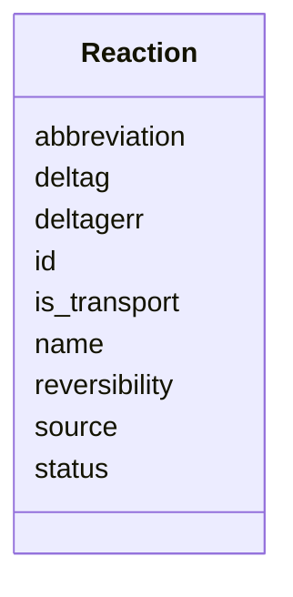

# Class: Reaction 


URI: [https://w3id.org/kbase/kbase_msd_biochemistry/Reaction](https://w3id.org/kbase/kbase_msd_biochemistry/Reaction)





<!-- no inheritance hierarchy -->


## Slots

| Name | Cardinality and Range | Description | Inheritance |
| ---  | --- | --- | --- |
| [abbreviation](abbreviation.md) | 0..1 <br/> [String](String.md) |  | direct |
| [deltag](deltag.md) | 0..1 <br/> [String](String.md) |  | direct |
| [deltagerr](deltagerr.md) | 0..1 <br/> [String](String.md) |  | direct |
| [id](id.md) | 1 <br/> [String](String.md) |  | direct |
| [is_transport](is_transport.md) | 0..1 <br/> [String](String.md) |  | direct |
| [name](name.md) | 0..1 <br/> [String](String.md) |  | direct |
| [reversibility](reversibility.md) | 0..1 <br/> [String](String.md) |  | direct |
| [source](source.md) | 0..1 <br/> [String](String.md) |  | direct |
| [status](status.md) | 0..1 <br/> [String](String.md) |  | direct |


## Identifier and Mapping Information


### Annotations

| property | value |
| --- | --- |
| source_table | reaction |


### Schema Source


* from schema: https://w3id.org/kbase/kbase_msd_biochemistry


## Mappings

| Mapping Type | Mapped Value |
| ---  | ---  |
| self | https://w3id.org/kbase/kbase_msd_biochemistry/Reaction |
| native | https://w3id.org/kbase/kbase_msd_biochemistry/Reaction |


## LinkML Source

<!-- TODO: investigate https://stackoverflow.com/questions/37606292/how-to-create-tabbed-code-blocks-in-mkdocs-or-sphinx -->

### Direct

<details>
```yaml
name: Reaction
annotations:
  source_table:
    tag: source_table
    value: reaction
from_schema: https://w3id.org/kbase/kbase_msd_biochemistry
attributes:
  abbreviation:
    name: abbreviation
    from_schema: https://w3id.org/kbase/kbase_msd_biochemistry
    domain_of:
    - Molecule
    - Reaction
    range: string
  deltag:
    name: deltag
    from_schema: https://w3id.org/kbase/kbase_msd_biochemistry
    domain_of:
    - Molecule
    - Reaction
    range: string
  deltagerr:
    name: deltagerr
    from_schema: https://w3id.org/kbase/kbase_msd_biochemistry
    domain_of:
    - Molecule
    - Reaction
    range: string
  id:
    name: id
    from_schema: https://w3id.org/kbase/kbase_msd_biochemistry
    identifier: true
    domain_of:
    - Molecule
    - Reaction
    range: string
    required: true
  is_transport:
    name: is_transport
    from_schema: https://w3id.org/kbase/kbase_msd_biochemistry
    rank: 1000
    domain_of:
    - Reaction
    range: string
  name:
    name: name
    from_schema: https://w3id.org/kbase/kbase_msd_biochemistry
    domain_of:
    - Molecule
    - Reaction
    range: string
  reversibility:
    name: reversibility
    from_schema: https://w3id.org/kbase/kbase_msd_biochemistry
    rank: 1000
    domain_of:
    - Reaction
    range: string
  source:
    name: source
    from_schema: https://w3id.org/kbase/kbase_msd_biochemistry
    domain_of:
    - Molecule
    - Reaction
    range: string
  status:
    name: status
    from_schema: https://w3id.org/kbase/kbase_msd_biochemistry
    rank: 1000
    domain_of:
    - Reaction
    range: string

```
</details>

### Induced

<details>
```yaml
name: Reaction
annotations:
  source_table:
    tag: source_table
    value: reaction
from_schema: https://w3id.org/kbase/kbase_msd_biochemistry
attributes:
  abbreviation:
    name: abbreviation
    from_schema: https://w3id.org/kbase/kbase_msd_biochemistry
    alias: abbreviation
    owner: Reaction
    domain_of:
    - Molecule
    - Reaction
    range: string
  deltag:
    name: deltag
    from_schema: https://w3id.org/kbase/kbase_msd_biochemistry
    alias: deltag
    owner: Reaction
    domain_of:
    - Molecule
    - Reaction
    range: string
  deltagerr:
    name: deltagerr
    from_schema: https://w3id.org/kbase/kbase_msd_biochemistry
    alias: deltagerr
    owner: Reaction
    domain_of:
    - Molecule
    - Reaction
    range: string
  id:
    name: id
    from_schema: https://w3id.org/kbase/kbase_msd_biochemistry
    identifier: true
    alias: id
    owner: Reaction
    domain_of:
    - Molecule
    - Reaction
    range: string
    required: true
  is_transport:
    name: is_transport
    from_schema: https://w3id.org/kbase/kbase_msd_biochemistry
    rank: 1000
    alias: is_transport
    owner: Reaction
    domain_of:
    - Reaction
    range: string
  name:
    name: name
    from_schema: https://w3id.org/kbase/kbase_msd_biochemistry
    alias: name
    owner: Reaction
    domain_of:
    - Molecule
    - Reaction
    range: string
  reversibility:
    name: reversibility
    from_schema: https://w3id.org/kbase/kbase_msd_biochemistry
    rank: 1000
    alias: reversibility
    owner: Reaction
    domain_of:
    - Reaction
    range: string
  source:
    name: source
    from_schema: https://w3id.org/kbase/kbase_msd_biochemistry
    alias: source
    owner: Reaction
    domain_of:
    - Molecule
    - Reaction
    range: string
  status:
    name: status
    from_schema: https://w3id.org/kbase/kbase_msd_biochemistry
    rank: 1000
    alias: status
    owner: Reaction
    domain_of:
    - Reaction
    range: string

```
</details>