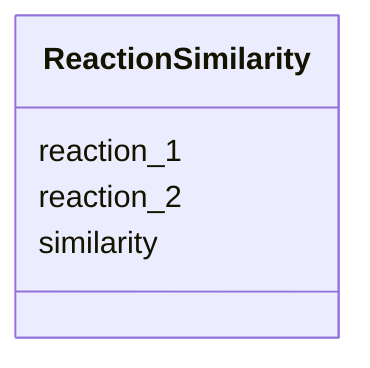

# Class: ReactionSimilarity 


URI: [https://w3id.org/kbase/kbase_msd_biochemistry/ReactionSimilarity](https://w3id.org/kbase/kbase_msd_biochemistry/ReactionSimilarity)





<!-- no inheritance hierarchy -->


## Slots

| Name | Cardinality and Range | Description | Inheritance |
| ---  | --- | --- | --- |
| [reaction_1](reaction_1.md) | 0..1 <br/> [String](String.md) |  | direct |
| [reaction_2](reaction_2.md) | 0..1 <br/> [String](String.md) |  | direct |
| [similarity](similarity.md) | 0..1 <br/> [String](String.md) |  | direct |


## Identifier and Mapping Information


### Annotations

| property | value |
| --- | --- |
| source_table | reaction_similarity |


### Schema Source


* from schema: https://w3id.org/kbase/kbase_msd_biochemistry


## Mappings

| Mapping Type | Mapped Value |
| ---  | ---  |
| self | https://w3id.org/kbase/kbase_msd_biochemistry/ReactionSimilarity |
| native | https://w3id.org/kbase/kbase_msd_biochemistry/ReactionSimilarity |


## LinkML Source

<!-- TODO: investigate https://stackoverflow.com/questions/37606292/how-to-create-tabbed-code-blocks-in-mkdocs-or-sphinx -->

### Direct

<details>
```yaml
name: ReactionSimilarity
annotations:
  source_table:
    tag: source_table
    value: reaction_similarity
from_schema: https://w3id.org/kbase/kbase_msd_biochemistry
attributes:
  reaction_1:
    name: reaction_1
    from_schema: https://w3id.org/kbase/kbase_msd_biochemistry
    rank: 1000
    domain_of:
    - ReactionSimilarity
    range: string
  reaction_2:
    name: reaction_2
    from_schema: https://w3id.org/kbase/kbase_msd_biochemistry
    rank: 1000
    domain_of:
    - ReactionSimilarity
    range: string
  similarity:
    name: similarity
    from_schema: https://w3id.org/kbase/kbase_msd_biochemistry
    rank: 1000
    domain_of:
    - ReactionSimilarity
    range: string

```
</details>

### Induced

<details>
```yaml
name: ReactionSimilarity
annotations:
  source_table:
    tag: source_table
    value: reaction_similarity
from_schema: https://w3id.org/kbase/kbase_msd_biochemistry
attributes:
  reaction_1:
    name: reaction_1
    from_schema: https://w3id.org/kbase/kbase_msd_biochemistry
    rank: 1000
    alias: reaction_1
    owner: ReactionSimilarity
    domain_of:
    - ReactionSimilarity
    range: string
  reaction_2:
    name: reaction_2
    from_schema: https://w3id.org/kbase/kbase_msd_biochemistry
    rank: 1000
    alias: reaction_2
    owner: ReactionSimilarity
    domain_of:
    - ReactionSimilarity
    range: string
  similarity:
    name: similarity
    from_schema: https://w3id.org/kbase/kbase_msd_biochemistry
    rank: 1000
    alias: similarity
    owner: ReactionSimilarity
    domain_of:
    - ReactionSimilarity
    range: string

```
</details>