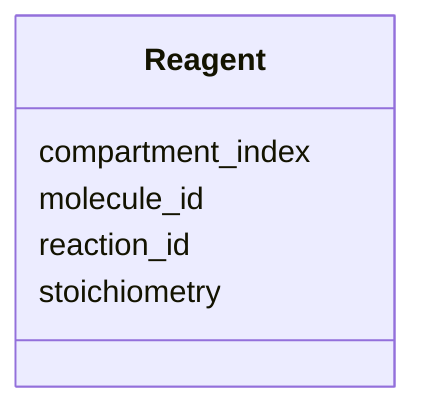

# Class: Reagent 


URI: [https://w3id.org/kbase/kbase_msd_biochemistry/Reagent](https://w3id.org/kbase/kbase_msd_biochemistry/Reagent)





<!-- no inheritance hierarchy -->


## Slots

| Name | Cardinality and Range | Description | Inheritance |
| ---  | --- | --- | --- |
| [reaction_id](reaction_id.md) | 0..1 <br/> [String](String.md) |  | direct |
| [molecule_id](molecule_id.md) | 0..1 <br/> [String](String.md) |  | direct |
| [compartment_index](compartment_index.md) | 0..1 <br/> [String](String.md) |  | direct |
| [stoichiometry](stoichiometry.md) | 0..1 <br/> [String](String.md) |  | direct |


## Identifier and Mapping Information


### Annotations

| property | value |
| --- | --- |
| source_table | reagent |


### Schema Source


* from schema: https://w3id.org/kbase/kbase_msd_biochemistry


## Mappings

| Mapping Type | Mapped Value |
| ---  | ---  |
| self | https://w3id.org/kbase/kbase_msd_biochemistry/Reagent |
| native | https://w3id.org/kbase/kbase_msd_biochemistry/Reagent |


## LinkML Source

<!-- TODO: investigate https://stackoverflow.com/questions/37606292/how-to-create-tabbed-code-blocks-in-mkdocs-or-sphinx -->

### Direct

<details>
```yaml
name: Reagent
annotations:
  source_table:
    tag: source_table
    value: reagent
from_schema: https://w3id.org/kbase/kbase_msd_biochemistry
attributes:
  reaction_id:
    name: reaction_id
    from_schema: https://w3id.org/kbase/kbase_msd_biochemistry
    rank: 1000
    identifier: false
    domain_of:
    - Reagent
    range: string
  molecule_id:
    name: molecule_id
    from_schema: https://w3id.org/kbase/kbase_msd_biochemistry
    rank: 1000
    identifier: false
    domain_of:
    - Reagent
    range: string
  compartment_index:
    name: compartment_index
    from_schema: https://w3id.org/kbase/kbase_msd_biochemistry
    rank: 1000
    domain_of:
    - Reagent
    range: string
  stoichiometry:
    name: stoichiometry
    from_schema: https://w3id.org/kbase/kbase_msd_biochemistry
    rank: 1000
    domain_of:
    - Reagent
    range: string

```
</details>

### Induced

<details>
```yaml
name: Reagent
annotations:
  source_table:
    tag: source_table
    value: reagent
from_schema: https://w3id.org/kbase/kbase_msd_biochemistry
attributes:
  reaction_id:
    name: reaction_id
    from_schema: https://w3id.org/kbase/kbase_msd_biochemistry
    rank: 1000
    identifier: false
    alias: reaction_id
    owner: Reagent
    domain_of:
    - Reagent
    range: string
  molecule_id:
    name: molecule_id
    from_schema: https://w3id.org/kbase/kbase_msd_biochemistry
    rank: 1000
    identifier: false
    alias: molecule_id
    owner: Reagent
    domain_of:
    - Reagent
    range: string
  compartment_index:
    name: compartment_index
    from_schema: https://w3id.org/kbase/kbase_msd_biochemistry
    rank: 1000
    alias: compartment_index
    owner: Reagent
    domain_of:
    - Reagent
    range: string
  stoichiometry:
    name: stoichiometry
    from_schema: https://w3id.org/kbase/kbase_msd_biochemistry
    rank: 1000
    alias: stoichiometry
    owner: Reagent
    domain_of:
    - Reagent
    range: string

```
</details>