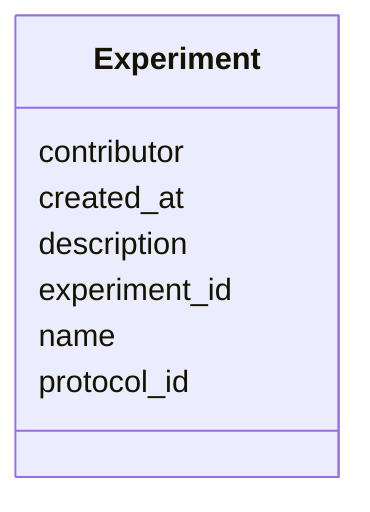

# Class: Experiment 


URI: [https://w3id.org/kbase/kbase_phenotype/Experiment](https://w3id.org/kbase/kbase_phenotype/Experiment)





<!-- no inheritance hierarchy -->


## Slots

| Name | Cardinality and Range | Description | Inheritance |
| ---  | --- | --- | --- |
| [experiment_id](experiment_id.md) | 1 <br/> [String](String.md) |  | direct |
| [name](name.md) | 0..1 <br/> [String](String.md) |  | direct |
| [description](description.md) | 0..1 <br/> [String](String.md) |  | direct |
| [protocol_id](protocol_id.md) | 0..1 <br/> [String](String.md) |  | direct |
| [created_at](created_at.md) | 0..1 <br/> [String](String.md) |  | direct |
| [contributor](contributor.md) | 0..1 <br/> [String](String.md) |  | direct |


## Identifier and Mapping Information


### Annotations

| property | value |
| --- | --- |
| source_table | experiment |


### Schema Source


* from schema: https://w3id.org/kbase/kbase_phenotype


## Mappings

| Mapping Type | Mapped Value |
| ---  | ---  |
| self | https://w3id.org/kbase/kbase_phenotype/Experiment |
| native | https://w3id.org/kbase/kbase_phenotype/Experiment |


## LinkML Source

<!-- TODO: investigate https://stackoverflow.com/questions/37606292/how-to-create-tabbed-code-blocks-in-mkdocs-or-sphinx -->

### Direct

<details>
```yaml
name: Experiment
annotations:
  source_table:
    tag: source_table
    value: experiment
from_schema: https://w3id.org/kbase/kbase_phenotype
attributes:
  experiment_id:
    name: experiment_id
    from_schema: https://w3id.org/kbase/kbase_phenotype
    rank: 1000
    identifier: true
    domain_of:
    - Experiment
    - ExperimentalContext
    - ExperimentXMeasurement
    range: string
    required: true
  name:
    name: name
    from_schema: https://w3id.org/kbase/kbase_phenotype
    rank: 1000
    domain_of:
    - Experiment
    - ExperimentalVariable
    - Protocol
    range: string
  description:
    name: description
    from_schema: https://w3id.org/kbase/kbase_phenotype
    rank: 1000
    domain_of:
    - Experiment
    - ExperimentalVariable
    - Protocol
    range: string
  protocol_id:
    name: protocol_id
    from_schema: https://w3id.org/kbase/kbase_phenotype
    rank: 1000
    identifier: false
    domain_of:
    - Experiment
    - Protocol
    range: string
  created_at:
    name: created_at
    from_schema: https://w3id.org/kbase/kbase_phenotype
    rank: 1000
    domain_of:
    - Experiment
    range: string
  contributor:
    name: contributor
    from_schema: https://w3id.org/kbase/kbase_phenotype
    rank: 1000
    domain_of:
    - Experiment
    range: string

```
</details>

### Induced

<details>
```yaml
name: Experiment
annotations:
  source_table:
    tag: source_table
    value: experiment
from_schema: https://w3id.org/kbase/kbase_phenotype
attributes:
  experiment_id:
    name: experiment_id
    from_schema: https://w3id.org/kbase/kbase_phenotype
    rank: 1000
    identifier: true
    alias: experiment_id
    owner: Experiment
    domain_of:
    - Experiment
    - ExperimentalContext
    - ExperimentXMeasurement
    range: string
  name:
    name: name
    from_schema: https://w3id.org/kbase/kbase_phenotype
    rank: 1000
    alias: name
    owner: Experiment
    domain_of:
    - Experiment
    - ExperimentalVariable
    - Protocol
    range: string
  description:
    name: description
    from_schema: https://w3id.org/kbase/kbase_phenotype
    rank: 1000
    alias: description
    owner: Experiment
    domain_of:
    - Experiment
    - ExperimentalVariable
    - Protocol
    range: string
  protocol_id:
    name: protocol_id
    from_schema: https://w3id.org/kbase/kbase_phenotype
    rank: 1000
    identifier: false
    alias: protocol_id
    owner: Experiment
    domain_of:
    - Experiment
    - Protocol
    range: string
  created_at:
    name: created_at
    from_schema: https://w3id.org/kbase/kbase_phenotype
    rank: 1000
    alias: created_at
    owner: Experiment
    domain_of:
    - Experiment
    range: string
  contributor:
    name: contributor
    from_schema: https://w3id.org/kbase/kbase_phenotype
    rank: 1000
    alias: contributor
    owner: Experiment
    domain_of:
    - Experiment
    range: string

```
</details>