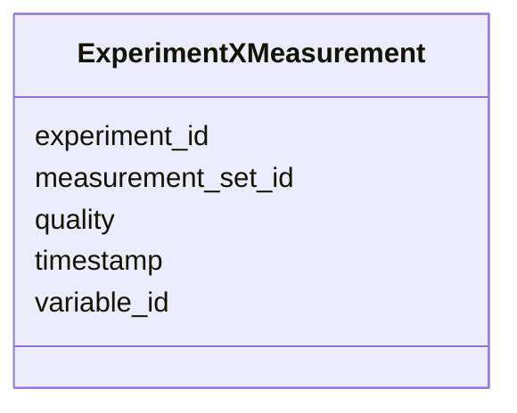

# Class: ExperimentXMeasurement 


URI: [https://w3id.org/kbase/kbase_phenotype/ExperimentXMeasurement](https://w3id.org/kbase/kbase_phenotype/ExperimentXMeasurement)





<!-- no inheritance hierarchy -->


## Slots

| Name | Cardinality and Range | Description | Inheritance |
| ---  | --- | --- | --- |
| [experiment_id](experiment_id.md) | 0..1 <br/> [String](String.md) |  | direct |
| [variable_id](variable_id.md) | 0..1 <br/> [String](String.md) |  | direct |
| [measurement_set_id](measurement_set_id.md) | 0..1 <br/> [String](String.md) |  | direct |
| [quality](quality.md) | 0..1 <br/> [String](String.md) |  | direct |
| [timestamp](timestamp.md) | 0..1 <br/> [String](String.md) |  | direct |


## Identifier and Mapping Information


### Annotations

| property | value |
| --- | --- |
| source_table | experiment_x_measurement |


### Schema Source


* from schema: https://w3id.org/kbase/kbase_phenotype


## Mappings

| Mapping Type | Mapped Value |
| ---  | ---  |
| self | https://w3id.org/kbase/kbase_phenotype/ExperimentXMeasurement |
| native | https://w3id.org/kbase/kbase_phenotype/ExperimentXMeasurement |


## LinkML Source

<!-- TODO: investigate https://stackoverflow.com/questions/37606292/how-to-create-tabbed-code-blocks-in-mkdocs-or-sphinx -->

### Direct

<details>
```yaml
name: ExperimentXMeasurement
annotations:
  source_table:
    tag: source_table
    value: experiment_x_measurement
from_schema: https://w3id.org/kbase/kbase_phenotype
attributes:
  experiment_id:
    name: experiment_id
    from_schema: https://w3id.org/kbase/kbase_phenotype
    identifier: false
    domain_of:
    - Experiment
    - ExperimentalContext
    - ExperimentXMeasurement
    range: string
  variable_id:
    name: variable_id
    from_schema: https://w3id.org/kbase/kbase_phenotype
    identifier: false
    domain_of:
    - ExperimentalVariable
    - ExperimentalContext
    - ExperimentXMeasurement
    range: string
  measurement_set_id:
    name: measurement_set_id
    from_schema: https://w3id.org/kbase/kbase_phenotype
    rank: 1000
    identifier: false
    domain_of:
    - ExperimentXMeasurement
    - Measurement
    range: string
  quality:
    name: quality
    from_schema: https://w3id.org/kbase/kbase_phenotype
    rank: 1000
    domain_of:
    - ExperimentXMeasurement
    range: string
  timestamp:
    name: timestamp
    from_schema: https://w3id.org/kbase/kbase_phenotype
    rank: 1000
    domain_of:
    - ExperimentXMeasurement
    range: string

```
</details>

### Induced

<details>
```yaml
name: ExperimentXMeasurement
annotations:
  source_table:
    tag: source_table
    value: experiment_x_measurement
from_schema: https://w3id.org/kbase/kbase_phenotype
attributes:
  experiment_id:
    name: experiment_id
    from_schema: https://w3id.org/kbase/kbase_phenotype
    identifier: false
    alias: experiment_id
    owner: ExperimentXMeasurement
    domain_of:
    - Experiment
    - ExperimentalContext
    - ExperimentXMeasurement
    range: string
  variable_id:
    name: variable_id
    from_schema: https://w3id.org/kbase/kbase_phenotype
    identifier: false
    alias: variable_id
    owner: ExperimentXMeasurement
    domain_of:
    - ExperimentalVariable
    - ExperimentalContext
    - ExperimentXMeasurement
    range: string
  measurement_set_id:
    name: measurement_set_id
    from_schema: https://w3id.org/kbase/kbase_phenotype
    rank: 1000
    identifier: false
    alias: measurement_set_id
    owner: ExperimentXMeasurement
    domain_of:
    - ExperimentXMeasurement
    - Measurement
    range: string
  quality:
    name: quality
    from_schema: https://w3id.org/kbase/kbase_phenotype
    rank: 1000
    alias: quality
    owner: ExperimentXMeasurement
    domain_of:
    - ExperimentXMeasurement
    range: string
  timestamp:
    name: timestamp
    from_schema: https://w3id.org/kbase/kbase_phenotype
    rank: 1000
    alias: timestamp
    owner: ExperimentXMeasurement
    domain_of:
    - ExperimentXMeasurement
    range: string

```
</details>