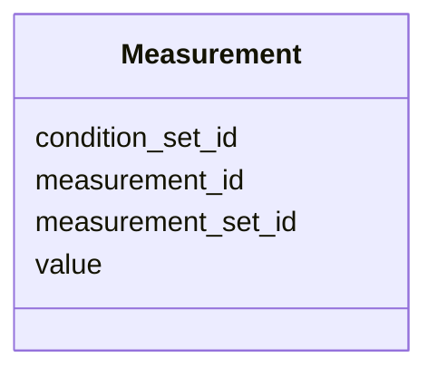

# Class: Measurement 


URI: [https://w3id.org/kbase/kbase_phenotype/Measurement](https://w3id.org/kbase/kbase_phenotype/Measurement)





<!-- no inheritance hierarchy -->


## Slots

| Name | Cardinality and Range | Description | Inheritance |
| ---  | --- | --- | --- |
| [measurement_id](measurement_id.md) | 1 <br/> [String](String.md) |  | direct |
| [measurement_set_id](measurement_set_id.md) | 0..1 <br/> [String](String.md) |  | direct |
| [condition_set_id](condition_set_id.md) | 0..1 <br/> [String](String.md) |  | direct |
| [value](value.md) | 0..1 <br/> [String](String.md) |  | direct |


## Identifier and Mapping Information


### Annotations

| property | value |
| --- | --- |
| source_table | measurement |


### Schema Source


* from schema: https://w3id.org/kbase/kbase_phenotype


## Mappings

| Mapping Type | Mapped Value |
| ---  | ---  |
| self | https://w3id.org/kbase/kbase_phenotype/Measurement |
| native | https://w3id.org/kbase/kbase_phenotype/Measurement |


## LinkML Source

<!-- TODO: investigate https://stackoverflow.com/questions/37606292/how-to-create-tabbed-code-blocks-in-mkdocs-or-sphinx -->

### Direct

<details>
```yaml
name: Measurement
annotations:
  source_table:
    tag: source_table
    value: measurement
from_schema: https://w3id.org/kbase/kbase_phenotype
attributes:
  measurement_id:
    name: measurement_id
    from_schema: https://w3id.org/kbase/kbase_phenotype
    rank: 1000
    identifier: true
    domain_of:
    - Measurement
    range: string
    required: true
  measurement_set_id:
    name: measurement_set_id
    from_schema: https://w3id.org/kbase/kbase_phenotype
    identifier: false
    domain_of:
    - ExperimentXMeasurement
    - Measurement
    range: string
  condition_set_id:
    name: condition_set_id
    from_schema: https://w3id.org/kbase/kbase_phenotype
    identifier: false
    domain_of:
    - ConditionSet
    - Measurement
    range: string
  value:
    name: value
    from_schema: https://w3id.org/kbase/kbase_phenotype
    domain_of:
    - ExperimentalContext
    - Measurement
    range: string

```
</details>

### Induced

<details>
```yaml
name: Measurement
annotations:
  source_table:
    tag: source_table
    value: measurement
from_schema: https://w3id.org/kbase/kbase_phenotype
attributes:
  measurement_id:
    name: measurement_id
    from_schema: https://w3id.org/kbase/kbase_phenotype
    rank: 1000
    identifier: true
    alias: measurement_id
    owner: Measurement
    domain_of:
    - Measurement
    range: string
    required: true
  measurement_set_id:
    name: measurement_set_id
    from_schema: https://w3id.org/kbase/kbase_phenotype
    identifier: false
    alias: measurement_set_id
    owner: Measurement
    domain_of:
    - ExperimentXMeasurement
    - Measurement
    range: string
  condition_set_id:
    name: condition_set_id
    from_schema: https://w3id.org/kbase/kbase_phenotype
    identifier: false
    alias: condition_set_id
    owner: Measurement
    domain_of:
    - ConditionSet
    - Measurement
    range: string
  value:
    name: value
    from_schema: https://w3id.org/kbase/kbase_phenotype
    alias: value
    owner: Measurement
    domain_of:
    - ExperimentalContext
    - Measurement
    range: string

```
</details>