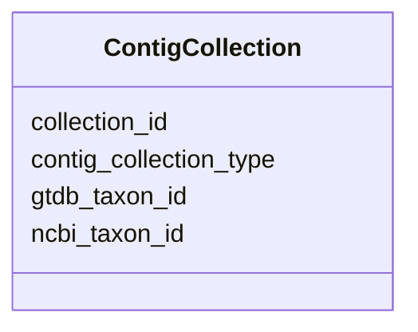

# Class: ContigCollection 


URI: [https://w3id.org/kbase/kbase_refseq_taxon_api/ContigCollection](https://w3id.org/kbase/kbase_refseq_taxon_api/ContigCollection)





<!-- no inheritance hierarchy -->


## Slots

| Name | Cardinality and Range | Description | Inheritance |
| ---  | --- | --- | --- |
| [collection_id](collection_id.md) | 0..1 <br/> [String](String.md) |  | direct |
| [contig_collection_type](contig_collection_type.md) | 0..1 <br/> [String](String.md) |  | direct |
| [ncbi_taxon_id](ncbi_taxon_id.md) | 0..1 <br/> [String](String.md) |  | direct |
| [gtdb_taxon_id](gtdb_taxon_id.md) | 0..1 <br/> [String](String.md) |  | direct |


## Identifier and Mapping Information


### Annotations

| property | value |
| --- | --- |
| source_table | contig_collection |


### Schema Source


* from schema: https://w3id.org/kbase/kbase_refseq_taxon_api


## Mappings

| Mapping Type | Mapped Value |
| ---  | ---  |
| self | https://w3id.org/kbase/kbase_refseq_taxon_api/ContigCollection |
| native | https://w3id.org/kbase/kbase_refseq_taxon_api/ContigCollection |


## LinkML Source

<!-- TODO: investigate https://stackoverflow.com/questions/37606292/how-to-create-tabbed-code-blocks-in-mkdocs-or-sphinx -->

### Direct

<details>
```yaml
name: ContigCollection
annotations:
  source_table:
    tag: source_table
    value: contig_collection
from_schema: https://w3id.org/kbase/kbase_refseq_taxon_api
attributes:
  collection_id:
    name: collection_id
    from_schema: https://w3id.org/kbase/kbase_refseq_taxon_api
    rank: 1000
    identifier: false
    domain_of:
    - ContigCollection
    range: string
  contig_collection_type:
    name: contig_collection_type
    from_schema: https://w3id.org/kbase/kbase_refseq_taxon_api
    rank: 1000
    domain_of:
    - ContigCollection
    range: string
  ncbi_taxon_id:
    name: ncbi_taxon_id
    from_schema: https://w3id.org/kbase/kbase_refseq_taxon_api
    rank: 1000
    identifier: false
    domain_of:
    - ContigCollection
    range: string
  gtdb_taxon_id:
    name: gtdb_taxon_id
    from_schema: https://w3id.org/kbase/kbase_refseq_taxon_api
    rank: 1000
    identifier: false
    domain_of:
    - ContigCollection
    range: string

```
</details>

### Induced

<details>
```yaml
name: ContigCollection
annotations:
  source_table:
    tag: source_table
    value: contig_collection
from_schema: https://w3id.org/kbase/kbase_refseq_taxon_api
attributes:
  collection_id:
    name: collection_id
    from_schema: https://w3id.org/kbase/kbase_refseq_taxon_api
    rank: 1000
    identifier: false
    alias: collection_id
    owner: ContigCollection
    domain_of:
    - ContigCollection
    range: string
  contig_collection_type:
    name: contig_collection_type
    from_schema: https://w3id.org/kbase/kbase_refseq_taxon_api
    rank: 1000
    alias: contig_collection_type
    owner: ContigCollection
    domain_of:
    - ContigCollection
    range: string
  ncbi_taxon_id:
    name: ncbi_taxon_id
    from_schema: https://w3id.org/kbase/kbase_refseq_taxon_api
    rank: 1000
    identifier: false
    alias: ncbi_taxon_id
    owner: ContigCollection
    domain_of:
    - ContigCollection
    range: string
  gtdb_taxon_id:
    name: gtdb_taxon_id
    from_schema: https://w3id.org/kbase/kbase_refseq_taxon_api
    rank: 1000
    identifier: false
    alias: gtdb_taxon_id
    owner: ContigCollection
    domain_of:
    - ContigCollection
    range: string

```
</details>