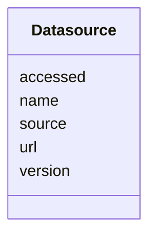

# Class: Datasource 


URI: [https://w3id.org/kbase/kbase_refseq_taxon_api/Datasource](https://w3id.org/kbase/kbase_refseq_taxon_api/Datasource)





<!-- no inheritance hierarchy -->


## Slots

| Name | Cardinality and Range | Description | Inheritance |
| ---  | --- | --- | --- |
| [name](name.md) | 0..1 <br/> [String](String.md) |  | direct |
| [source](source.md) | 0..1 <br/> [String](String.md) |  | direct |
| [url](url.md) | 0..1 <br/> [String](String.md) |  | direct |
| [accessed](accessed.md) | 0..1 <br/> [String](String.md) |  | direct |
| [version](version.md) | 0..1 <br/> [String](String.md) |  | direct |


## Identifier and Mapping Information


### Annotations

| property | value |
| --- | --- |
| source_table | datasource |


### Schema Source


* from schema: https://w3id.org/kbase/kbase_refseq_taxon_api


## Mappings

| Mapping Type | Mapped Value |
| ---  | ---  |
| self | https://w3id.org/kbase/kbase_refseq_taxon_api/Datasource |
| native | https://w3id.org/kbase/kbase_refseq_taxon_api/Datasource |


## LinkML Source

<!-- TODO: investigate https://stackoverflow.com/questions/37606292/how-to-create-tabbed-code-blocks-in-mkdocs-or-sphinx -->

### Direct

<details>
```yaml
name: Datasource
annotations:
  source_table:
    tag: source_table
    value: datasource
from_schema: https://w3id.org/kbase/kbase_refseq_taxon_api
attributes:
  name:
    name: name
    from_schema: https://w3id.org/kbase/kbase_refseq_taxon_api
    rank: 1000
    domain_of:
    - Datasource
    - Name
    range: string
  source:
    name: source
    from_schema: https://w3id.org/kbase/kbase_refseq_taxon_api
    rank: 1000
    domain_of:
    - Datasource
    - Identifier
    - Name
    range: string
  url:
    name: url
    from_schema: https://w3id.org/kbase/kbase_refseq_taxon_api
    rank: 1000
    domain_of:
    - Datasource
    range: string
  accessed:
    name: accessed
    from_schema: https://w3id.org/kbase/kbase_refseq_taxon_api
    rank: 1000
    domain_of:
    - Datasource
    range: string
  version:
    name: version
    from_schema: https://w3id.org/kbase/kbase_refseq_taxon_api
    rank: 1000
    domain_of:
    - Datasource
    range: string

```
</details>

### Induced

<details>
```yaml
name: Datasource
annotations:
  source_table:
    tag: source_table
    value: datasource
from_schema: https://w3id.org/kbase/kbase_refseq_taxon_api
attributes:
  name:
    name: name
    from_schema: https://w3id.org/kbase/kbase_refseq_taxon_api
    rank: 1000
    alias: name
    owner: Datasource
    domain_of:
    - Datasource
    - Name
    range: string
  source:
    name: source
    from_schema: https://w3id.org/kbase/kbase_refseq_taxon_api
    rank: 1000
    alias: source
    owner: Datasource
    domain_of:
    - Datasource
    - Identifier
    - Name
    range: string
  url:
    name: url
    from_schema: https://w3id.org/kbase/kbase_refseq_taxon_api
    rank: 1000
    alias: url
    owner: Datasource
    domain_of:
    - Datasource
    range: string
  accessed:
    name: accessed
    from_schema: https://w3id.org/kbase/kbase_refseq_taxon_api
    rank: 1000
    alias: accessed
    owner: Datasource
    domain_of:
    - Datasource
    range: string
  version:
    name: version
    from_schema: https://w3id.org/kbase/kbase_refseq_taxon_api
    rank: 1000
    alias: version
    owner: Datasource
    domain_of:
    - Datasource
    range: string

```
</details>