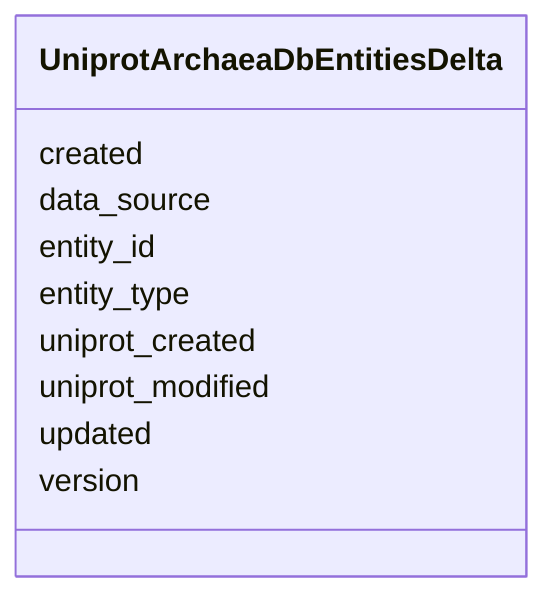

# Class: UniprotArchaeaDbEntitiesDelta 


URI: [https://w3id.org/kbase/kbase_uniprot_archaea/UniprotArchaeaDbEntitiesDelta](https://w3id.org/kbase/kbase_uniprot_archaea/UniprotArchaeaDbEntitiesDelta)





<!-- no inheritance hierarchy -->


## Slots

| Name | Cardinality and Range | Description | Inheritance |
| ---  | --- | --- | --- |
| [entity_id](entity_id.md) | 0..1 <br/> [String](String.md) |  | direct |
| [entity_type](entity_type.md) | 0..1 <br/> [String](String.md) |  | direct |
| [data_source](data_source.md) | 0..1 <br/> [String](String.md) |  | direct |
| [created](created.md) | 0..1 <br/> [String](String.md) |  | direct |
| [updated](updated.md) | 0..1 <br/> [String](String.md) |  | direct |
| [version](version.md) | 0..1 <br/> [String](String.md) |  | direct |
| [uniprot_created](uniprot_created.md) | 0..1 <br/> [String](String.md) |  | direct |
| [uniprot_modified](uniprot_modified.md) | 0..1 <br/> [String](String.md) |  | direct |


## Identifier and Mapping Information


### Annotations

| property | value |
| --- | --- |
| source_table | uniprot_archaea_db_entities_delta |


### Schema Source


* from schema: https://w3id.org/kbase/kbase_uniprot_archaea


## Mappings

| Mapping Type | Mapped Value |
| ---  | ---  |
| self | https://w3id.org/kbase/kbase_uniprot_archaea/UniprotArchaeaDbEntitiesDelta |
| native | https://w3id.org/kbase/kbase_uniprot_archaea/UniprotArchaeaDbEntitiesDelta |


## LinkML Source

<!-- TODO: investigate https://stackoverflow.com/questions/37606292/how-to-create-tabbed-code-blocks-in-mkdocs-or-sphinx -->

### Direct

<details>
```yaml
name: UniprotArchaeaDbEntitiesDelta
annotations:
  source_table:
    tag: source_table
    value: uniprot_archaea_db_entities_delta
from_schema: https://w3id.org/kbase/kbase_uniprot_archaea
attributes:
  entity_id:
    name: entity_id
    from_schema: https://w3id.org/kbase/kbase_uniprot_archaea
    rank: 1000
    identifier: false
    domain_of:
    - UniprotArchaeaDbEntitiesDelta
    - UniprotArchaeaDbIdentifiersDelta
    - UniprotArchaeaDbNamesDelta
    - UniprotArchaeaDbPublicationsDelta
    range: string
  entity_type:
    name: entity_type
    from_schema: https://w3id.org/kbase/kbase_uniprot_archaea
    rank: 1000
    domain_of:
    - UniprotArchaeaDbEntitiesDelta
    range: string
  data_source:
    name: data_source
    from_schema: https://w3id.org/kbase/kbase_uniprot_archaea
    rank: 1000
    domain_of:
    - UniprotArchaeaDbEntitiesDelta
    range: string
  created:
    name: created
    from_schema: https://w3id.org/kbase/kbase_uniprot_archaea
    rank: 1000
    domain_of:
    - UniprotArchaeaDbEntitiesDelta
    range: string
  updated:
    name: updated
    from_schema: https://w3id.org/kbase/kbase_uniprot_archaea
    rank: 1000
    domain_of:
    - UniprotArchaeaDbEntitiesDelta
    range: string
  version:
    name: version
    from_schema: https://w3id.org/kbase/kbase_uniprot_archaea
    rank: 1000
    domain_of:
    - UniprotArchaeaDbEntitiesDelta
    range: string
  uniprot_created:
    name: uniprot_created
    from_schema: https://w3id.org/kbase/kbase_uniprot_archaea
    rank: 1000
    domain_of:
    - UniprotArchaeaDbEntitiesDelta
    range: string
  uniprot_modified:
    name: uniprot_modified
    from_schema: https://w3id.org/kbase/kbase_uniprot_archaea
    rank: 1000
    domain_of:
    - UniprotArchaeaDbEntitiesDelta
    range: string

```
</details>

### Induced

<details>
```yaml
name: UniprotArchaeaDbEntitiesDelta
annotations:
  source_table:
    tag: source_table
    value: uniprot_archaea_db_entities_delta
from_schema: https://w3id.org/kbase/kbase_uniprot_archaea
attributes:
  entity_id:
    name: entity_id
    from_schema: https://w3id.org/kbase/kbase_uniprot_archaea
    rank: 1000
    identifier: false
    alias: entity_id
    owner: UniprotArchaeaDbEntitiesDelta
    domain_of:
    - UniprotArchaeaDbEntitiesDelta
    - UniprotArchaeaDbIdentifiersDelta
    - UniprotArchaeaDbNamesDelta
    - UniprotArchaeaDbPublicationsDelta
    range: string
  entity_type:
    name: entity_type
    from_schema: https://w3id.org/kbase/kbase_uniprot_archaea
    rank: 1000
    alias: entity_type
    owner: UniprotArchaeaDbEntitiesDelta
    domain_of:
    - UniprotArchaeaDbEntitiesDelta
    range: string
  data_source:
    name: data_source
    from_schema: https://w3id.org/kbase/kbase_uniprot_archaea
    rank: 1000
    alias: data_source
    owner: UniprotArchaeaDbEntitiesDelta
    domain_of:
    - UniprotArchaeaDbEntitiesDelta
    range: string
  created:
    name: created
    from_schema: https://w3id.org/kbase/kbase_uniprot_archaea
    rank: 1000
    alias: created
    owner: UniprotArchaeaDbEntitiesDelta
    domain_of:
    - UniprotArchaeaDbEntitiesDelta
    range: string
  updated:
    name: updated
    from_schema: https://w3id.org/kbase/kbase_uniprot_archaea
    rank: 1000
    alias: updated
    owner: UniprotArchaeaDbEntitiesDelta
    domain_of:
    - UniprotArchaeaDbEntitiesDelta
    range: string
  version:
    name: version
    from_schema: https://w3id.org/kbase/kbase_uniprot_archaea
    rank: 1000
    alias: version
    owner: UniprotArchaeaDbEntitiesDelta
    domain_of:
    - UniprotArchaeaDbEntitiesDelta
    range: string
  uniprot_created:
    name: uniprot_created
    from_schema: https://w3id.org/kbase/kbase_uniprot_archaea
    rank: 1000
    alias: uniprot_created
    owner: UniprotArchaeaDbEntitiesDelta
    domain_of:
    - UniprotArchaeaDbEntitiesDelta
    range: string
  uniprot_modified:
    name: uniprot_modified
    from_schema: https://w3id.org/kbase/kbase_uniprot_archaea
    rank: 1000
    alias: uniprot_modified
    owner: UniprotArchaeaDbEntitiesDelta
    domain_of:
    - UniprotArchaeaDbEntitiesDelta
    range: string

```
</details>