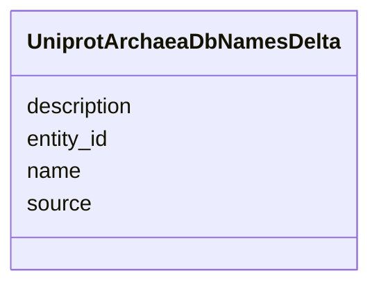

# Class: UniprotArchaeaDbNamesDelta 


URI: [https://w3id.org/kbase/kbase_uniprot_archaea/UniprotArchaeaDbNamesDelta](https://w3id.org/kbase/kbase_uniprot_archaea/UniprotArchaeaDbNamesDelta)





<!-- no inheritance hierarchy -->


## Slots

| Name | Cardinality and Range | Description | Inheritance |
| ---  | --- | --- | --- |
| [entity_id](entity_id.md) | 0..1 <br/> [String](String.md) |  | direct |
| [name](name.md) | 0..1 <br/> [String](String.md) |  | direct |
| [description](description.md) | 0..1 <br/> [String](String.md) |  | direct |
| [source](source.md) | 0..1 <br/> [String](String.md) |  | direct |


## Identifier and Mapping Information


### Annotations

| property | value |
| --- | --- |
| source_table | uniprot_archaea_db_names_delta |


### Schema Source


* from schema: https://w3id.org/kbase/kbase_uniprot_archaea


## Mappings

| Mapping Type | Mapped Value |
| ---  | ---  |
| self | https://w3id.org/kbase/kbase_uniprot_archaea/UniprotArchaeaDbNamesDelta |
| native | https://w3id.org/kbase/kbase_uniprot_archaea/UniprotArchaeaDbNamesDelta |


## LinkML Source

<!-- TODO: investigate https://stackoverflow.com/questions/37606292/how-to-create-tabbed-code-blocks-in-mkdocs-or-sphinx -->

### Direct

<details>
```yaml
name: UniprotArchaeaDbNamesDelta
annotations:
  source_table:
    tag: source_table
    value: uniprot_archaea_db_names_delta
from_schema: https://w3id.org/kbase/kbase_uniprot_archaea
attributes:
  entity_id:
    name: entity_id
    from_schema: https://w3id.org/kbase/kbase_uniprot_archaea
    identifier: false
    domain_of:
    - UniprotArchaeaDbEntitiesDelta
    - UniprotArchaeaDbIdentifiersDelta
    - UniprotArchaeaDbNamesDelta
    - UniprotArchaeaDbPublicationsDelta
    range: string
  name:
    name: name
    from_schema: https://w3id.org/kbase/kbase_uniprot_archaea
    rank: 1000
    domain_of:
    - UniprotArchaeaDbNamesDelta
    range: string
  description:
    name: description
    from_schema: https://w3id.org/kbase/kbase_uniprot_archaea
    domain_of:
    - UniprotArchaeaDbIdentifiersDelta
    - UniprotArchaeaDbNamesDelta
    range: string
  source:
    name: source
    from_schema: https://w3id.org/kbase/kbase_uniprot_archaea
    domain_of:
    - UniprotArchaeaDbIdentifiersDelta
    - UniprotArchaeaDbNamesDelta
    range: string

```
</details>

### Induced

<details>
```yaml
name: UniprotArchaeaDbNamesDelta
annotations:
  source_table:
    tag: source_table
    value: uniprot_archaea_db_names_delta
from_schema: https://w3id.org/kbase/kbase_uniprot_archaea
attributes:
  entity_id:
    name: entity_id
    from_schema: https://w3id.org/kbase/kbase_uniprot_archaea
    identifier: false
    alias: entity_id
    owner: UniprotArchaeaDbNamesDelta
    domain_of:
    - UniprotArchaeaDbEntitiesDelta
    - UniprotArchaeaDbIdentifiersDelta
    - UniprotArchaeaDbNamesDelta
    - UniprotArchaeaDbPublicationsDelta
    range: string
  name:
    name: name
    from_schema: https://w3id.org/kbase/kbase_uniprot_archaea
    rank: 1000
    alias: name
    owner: UniprotArchaeaDbNamesDelta
    domain_of:
    - UniprotArchaeaDbNamesDelta
    range: string
  description:
    name: description
    from_schema: https://w3id.org/kbase/kbase_uniprot_archaea
    alias: description
    owner: UniprotArchaeaDbNamesDelta
    domain_of:
    - UniprotArchaeaDbIdentifiersDelta
    - UniprotArchaeaDbNamesDelta
    range: string
  source:
    name: source
    from_schema: https://w3id.org/kbase/kbase_uniprot_archaea
    alias: source
    owner: UniprotArchaeaDbNamesDelta
    domain_of:
    - UniprotArchaeaDbIdentifiersDelta
    - UniprotArchaeaDbNamesDelta
    range: string

```
</details>