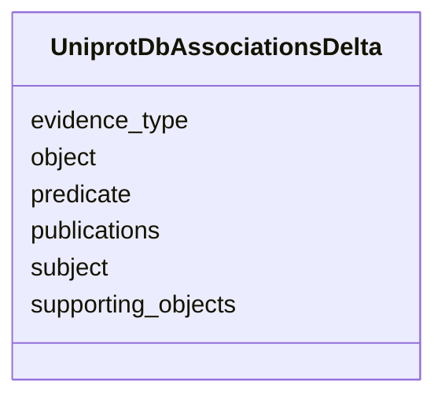

# Class: UniprotDbAssociationsDelta 


URI: [https://w3id.org/kbase/kbase_uniprot_bacteria/UniprotDbAssociationsDelta](https://w3id.org/kbase/kbase_uniprot_bacteria/UniprotDbAssociationsDelta)





<!-- no inheritance hierarchy -->


## Slots

| Name | Cardinality and Range | Description | Inheritance |
| ---  | --- | --- | --- |
| [subject](subject.md) | 0..1 <br/> [String](String.md) |  | direct |
| [object](object.md) | 0..1 <br/> [String](String.md) |  | direct |
| [predicate](predicate.md) | 0..1 <br/> [String](String.md) |  | direct |
| [evidence_type](evidence_type.md) | 0..1 <br/> [String](String.md) |  | direct |
| [supporting_objects](supporting_objects.md) | 0..1 <br/> [String](String.md) |  | direct |
| [publications](publications.md) | 0..1 <br/> [String](String.md) |  | direct |


## Identifier and Mapping Information


### Annotations

| property | value |
| --- | --- |
| source_table | uniprot_db_associations_delta |


### Schema Source


* from schema: https://w3id.org/kbase/kbase_uniprot_bacteria


## Mappings

| Mapping Type | Mapped Value |
| ---  | ---  |
| self | https://w3id.org/kbase/kbase_uniprot_bacteria/UniprotDbAssociationsDelta |
| native | https://w3id.org/kbase/kbase_uniprot_bacteria/UniprotDbAssociationsDelta |


## LinkML Source

<!-- TODO: investigate https://stackoverflow.com/questions/37606292/how-to-create-tabbed-code-blocks-in-mkdocs-or-sphinx -->

### Direct

<details>
```yaml
name: UniprotDbAssociationsDelta
annotations:
  source_table:
    tag: source_table
    value: uniprot_db_associations_delta
from_schema: https://w3id.org/kbase/kbase_uniprot_bacteria
attributes:
  subject:
    name: subject
    from_schema: https://w3id.org/kbase/kbase_uniprot_bacteria
    rank: 1000
    domain_of:
    - UniprotDbAssociationsDelta
    range: string
  object:
    name: object
    from_schema: https://w3id.org/kbase/kbase_uniprot_bacteria
    rank: 1000
    domain_of:
    - UniprotDbAssociationsDelta
    range: string
  predicate:
    name: predicate
    from_schema: https://w3id.org/kbase/kbase_uniprot_bacteria
    rank: 1000
    domain_of:
    - UniprotDbAssociationsDelta
    range: string
  evidence_type:
    name: evidence_type
    from_schema: https://w3id.org/kbase/kbase_uniprot_bacteria
    rank: 1000
    domain_of:
    - UniprotDbAssociationsDelta
    range: string
  supporting_objects:
    name: supporting_objects
    from_schema: https://w3id.org/kbase/kbase_uniprot_bacteria
    rank: 1000
    domain_of:
    - UniprotDbAssociationsDelta
    range: string
  publications:
    name: publications
    from_schema: https://w3id.org/kbase/kbase_uniprot_bacteria
    rank: 1000
    domain_of:
    - UniprotDbAssociationsDelta
    range: string

```
</details>

### Induced

<details>
```yaml
name: UniprotDbAssociationsDelta
annotations:
  source_table:
    tag: source_table
    value: uniprot_db_associations_delta
from_schema: https://w3id.org/kbase/kbase_uniprot_bacteria
attributes:
  subject:
    name: subject
    from_schema: https://w3id.org/kbase/kbase_uniprot_bacteria
    rank: 1000
    alias: subject
    owner: UniprotDbAssociationsDelta
    domain_of:
    - UniprotDbAssociationsDelta
    range: string
  object:
    name: object
    from_schema: https://w3id.org/kbase/kbase_uniprot_bacteria
    rank: 1000
    alias: object
    owner: UniprotDbAssociationsDelta
    domain_of:
    - UniprotDbAssociationsDelta
    range: string
  predicate:
    name: predicate
    from_schema: https://w3id.org/kbase/kbase_uniprot_bacteria
    rank: 1000
    alias: predicate
    owner: UniprotDbAssociationsDelta
    domain_of:
    - UniprotDbAssociationsDelta
    range: string
  evidence_type:
    name: evidence_type
    from_schema: https://w3id.org/kbase/kbase_uniprot_bacteria
    rank: 1000
    alias: evidence_type
    owner: UniprotDbAssociationsDelta
    domain_of:
    - UniprotDbAssociationsDelta
    range: string
  supporting_objects:
    name: supporting_objects
    from_schema: https://w3id.org/kbase/kbase_uniprot_bacteria
    rank: 1000
    alias: supporting_objects
    owner: UniprotDbAssociationsDelta
    domain_of:
    - UniprotDbAssociationsDelta
    range: string
  publications:
    name: publications
    from_schema: https://w3id.org/kbase/kbase_uniprot_bacteria
    rank: 1000
    alias: publications
    owner: UniprotDbAssociationsDelta
    domain_of:
    - UniprotDbAssociationsDelta
    range: string

```
</details>